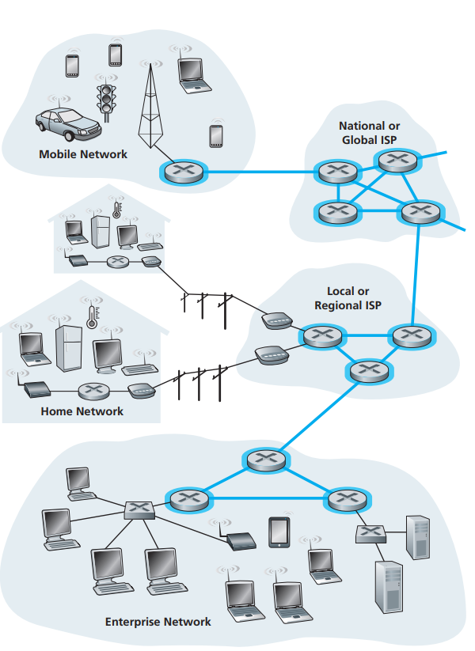
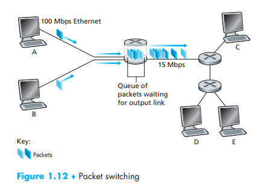

[toc]

The mesh of **packet switches and links** that interconnects the Internet’s
end systems

the blue parts are the network core

# 1. Packet Switching

packet switches = routers + link-layer switches

## Packets

To send a message from a source end system to a destination end system, the source breaks long messages into smaller chunks of data known as **packets**,

- each packet travels through communication links and **packet switches**   
- full-width speed: Packets are transmitted over **each communication link at a rate equal to the full transmission rate of the link**, if a source end system or a packet switch is sending a packet of L bits over a link with transmission rate R bits/sec, then the time to transmit the packet is L / R seconds

## Store-and-forward Transmission

The packet switch must receive **the entire packet** before it can begin to transmit **the first bit of the packet** onto the outbound link

For N links(thus N-1 routers between, do not consider other delays) delay: $$d_{end-to-end}=N\dfrac{L}{R}$$

Check yourself if you know how this is conducted

## Queuing Delays and Packet Loss

### *Queuing Delays*

In addition to the store-and-forward delays, packets suffer output buffer queuing delays, which depend on the level of congestion.

Output buffer(output queue) exists in every packet switch and store the packet that the router is about to send

### *Packet Loss*

The buffer is completely full with other packets waiting for transmission - either **the arriving packet or one of the already-queued packets** will be dropped  

here if the packets sent from A&B exceed 15Mbps, packet loss will occur

## Forwarding Tables and Routing Protocols

# Glossary