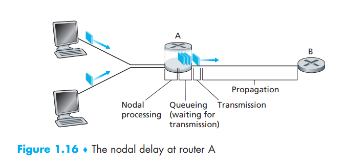
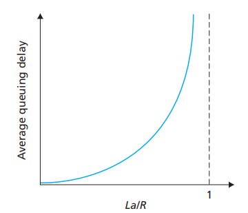
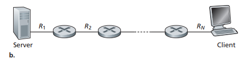
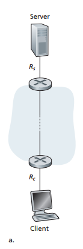
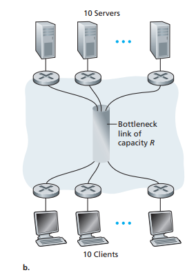

[toc]

In This chapter, remember those measures to evaluate a network system:

- delays(all kinds of)
- packet loss
- throughput

# 1. Overview of Delay in Packet-Switched Networks

## Types of Delay

### Processing Delay(处理延迟)

- the time required to **examine the packet’s header and determine where to direct the packet**
- the time needed to **check for bit-level errors in the packet** that occurred in transmitting the packet’s bits from the upstream node to router A

The time is usually microseconds or less  

After Nodal processing,  the router directs the packet to the queue that precedes the link to router B

### Queuing Delay(排队延迟)

The length of the queuing delay of a specific packet will depend on **the number of earlier-arriving packets** that are queued and waiting for transmission onto the link. 0 if there are no packets ahead.

The time is usually on the order of microseconds to milliseconds

### Transmission Delay(传输延迟)

A packet by L bits, and denote the transmission rate of the link from router A to router B by R bits/sec: L/R (for a 10 Mbps Ethernet link, the rate is R = 10 Mbps  etc)

### Propagation Delay(传播延迟)

*d/s*, where d is the distance between router A and router B and s is the propagation speed of the link

propagation speed: $2 * 10^8$ meters/sec to $3 * 10^8$ meters/sec  

### Transmission Delay vs Propagation Delay

|                         Transmission                         |                         Propagation                          |
| :----------------------------------------------------------: | :----------------------------------------------------------: |
| the amount of time required for the router to push out the packet | the time it takes a bit to propagate from one router to the next |
| a function of the packet’s length and the transmission rate of the link, but has nothing to do with the distance between the two routers | it is a function of the distance between the two routers, but has nothing to do with the packet’s length or the transmission rate of the link |

**The total speed rate of Internet transmission is thus determined by the transmission speed rate**

### Total Delay(总延迟)

$$d_{nodal}=d_{proc}+d_{queue}+d_{trans}+d_{prop}$$

- proc: often negligible
- trans: range from negligible to significant
- prop: hundreds of milliseconds, dominant term for $d_{nodal}$
- queue: small too 

# 2. Queuing Delay and Packet Loss 

## Queuing Delay

traffic intensity: $$L a / R$$, a = packets/sec, L = bits, R = bits/sec

- $L a / R>1$ = queue increase to infinity
- $L a / R \leq 1$ = what you need to do

As the packets come periodically or drastically, the traffic intensity will be instable too over those different packets arriving rate but also could be 0 under a totally ideal circumstance.

Normally, the more the traffic intensity comes close to 1, the more rapidly the average queuing delay increases

## Packet Loss

When $L a / R>1$, the arriving packet may not be able to find available space in the queue, thus the packet will be lost, and case **packet loss**

# 3. End-to-End Delay

For the whole end-to-end network consisting of many nodals(all same), the total delay can be presented as: $$d_{\text {end-end }}=N\left(d_{\text {proc }}+d_{\text {trans }}+d_{\text {prop }}\right)$$. In this formula we ignore the queuing delay as it’s complicated and highly depend on the outside world

## Traceroute

I think nothing worth to write here

## End System, Application, and Other Delays

Some end systems and Applications like VoIP may somehow cause a delay.

This will be explored more in further chapters

# 4 Throughput in Computer Networks  

average throughput = F/T(F: file size, T: time to send/receive the file)

Think of the link between the server and client is a pipe. Now for this example: T = F/min{R1, R2, …, RN}, and *bottleneck link* is min{R1, R2, …, RN}

In most cases, **the core of the communication network have a very high transmission rate that is bigger than this server-to-client network**. Therefore, the constraining factor for throughput in today’s Internet is typically **the access network** as below:

Now consider a situation in which the core transmission speed is not much bigger than the end systems with and only with 10 pairs of server-client and a shared link: $R_s$= 2Mbps, $R_C$=1Mbps, $R$=5Mbps(the common link in the core network), the bottleneck will now instead be the shared link in the core network:

Let’s say there are 10 downloads happened between those pairs in the same time, the throughput of this network is: 500 kbps

# Translation & Glossary

- total nodal delay: 总延迟
- traffic intensity: 通信量强度
- throughout: 吞吐量
- instantaneous throughput: 瞬时吞吐量
- average throughput: 平均吞吐量
- bottleneck link: 瓶颈环节
- the access network: 接入网

