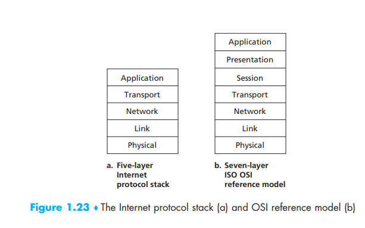
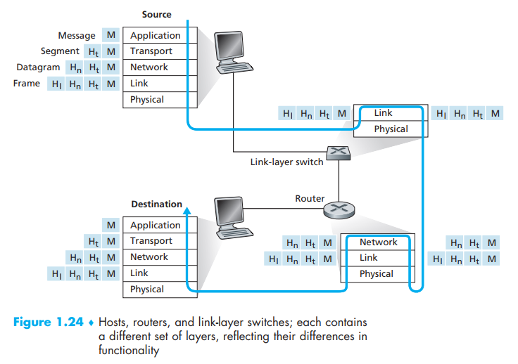

[toc]

It’s very important to find a way to describe the network architecture, and one way to do this is to describe the structure by assuming what procedures will we going through. Then, we category those procedures into different layers as there are some steps tending to finish the same kind of steps

# 1. Layered Architecture

## Protocol Layering

A protocol that below to one of those layers serves as a service model to finish one kind of task 

Protocols in various layers are called the *protocol stack*

- a protocol can be both implemented in hardware, software and mix of those two
- a layer n  protocol is distributed among the end systems and other network components

Advantage:

- layering provides a structured way to discuss system components
- Modularity makes it easier to update system components

Disadvantage:

- one layer may duplicate lower-layer functionality(many stack provide error recovery on both a per-link basis and an end-to-end basis)
- functionality at one layer may need information  that is present only in another layer; this violates the goal of separation of layers

## Application Layer

The application layer is where network applications and their application-layer protocols reside

- HTTP protocol: provides for Web document request and transfer
- SMTP: provides for the transfer of e-mail messages  
- FTP: provides for the transfer of files between two end systems
- DNS: the domain name system, a specific application-layer protocol

We refer to this packet of information at the application layer as **message**

## Transport Layer

The Internet’s transport layer transports application-layer messages between application endpoints

### TCP

- provides a **connection-oriented** service to its applications, including **guaranteed delivery** of application layer messages to the destination and **flow control** (that is, sender/receiver speed matching)
- breaks long messages into shorter segments and provides a congestion-control mechanism, so that a source throttles its transmission rate when the network is congested  

### UDP

Provides a connectionless service to its applications. This is a no-frills service that provides:

- no reliability
- no flow control
- no congestion control

We will refer to a transport-layer packet as a **segment**

## Network Layer

The Internet’s network layer is responsible for moving network-layer packets known as **datagrams** from one host to another  which receives **destination address and segment** from the transport layer in the source host and then deliver the segment to the transport layer in the destination host

### IP protocol

Defines the fields in the datagram as well as how the end systems and routers act on these fields  

- there is only one IP protocol
- all Internet components that have a network layer must run the IP protocol

### routing protocol

Determine the routes that datagrams take between sources and destinations

- the Internet has many routing protocols
- within a network, the network administrator can run any routing protocol desired

We often refer to this layer as the IP layer to indicate that IP protocol is the glue that binds the networks together

## Link layer

The network layer passes the datagram down to the link layer, which delivers the datagram to the next node along the route. At this next node, the link layer passes the datagram up to the network layer

- WIFI
- Ethernet
- DOCSIS protocol
- PPP

During the Transmission on the link layer:

- a datagram may be handled by different link-layer protocols at different
  links along its route(WIFI in this link and PPP in another link)
- the network layer will receive a different service from each of the different link-layer protocols

We refer to the link layer packets as frames

## Physical layer

The job of the physical layer is to move the individual bits within the frame from one node to the next  

- twisted-pair 
- copper wire
- single-mode fiber optics  

For example, Ethernet has many physical-layer protocols: one for twisted-pair copper wire, another for coaxial cable, another for fiber, and so on  

## The OSI Model

there are two additional layers present in the OSI reference model:

- the presentation layer: provide services that allow communicating  applications to interpret the meaning of data exchanged, including data compression and data encryption (which are self-explanatory) as well as
  data description   
- the session layer: provides for delimiting and synchronization of data exchange, including the means to build a checkpointing and recovery scheme

Whether you want to implement those layers are totally depend on the application developer

# Encapsulation

Some layer below adds its layer header to the original information:

- header fields: transport-layer header, network-layer header and link-layer-header
- payload field: a packet from the layer above

Pay attention to the different layer protocol existing in different network components and then think of those as your home, your email target home, post office(only send this letter to another post office) and delivery man

# Translation and Glossary

- protocol layer: 协议层
- service model: 服务模式
- protocol stack: 协议栈
- congestion-control mechanism: 拥塞控制机制
- flow-control:  流控制