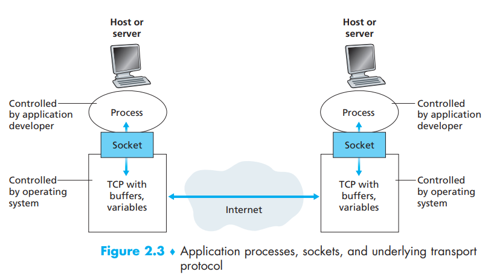
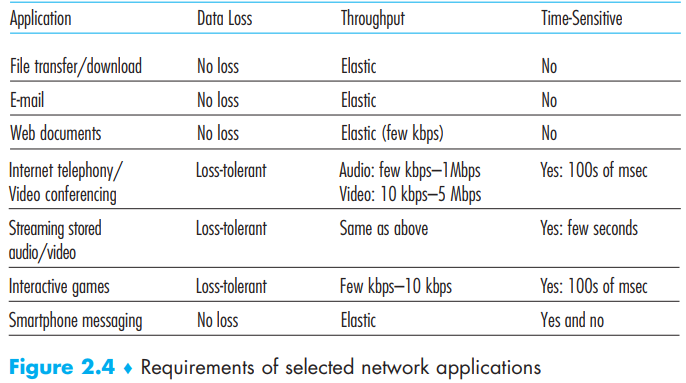
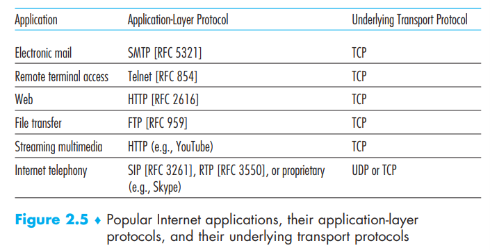

[toc]

 Be aware that you can not write programs for the link layer switch or router as they work in lower layer that does not involve the application layer

# 1. Network Application Architectures

Application architectures are defined by application developer, there are some typical architecture for us to choose

## client-server

Include an always-on host — the server which client can always communicate to

- Web
- FTP
- Telnet
- e-mail

Above applications uses client-server architecture, and in most cases, one server is not enough. We tend to use **data center** to provide service. And the service provider controls this which cost him money for bandwidth and recurring interconnection

## peer-to-peer

De-centralized, no-service-provider-owned architecture in which application directly communicate between pairs of connected hosts — peers, and the user in this peer controls this communication

- BitTorrent
- Xunlei
- Skype

Comparing to client-server, P2P owns some advantages:

- self-scalability: the workload and service capacity grows with the each peer
- cost effective: don’t require significant server infrastructure and server bandwidth

Disadvantage:

- security issue
- performance issue
- reliability issue

## hybrid architectures

For many instant messaging applications, servers are used to track the IP addresses of users, but user-to-user messages are sent directly between user hosts (without passing through intermediate servers)  

# 2. Processes Communicating

In the jargon of operating systems, it is not actually programs but **processes that communicate **

Processes can be thought of as a program that is running within an end system, so we will dive into how processes running on different hosts communicate

## Client and Server Processes

>  In the context of a communication session between a pair of processes, the process that initiates the communication (that is, initially contacts the other process at the beginning of the session) is labeled as the client. The process that waits to be contacted to begin the session is the server

This applies to both client-server and peer-to-peer architecture

## The Interface Between the Process and the Computer Network

A process sends messages into, and receives messages from, the network through a software interface called a **socket** which is also referred to as **Application Programming Interface (API)** between **the application and the transport layer**

Consider this socket a door. Now our programmer has full control of behind the door(the house) but has few control of the things outside the door(the transport layer)

- the choice of transport protocol
- perhaps the ability to fix a few transport-layer parameters such as  maximum buffer and maximum segment sizes   

## Addressing Processes

To identify the receiving process, two pieces of information need to be specified:  

- 32-bit IP address: the address of the host
- destination **port number**: an identifier that specifies the receiving process(socket) in the destination host

# 3. Transport Services Available to Applications

The application at the sending side pushes messages through the socket. At the other side of the socket, the transport-layer protocol has the responsibility of getting the messages to the socket of the receiving process

Their are 4 dimensions for us to choose a protocol which all provided by the computer

## Reliable Data Transfer

- packet loss
- corrupt data bits discarded by the router

To solve those devastating unreliable data, we can use **process-to-process reliable data transfer** so that the sending side can just pass the data and make sure that it arrives completely

Another case is loss-tolerant applications if without reliable data transfer, typically about videos and audios

## Throughput

###  bandwidth-sensitive applications

Applications that have throughput requirements are said to be **bandwidth-sensitive applications **

With such a service, the application could request a guaranteed throughput of r bits/sec, and **the transport protocol would then ensure that the available throughput is always at least r bits/sec**

Many current multimedia applications are bandwidth sensitive although some others can use adaptive coding to encode media at a rate that matches the currently available throughput

### elastic applications

Elastic applications can make use of as much, or as little, throughput as happens to be available

- Electronic mail  
- file transfer  
- Web transfers

Of course, the more, the better

## Timing

Always refers to **lower delay**.  An example guarantee might be that every bit that the sender pumps into the socket arrives at the receiver’s socket no more than 100 msec later

- Internet telephony
- virtual environments
- teleconferencing
- multiplayer games

All above interactive real-time applications requires a low delay

## Security  

- encoding service in the sending host
- decoding service in the receiving host
- data integrity
- end-point authentication
- and more…

# 4 Transport Services Provided by the Internet

Now we will discuss the transport services that could be provided by the Internet

## TCP Services

### Connection-oriented service

1. handshake: TCP has the client and server **exchange transport layer control information** with each other before the application-level messages begin to flow
2. After the handshaking phase, a TCP connection is said to exist between the sockets
3. When the application finishes sending messages, it must tear down the connection  

The connection is **a full-duplex connection** in that the two processes can send messages to each other over the connection at the same time

### Reliable data transfer service

- deliver all data sent without error 
- deliver all data in the proper order

### Congestion-control mechanism

This is a service for the general welfare of the Internet rather than for the direct benefit of the communicating processes

- throttles a sending process (client or server) when the network is congested between sender and receiver
- attempts to limit each TCP connection to its fair share of network bandwidth

## UDP Services

UDP is a **no-frills, lightweight transport protocol**, providing minimal services that is **unreliable without handshaking and guarantee**

Also, UDP **does not include a congestion-control mechanism**, so the sending side of UDP can pump data into the layer below (the network layer) at any rate it pleases

## Services Not Provided by Internet Transport Protocols

Today’s Internet can often provide satisfactory service to time-sensitive
applications, but it cannot provide any timing/throughput/security guarantees as the some transport services provided by the computer exceeds the scope of TCP/UDP(Internet transport service).

Reliable data transfer can be completely satisfied with TCP

# 5. Application-Layer Protocols

An application-layer protocol defines:

- how an application’s processes
- running on different end systems
- pass messages to each other

In particular:

- **The types of messages exchanged**, for example, request messages and response messages
- **The syntax of the various message types**, such as the fields in the message and how the fields are delineated
- **The semantics of the fields**, that is, the meaning of the information in the fields
- **Rules for determining when and how a process sends messages and responds to messages**

Application-layer protocols are specified in **RFCs** and are therefore in **the
public domain**,  while some applications like skype use **proprietary application-layer protocols**

Remember that application-layer protocol is just one part of the application

- HTTP(RFC) for web applications
- SMTP(RFC) for email applications

# 6. Network Applications Covered in This Book

- Web: HTTP
- email: SMTP…
- P2P
- video streaming: loss-tolerant and bandwidth-requirement
- directory service: DNS, users invoke DNS indirectly through other applications (including the Web, file transfer, and electronic mail)  

# Translation & Glossary

