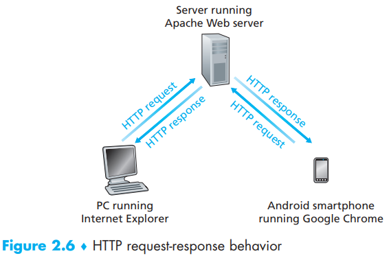
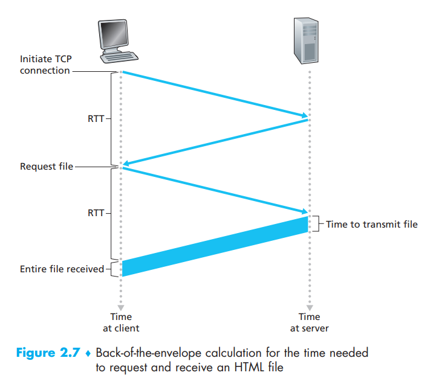
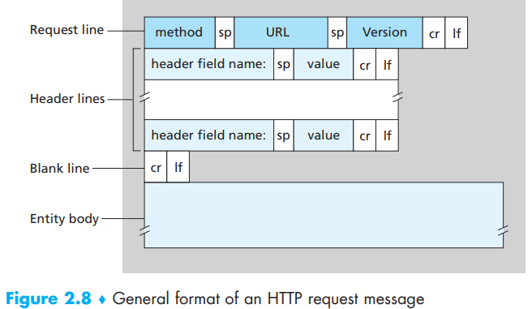
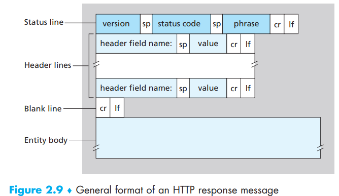
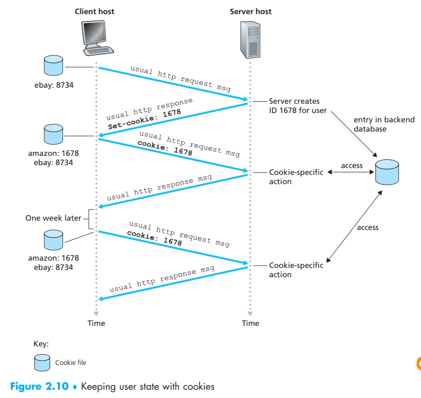
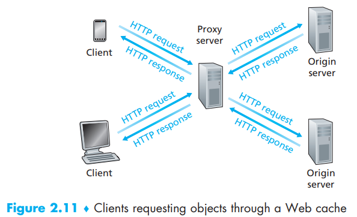

[toc]

Why we like WWW ?

- *on demand*: users receive what they want, when they want it
- enormously easy for any individual to make information available over the Web  

# 1. Overview of HTTP

HyperText Transfer Protocol(HTTP) is the Web’s application-layer protocol

- **Web page**: a document consists of **objects**, including a **base HTML file**
- **object**: simply a file, like HTML file, JEPG image, Java applet, video clip etc…
- **Web browsers**: implement the client side of HTTP and equals to *client* in Web
- **Web servers**: implement the server side of HTTP, house Web objects, each addressable by a URL
- URL = the host name of the server + the object’s path name

HTTP defines how Web clients request **Web pages** from Web servers and how
servers transfer **Web pages** to clients:

- HTTP uses **TCP** as its underlying transport protocol, Once the client sends a message into its socket interface, the message is out of the client’s hands and is “in the hands” of TCP which guarantee its data and  details
- Also, an HTTP server maintains no information about the clients, HTTP is said to be a **stateless protocol**, so the server sends requested files to clients without storing any state information about the client

So HTTP has nothing to do with how a Web page is interpreted by a client

# 2， Non-Persistent and Persistent Connections

- Non-persistent connections: use different TCP connections to respond requests from the same client
- Persistent connections: use the same TCP connection …

## HTTP with Non-Persistent Connections

- each TCP connection transports exactly one request message and one response message and 
- each TCP connection is closed after the server sends the object—the connection does not persist for other objects
- the number of TCP connections  = the number of total objects(including the basis HTML file)

Most browsers open 5 to 10 parallel TCP connections, and each of these connections handles one request-response transaction, and user can configure this

Disadvantages:

- high burden: For each of these connections, TCP buffers must be  allocated and TCP variables must be kept in both the client and server
- higher delay: each object suffers a delivery delay of two RTTs—one RTT to establish the TCP connection and one RTT to request and receive an object

### round-trip time(RTT)

includes(where is the transmission delay? too small so ignored):

- packet-propagation delays
- packet-queuing delays
- packet-processing delays

Total time = 2 x RTT + transmission time

## HTTP with Persistent Connections

So persistent connections can do this:

- hold TCP connection open to send all the objects requested by the same client in a close time
- hold TCP connection open to send the server-side object to different clients
- HTTP/2: allowing multiple requests and replies to be interleaved in the same  connection, and a mechanism for prioritizing HTTP message requests  and replies within this connection

# 3. HTTP Message Format

The HTTP specification defines many, many more header lines that can be inserted by browsers, Web servers, and network cache servers. We will see many typical header lines(not all) below but we must know that there are different products, versions, and configurations, all of which influence which header lines are included in response messages  

## HTTP Request Message

ASCII: 

> Get /somedir/page.html HTTP/1.1  –> **request line**
> `Host: www.someschool.edu` –> required by Web proxy cashes
> `Connection: close` –> use non-persistent connections
> `User-agent: Mozilla/5.0` –> the browser type-different type files same url
> `Accept-language: fr`  –> French version of the object if it exists
> –> **header lines**

request line:

- method field: GET/POST/HEAD/PUT/DELETE
- URL field
- HTTP version field

- Entity body: used in POST. For example a search engine. Another alternative way is to include the key words in URL using GET
- HEAD method: a server receives a request with the HEAD method and it responds with an HTTP message but it **leaves out the requested object**
- PUT method: modify the data, overwrite if the request duplicated, often used in conjunction with Web publishing tools or applications that need to upload objects to Web servers  
- POST method: add the data, ignore duplicated request

## Response

> HTTP/1.1 200 OK –> an initial status line
> `Connection: close` –> use non-persistent connections
> `Date: Tue, 18 Aug 2015 15:44:04 GMT` –> the time when the server retrieves the object from its file system
> `Server: Apache/2.2.3 (CentOS)` –> analogous to the User-agent, server
> `Last-Modified: Tue, 18 Aug 2015 15:11:03 GMT` –> when the object was created or last modified, critical for object caching
> `Content-Length: 6821` –> length of the object sent
> `Content-Type: text/html` –> object in entity body is HTML file
> –> six header lines
>
> (data data data …) –> requested object

status line:

- the protocol version type
- a status code
- a corresponding status message

Status code:

- *200 OK*: Request succeeded and the information is returned in the response
-  *301 Moved Permanently*: Requested object has been permanently moved; the new URL is specified in *Location*: header of the response message. The client software will automatically retrieve the new URL
- *400 Bad Request*: This is a generic error code indicating that the request
  could not be understood by the server
- *404 Not Found*: The requested document does not exist on this server
- *505 HTTP Version Not Supported*: The requested HTTP protocol version is not supported by the server  

# 4. User-Server Interaction: Cookies

four parts of the cookie technology:

- a cookie header line in the HTTP response message
- a cookie header line in the HTTP request message
- a cookie file kept on the use’s end system and managed by the user’s browser
- a back-end database at the Web site. 

Cookie technology is widely used in e-commerce sites that provide “one-click shopping”

# 5. Web Caching

Web server, known as **Proxy Server**, works as an intermediate proxy for all TCP(HTTP) connection between clients and servers. So a Web cache can both work as a client and a server:

- When as a client, Web cache copies the response and store the objects in the local storage
- When as a server, Web cache checks the requests from clients and send back the copy of the requested object in local response if the copy exists

Usually ISP provides Web cache service for us, we need those because:

- a Web cache can substantially **reduce the response time for a client request**, particularly if the bottleneck bandwidth between the client and the origin server is much less than the bottleneck bandwidth between the client and the cache. If there is a high-speed connection between the client and the cache, as there often is, and if the cache has the requested object, then the cache will be able to deliver the object rapidly to the client  
- Web caches can substantially reduce traffic on an institution’s access  link to the Internet, thereby reducing costs
- Web caches can substantially reduce Web traffic in the Internet as a whole, thereby improving performance for all applications

# 6. The Conditional GET

A mechanism in HTTP that allows  a cache to verify that its object are up-to-date. It needs to be satisfied as: 

- the request message uses the GET method
- the request message includes an If-Modified-Since: header line

We will discuss how this works from the beginning of the first request:

1. a client first send a request to a server
2. Web cache receives the request, checks that no copy in local storage and then send it to the server
3. the server responses with objects and a base html file containing header line *Last_modified*
4. Web cache copies the response objects and deliver it to the client

A week later:

1. the same client request the same thing to the same server
2. Web cache accepts the request, finds a copy, but send a request that contains header-line *If-modified-Since* to the server
3. the server checks if the file is modified since, and send only a response message with the header-line like *HTTP/1.1 304 Not Modified*
4. Web cache receives the response, knows there is nothing change. Thus send the local copy to the client

So there is no objects the server needs to transfer to the Web cache. Bandwidth saved

# Translation & Glossary

- World Wide Web: 万维网
- stateless protocol: 无状态协议
- round-trip time: 往返时间
- Content  Distribution Networks(CDNs): 内容发布网络

