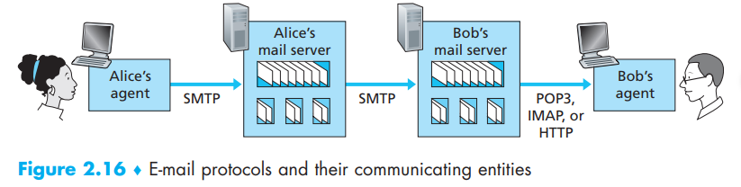

[toc]

- **user agent**
- **mail servers**
- **Simple Mail Transfer Protocol(SMTP)**
- **user mailbox**: manage and maintain the messages received
- **outgoing message queue**: send emails in queue. If sending fails, retry multiple times(30 minutes each time). If keep failing, send an email to the sender to notice the failure

# 1. SMTP - the core protocol between servers

SMTP exists on both the client and server side in mail server

- When a mail server sends mail to other mail servers, it acts as an SMTP client
- When a mail server receives mail from other mail servers, it acts as an SMTP server

To see how SMTP works:

1. Alice invokes her user agent for e-mail, provides Bob’s e-mail address (for example, bob@someschool.edu), composes a message, and instructs the user agent to send the message.
2. Alice’s user agent sends the message to her mail server, where it is placed in a message queue.
3. The client side of SMTP, running on Alice’s mail server, sees the message in the message queue. It opens a **TCP** connection to an SMTP server, running on Bob’s mail server.
4. After some initial SMTP handshaking, the SMTP client sends Alice’s message into the TCP connection.
5. At Bob’s mail server, the server side of SMTP receives the message. Bob’s mail server then places the message in Bob’s mailbox.
6. Bob invokes his user agent to read the message at his convenience.  

In fact, everything works like there is only two side directly communicate. Let’s say: **the message does not get placed in some intermediate mail server**.

Now lets see how those two sides communicate(S-lines server sends into its TCP socket, C-lines client sends …):

> S: 220 hamburger.edu
> C: **HELO **crepes.fr
> S: 250 Hello crepes.fr, pleased to meet you
> C: **MAIL FROM**: <alice@crepes.fr>
> S: 250 alice@crepes.fr ... Sender ok
> C: **RCPT TO**: <bob@hamburger.edu>
> S: 250 bob@hamburger.edu ... Recipient ok
> C: **DATA**
> S: 354 Enter mail, end with ”.” on a line by itself
> C: Do you like ketchup?
> C: How about pickles?
> C: .
> S: 250 Message accepted for delivery
> C: **QUIT**
> S: 221 hamburger.edu closing connection  

Bolds parts are the **commands** which are self-explanatory. Notice the three separate content below **DATA**, we can see that SMTP use **persistent TCP connections**

# 2. Comparison with HTTP

| HTTP                                                         | SMTP                                                         |
| ------------------------------------------------------------ | ------------------------------------------------------------ |
| **pull protocol**—someone loads information on a Web server and users use HTTP to pull the information from the server at their convenience. the TCP connection is initiated by the machine that wants to receive the file | **push protocol**—the sending mail server pushes the file to the receiving mail server. TCP connection is initiated by the machine that wants to send the file |
| encoding as you want                                         | SMTP requires each message, including the body of each message, to be in 7-bit ASCII format |
| HTTP encapsulates each object in its own HTTP response message | SMTP places all of the message’s objects into one message(in ASCII) |

# 3. Mail Message Formats

The headlines are different from commands. The header lines are part of the mail message itself that precedes the body of the message while commands are part of the SMTP handshaking protocol

> **From**: alice@crepes.fr
> **To**: bob@hamburger.edu
> **Subject**: Searching for the meaning of life.
> — a blank line —
> message body …

**mail address**: user@email-server-address (example@address.com)

# 4. Mail Access Protocols - the whole process

In the modern world, a typical user runs a user agent (MUA-message user agent) on the local PC but accesses its mailbox stored on an always-on shared mail server, like QQ email server and company email server.

Now we know sender’s user agent can push the message to it’s mail server using **SMTP**, and the same for sender’s mail server pushing the message to recipient’s mail server. But how can the recipient’s user agent can **retrieve messages** from his mail server as SMTP is a push protocol?  see below:

## POP3(RFC)

The user agent (the client) opens a **TCP connection** to the mail server (the server) on port 110, then:

1. **authentication**: the user agent sends a username and a password
   (in the clear) to authenticate the user
2. **transaction**: the user agent can retrieves messages,  mark messages
   for deletion, remove deletion marks, and obtain mail statistics
3. **update**: after the client has issued the quit command, ending the POP3 session; at this time, the mail server deletes the messages that were marked for deletion

### authentication

The authorization phase has two principal commands:

- user <username> 
- pass <password>  

### transaction

During this period, the user agent issues commands, and the server responds to each command with a reply:

- +OK(sometime followed by server-to-client data): indicate that the previous command was fine
- -ERR: indicate that something was wrong with the previous command

The user agent also got two modes for transaction:

- *download and keep*

- *download and delete*: need to use command - *list, retr, dele*

  >C: **list**
  >S: 1 498
  >S: 2 912
  >S: .
  >C: **retr 1** –> retrieve part 1
  >S: (blah blah ...
  >S: .................
  >S: ..........blah)
  >S: .
  >C: **dele 1** –> delete part 1
  >C: **retr 2**
  >S: (blah blah ...
  >S: .................
  >S: ..........blah)
  >S: .
  >C: **dele 2**
  >C: **quit**
  >S: +OK POP3 server signing off 
  >
  >using this mode will kill your hope of accessing mail in different machines

During a POP3 session **between a user agent and the mail server**, the POP3 server maintains some state information; in particular, it keeps track of which user messages have been marked deleted. However, the POP3 server does not carry state information across POP3 sessions. This lack of state information across sessions greatly simplifies the implementation of a POP3 server.

## IMAP(RFC)

IMAP protocol provides will associate each message with a folder, including:

- provides commands to allow users to create folders and move messages from one folder to another
- provides commands that allow users to **search** remote folders for messages matching specific criteria
- maintains user state information across IMAP sessions. For example, the names of the folders and which messages are associated with which  folders
- provides commands that permit a user agent to obtain components of messages, For example, a user agent can obtain just the message header of a message or just one part of a multipart MIME message

Above all, IMAP provides the ability to organize and separate the mails in the web server

## Web-Based E-Mail

With this service, the user agent is an ordinary Web browser, and the user communicates with its remote mailbox via HTTP (instead of SMTP used by user agent)

- HTTP: when the user agents communicate with mail servers, they use HTTP
- SMTP: when the mail servers send and receive email from other mail servers, they use SMTP

# Translation & Glossary
