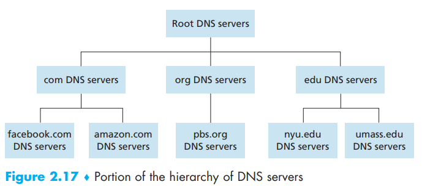
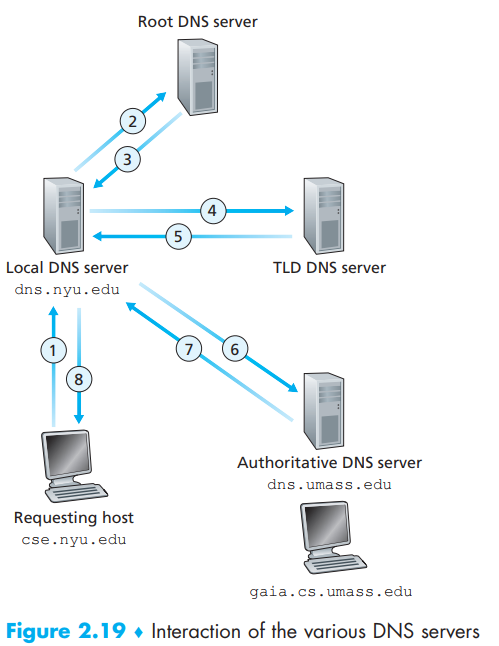
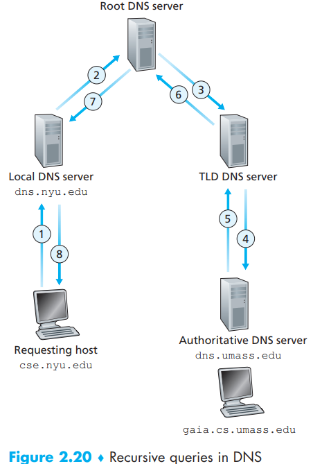
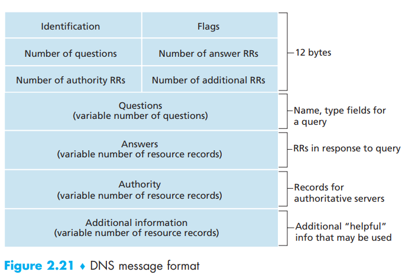

[toc]

Hostname is designed for humans while IP address is used by network cores. To fill the gap between those two systems, we use DNS to provide us the service to match hostnames with IP addresses

DNS - RFC

# 1. Services Provided by DNS

The basic and core functionality that DNS provides us is to match the hostname and its IP address:

1. The same user machine runs the client side of the DNS application.
2. The browser extracts the hostname, www.someschool.edu, from the URL
   and passes the hostname to the client side of the DNS application.
3. The DNS client sends a query containing the hostname to a DNS server.
4. The DNS client eventually receives a reply, which includes the IP address for the hostname.
5. Once the browser receives the IP address from DNS, it can initiate a TCP connection to the HTTP server process located at port 80 at that IP address.

We can see there is a delay for DNS to match the IP address and the host name. Luckily, many of those matches have local cache

DNS provides more services:

- **Host aliasing**: this is often used to provide simpler and more mnemonic names for complicate **canonical hostname**
- **Mail server aliasing**: this is what we daily used email names because in fact the host name for mail server can be much more  complicated(relay1.west-coast.yahoo.com). So DNS can obtain both the canonical hostname and its IP address or even provide companies the same name for Web server and mail server
- **Load distribution**: for replicated servers in both the Web and the Mail(one hostname but different servers across the world). The DNS database will obtain a set of those IP addresses and send them to the DNS application in the user side that requested the certain hostname, and DNS will choose the first IP address to reach. And then, DNS rotates the set of IP addresses for next request

# 2. Overview of How DNS Works

Now focus back on the mapping service. All DNS query and reply messages are sent within UDP datagrams to port 53

We can conclude some shortcomings of a centered design for DNS:

- **A single point of failure**
- Traffic volume
- Distant centralized database
- Maintenance

## A Distributed, Hierarchical Database

 

- **Root DNS servers**: these root name servers are managed
  by 13 different organizations and provide the IP addresses of the TLS servers

- **Top-level domain (TLD) servers**： For each of the top-level domains — top-level domains such as com, org, net, edu, and gov, and all of the country top-level domains such as uk, fr, ca, and jp — there is TLD server (or server cluster), TLD servers provide the IP addresses for authoritative DNS servers

- **Authoritative DNS servers**: Every organization with publicly accessible hosts (such as Web servers and mail servers) on the Internet must provide publicly accessible DNS records that map the names of those hosts to IP addresses. An organization’s authoritative DNS server houses these DNS records, An organization can choose to implement its own authoritative DNS server to hold these records; alternatively, the organization can pay to have these records stored in an authoritative DNS server of some service provider. Most universities and large companies implement and maintain their own primary and secondary (backup) authoritative DNS server

- **local DNS server**: local DNS server serves as an proxy and is nevertheless central to the DNS architecture although not being one of the hierarchy of servers. Local DNS server is always provided by residential ISP(the local DNS server is typically separated from the host by no more than a few routers) or an institutional ISP(the local DNS server may be on the same LAN as the host  )

  >Let’s take a look at a simple example. Suppose the host cse.nyu.edu desires the IP address of gaia.cs.umass.edu. Also suppose that NYU’s ocal DNS server for cse.nyu.edu is called dns.nyu.edu and that an authoritative DNS server for gaia.cs.umass.edu is called dns.umass.edu. As shown in Figure 2.19, the host cse.nyu.edu first sends a DNS query message to its local DNS server, dns.nyu.edu. The query message contains the hostname to be translated, namely, gaia.cs.umass.edu. The local DNS server forwards the query message to a root DNS server. The root DNS server takes note of the edu suffix and returns to the local DNS server a list of IP addresses for TLD servers responsible for edu. The local DNS server then resends the query message to one of these TLD servers. The TLD server takes note of the umass.edu suffix and responds with the IP address of the authoritative DNS server for the University of Massachusetts, namely, dns.umass.edu. Finally, the local DNS server resends the query message directly to dns.umass.edu, which responds with the IP address of gaia .cs.umass.edu. Note that in this example, in order to obtain the mapping for one hostname, eight DNS messages were sent: four query messages and four reply messages! We’ll soon see how DNS caching reduces this query traffic.  
  >
  >
  >
  >Our previous example assumed that the TLD server knows the authoritative DNS server for the hostname. In general this not always true. Instead, the TLD server may know only of an intermediate DNS server, which in turn knows the authoritative DNS server for the hostname. For example, suppose again that the University of Massachusetts has a DNS server for the university, called dns.umass.edu. Also suppose that each of the departments at the University of Massachusetts has its own DNS server, and that each departmental DNS server is authoritative for all hosts in the department. In this case, when the intermediate DNS server, dns.umass.edu, receives a query for a host with a hostname ending with cs.umass.edu, it returns to dns.nyu.edu the IP address of dns.cs.umass.edu, which is authoritative for all hostnames ending with cs.umass.edu. The local DNS server dns.nyu.edu then sends the query to the authoritative DNS server, which returns the desired mapping to the local DNS server, which in turn returns the mapping to the requesting host. In this case, a total of 10 DNS messages are sent!

  The query sent from cse.nyu.edu to dns.nyu.edu is a recursive query, the subsequent three queries are iterative since all of the replies are directly returned to dns.nyu.edu.

  Now we can also use total Recursive queries:

  

  In theory, any DNS query can be iterative or recursive

# DNS Caching

In a query chain, **when a DNS server receives a DNS reply (containing, for example, a mapping from a hostname to an IP address)**, it can cache the mapping in its local memory. the DNS server can provide the desired IP address, even if it is not authoritative for the hostname, hosts and mappings between hostnames and IP addresses are by no means permanent, **DNS servers discard cached information after a period of time** (often set to two days)

Usually it’s local DNS server is doing the cache, and it tends to bypass root DNS servers all the time in a query chain

# DNS Records and Messages

The DNS servers that together implement the DNS distributed database store
**resource records (RRs)**, including RRs that provide hostname-to-IP address mappings. Each DNS reply message carries **one or more** resource records

A resource record is a four-tuple:

> (Name, Value, Type, TTL)

TTL determines when a resource should be removed from a cache

As for different types:

- Type=A: **Name is a hostname** and **Value is the IP address** for the hostname - (relay1.bar.foo.com, 145.37.93.126, A)

  > If a DNS server is **authoritative **for a particular hostname, then the DNS server will contain a **Type A record** for the hostname. 

- Type=NS: **Name is a domain** (such as foo.com) and **Value is the  hostname of an authoritative DNS server** that knows how to obtain the IP addresses for hosts in the domain - (foo.com, dns.foo.com, NS)

  > If a server is not authoritative for a hostname, then the server will contain a Type NS record for the domain that includes the hostname It will also contain a **Type A record** that provides the IP address of
  > the DNS server in **the Value field of the NS record**. 

- Type=CNAME: **Value is a canonical hostname for the alias hostname Name**. This record can provide querying hosts the canonical name for a hostname  - (foo.com, relay1.bar.foo.com, CNAME)

  > To obtain the canonical name for the other server, the DNS client would query for the CNAME record

- Type=MX: **Value is the canonical name of a mail server that has an alias hostname Name** - (foo.com, mail.bar.foo.com, MX). MX records allow the hostnames of mail servers to have simple aliases. Note that by using the MX record, a company can have the same aliased name for its mail server and for one of its other servers (such as its Web server)

  > To obtain the canonical name for the mail server, a DNS client would query for an MX record

## DNS Messages

Both query and reply messages have the same format  

- *header section*: the first 12 bytes.
  - 16-bit identification field: This identifier is copied into the reply message to a query, allowing the client to match received replies with sent queries. 
  - 4-bit Flags field: A 1-bit query/reply flag indicates whether the message is  a query (0) or a reply (1). A 1-bit authoritative flag is set in a reply message when a DNS server is an authoritative server for a queried name. A 1-bit recursion-desired flag is set when a client (host or DNS server) desires that the DNS server perform recursion when it doesn’t have the record. A 1-bit recursion-available field is set in a reply if the DNS server supports  recursion
  - four number-of fields: indicate the number of occurrences of the four types of data sections that follow the header
- *question section*: contains information about the query that is being made. 
  - a name field that contains the name that is being queried
  - a type field that indicates the type of question being asked about the name
- *answer section*: contains the **resource records** for the name that was originally queried. A reply can return multiple RRs in the answer, since a hostname can have multiple IP addresses
- *authority section*: contains records of other authoritative servers
- *additional section*: contains other helpful records. For example, the answer field in a reply to an MX query contains a resource record providing the canonical hostname of a mail server. The additional section contains a Type A record providing the IP address for the canonical hostname of the mail server

## Inserting Records into the DNS Database

1. register your domain name with the help of a registrar, providing names and IP addresses for your primary and secondary authoritative DNS servers

2. the registrar will make sure that a Type NS and a Type A record are entered into the **TLD com servers** - for the primary one:

   >(networkutopia.com, dns1.networkutopia.com, NS)
   >(dns1.networkutopia.com, 212.212.212.1, A)

3. You’ll also have to make sure that the Type A resource record for your Web server www.networkutopia.com and the Type MX resource record for your mail server mail.networkutopia.com are entered into your authoritative DNS server

> Suppose Alice in Australia wants to view the Web page www.networkutopia.com. As discussed earlier, her host will first send a DNS query to her local DNS server. The local DNS server will then contact a TLD com server. (The local DNS server will also have to contact a root DNS server if the address of a TLD com server is not cached.) This TLD server contains the Type NS and Type A resource records listed above, because the registrar had these resource records inserted into all of the TLD com servers. The TLD com server
> sends a reply to Alice’s local DNS server, with the reply containing the two resource records. The local DNS server then sends a DNS query to 212.212.212.1, asking for the Type A record corresponding to www.networkutopia.com. This record provides the IP address of the desired Web server, say, 212.212.71.4, which the local DNS server passes back to Alice’s host. Alice’s browser can now initiate a TCP connection to the host 212.212.71.4 and send an HTTP request over the connection. Whew! There’s a lot more going on than what meets the eye when one surfs the Web!  

# Translation & Glossary

- domain name system(DNS): 域名系统
- host aliasing: 主机别名
- canonical hostname: 规范主机名
- mail server aliasing: 邮件服务器别名
- load distribution:  负载分配
- Root DNS servers: 根域名服务器
- Top-level domain (TLD) servers: 顶级域服务器
- Authoritative DNS servers: 权威域服务器
- local DNS server: 本地域名服务器
- recursive queries: 递归查询
- iterative queries: 迭代查询
- resource records (RRs): 源记录
- nslookup program: 网路资讯查询程序
- 

