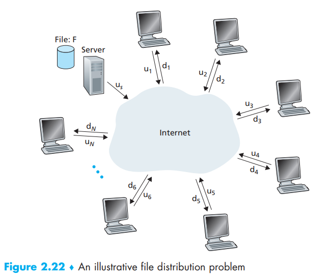
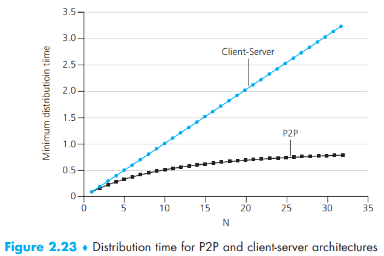
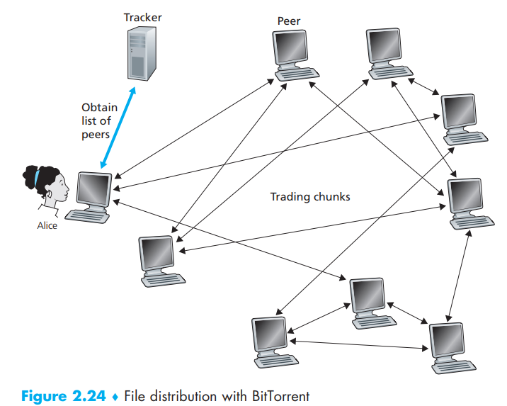

[toc]

In P2P file distribution, each peer can redistribute any portion of the file it has received to any other peers, thereby assisting the server in the distribution process.

# Scalability of P2P Architectures

There are two assumptions in this model:

- the Internet core has abundant bandwidth, implying that all of the bottlenecks are in access networks
- the server and clients are not participating in any other network applications, so that all of their upload and download access bandwidth can be fully  devoted to distributing this file

If we first assume that this is in a client-server architecture, then the distribution time(make copy for each client) is NF/us, which linearly increases with N

But for P2P architecture, things are different:

> - At the beginning of the distribution, only the server has the file. To get this file into the community of peers, the server must send each bit of the file at least once into its access link. Thus, the minimum distribution time is at least F/us. (Unlike the client-server scheme, a bit sent once by the server may not have to be sent by the server again, as the peers may redistribute the bit among themselves.)
> - As with the client-server architecture, the peer with the lowest  download rate cannot obtain all F bits of the file in less than F/dmin seconds. Thus the minimum distribution time is at least F/dmin.
> - Finally, observe that the total upload capacity of the system as a whole is equal to the upload rate of the server plus the upload rates of each of the individual peers, that is, utotal = us + u1 + g + uN. The system must deliver (upload) F bits to each of the N peers, thus delivering a total of NF bits. This cannot be done at a rate faster than utotal. Thus, the minimum distribution time is also at least NF/(us + u1 + g + uN)

Thus we can say: 

$$D_{\mathrm{P} 2 \mathrm{P}}=\max \left\{\frac{F}{u_{s}}, \frac{F}{d_{\min }}, \frac{N F}{u_{s}+\sum_{i=1}^{N} u_{i}}\right\}$$

As the download rate is no longer a problem in many regions, we can assume that it’s still the distribution time that takes over the primary time. 

So compare both architectures:

Now we can see the advantage of P2P

Notice that P2P does not mean actually faster that client-server for uses, because **P2P reduce the whole distribution time for the system**, not a single one

# BitTorrent

- *torrent*: the collection of all peers participating in the distribution of a particular file. Peers in a torrent download equal-size chunks of the file from one another, with a typical chunk size of 256 kbytes  
- When a peer first joins a torrent, it has no chunks. Over time it  accumulates more and more chunks. While it downloads chunks it also uploads chunks to other peers 
- Once a peer has acquired the entire file, it may (selfishly) leave the torrent, or (altruistically) remain in the torrent and continue to upload chunks to other peers. Once a peer has acquired the entire file, it may (selfishly) leave the torrent, or (altruistically) remain in the torrent and
  continue to upload chunks to other peers  

Each torrent has an infrastructure node called a tracker, When a peer joins a torrent, it registers itself with the tracker and periodically informs the tracker that it is still in the torrent. Total number could <10 or >1000

> As shown in Figure 2.24, when a new peer, Alice, joins the torrent, the tracker
> randomly **selects a subset of peers** (for concreteness, say 50) from the set of participating peers, and sends the IP addresses of these 50 peers to Alice. Possessing this list of peers, Alice attempts to establish concurrent TCP connections with all the peers on this list. Let’s call all the peers with which Alice succeeds in establishing a **TCP connection** “**neighboring peers**.”  Alice is shown to have only three neighboring peers. Normally, she would have many more.) As time evolves, some of these peers may leave and other peers (outside the initial 50) may attempt to establish TCP connections with Alice. So a peer’s neighboring peers will fluctuate over time. At any given time, each peer will have a subset of chunks from the file, with different peers having different subsets. **Periodically, Alice will ask each of her neighboring peers (over the TCP connections) for the list of the chunks they have**. If Alice has L different neighbors, she will obtain L lists of chunks. With this knowledge,  Alice will issue requests (again over the TCP connections) for chunks she currently does not have. So at any given instant of time, Alice will have a subset of chunks and will know which chunks her neighbors have. With this information, Alice will have two important decisions to make. First, which chunks should she request first from her neighbors? And second, to which of her neighbors should she send requested chunks? In deciding which chunks to request, Alice uses a technique called **rarest first**. The idea is to determine, from among the chunks she does not have, the chunks that are the rarest among her neighbors (that is, the chunks that have the fewest repeated copies among her neighbors) and then request those rarest chunks first. In this manner, the rarest chunks get more quickly redistributed, aiming to (roughly) equalize the numbers of copies of each chunk in the torrent. To determine which requests she responds to, BitTorrent uses a clever trading algorithm. The basic idea is that **Alice gives priority to the neighbors that are currently supplying her data at the highest rate**. Specifically, for each of her neighbors, Alice continually measures the rate at which she receives bits and determines the **four peers that are feeding her bits at the highest rate**. She then reciprocates by sending chunks to these same four peers. Every 10 seconds, she recalculates the rates and possibly modifies the set of four peers. In BitTorrent lingo, these four peers are said to be **unchoked**.  Importantly, every 30 seconds, she also picks one **additional neighbor** at random and sends it chunks. Let’s call the randomly chosen peer Bob. In BitTorrent lingo, Bob is said to be **optimistically unchoked**. Because Alice is sending data to Bob, she may become one of Bob’s top four uploaders, in which case Bob would start to send data to Alice. If the rate at which Bob sends data to Alice is high enough, Bob could then, in turn, become one of Alice’s top four uploaders. In other words, every 30 seconds, Alice will randomly choose a new trading partner and initiate trading with that partner. If the two peers are satisfied with the trading, they will put each other in their top four lists and continue trading with each other until one of the peers finds a better partner. The effect is that peers capable of uploading at compatible rates tend to find each other. The random neighbor selection also allows new peers to get chunks, so that they can have something to trade. All other neighboring peers besides these five peers (four “top” peers and one probing peer) are “chocked” ,that is, they do not receive any chunks from Alice. BitTorrent has a number of interesting mechanisms that are not discussed here, including pieces (mini-chunks), pipelining, random first selection, endgame mode, and antisnubbing

# Translation & Glossary

- optimistically unchoked: 乐观疏通
- Distributed Hash Table (DHT): 分布式哈希表 - A distributed hash table is a simple database, with the database records being distributed over the peers in a P2P system  