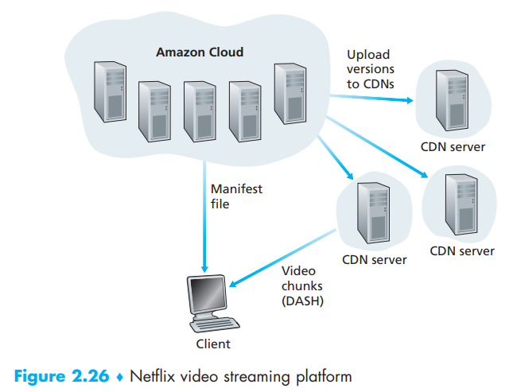
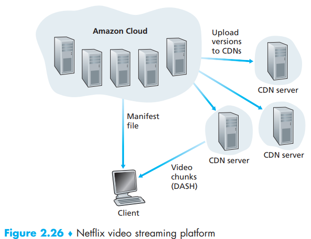

[toc]

# 1. Internet Video

People request the preordered video in the server *on-demand*

Video steam ranging from 100kps to 10Mbps and even more. Luckily videos can be compressed

By far, the most important performance measure for streaming video is **average end-to-end throughput**, where the network must provide an average throughput that is at least as large as the bit rate of the compressed video(we can compress video to multiple version)

# 2. HTTP Streaming and DASH  

HTTP GET request in DASH:

- each video version is stored in the HTTP server, **each with a different URL** and the server has a manifest file for this
- The client **first requests the manifest file** and learns about the various versions. The client then selects one chunk at a time by specifying a
  URL and a byte range in an HTTP GET request message for each chunk
- while downloading chunks, the client also measures the received  bandwidth and runs a rate determination algorithm to select the chunk to request next  

When the amount of available bandwidth is high, the client naturally selects chunks from a high-rate version, and when the available bandwidth is low, it naturally selects from a low-rate version

# 3. Content Distribution Networks

CDNs is designed to solve the drawbacks of a single huge data center

A CDN manages servers in multiple geographically  distributed locations, store all kinds of Web content(including videos), and attempts to direct each user request to a CDN location that will provide the best user experience  

- private CDN: owned by the content provider itself; for example, Google’s CDN distributes YouTube videos
- third-party CDN: distributes content on behalf of multiple content providers; Akamai, Limelight and Level-3 all operate third-party CDNs  

CDNs typically adopt one of two different server placement philosophies:

- *Enter Deep*: deploying server clusters in access ISPs all over the world to get closer to users - Akamai - highly distributed and hard to maintain
- *Bring Home*: building large clusters at a smaller number (for example, tens) of sites - Limelight and others - lower maintenance but higher delay and lower throughput

Once its clusters are in place, the CDN replicates content across its clusters but not all videos (and other content):

> pull strategy: If a client requests a video from a cluster that is not storing the video, then the cluster retrieves the video (from a central repository or from another cluster) and stores a copy locally while streaming the video to the client at the same time  

## CDN Operation

redirect the client’s request to a server in that cluster:

> 1. The user visits the Web page at NetCinema  
> 2. When the user clicks on the link http://video.netcinema.com/6Y7B23V, the user’s host sends a DNS query for video.netcinema.com
> 3. The user’s Local DNS Server (LDNS) relays the DNS query to an authoritative DNS server for NetCinema, which observes the string “video” in the hostname video.netcinema.com. To “hand over” the DNS query to KingCDN, instead of returning an IP address, **the NetCinema authoritative DNS server returns to the LDNS a hostname in the KingCDN’s domain**, for example, a1105.kingcdn.com
> 4. From this point on, the DNS query enters into KingCDN’s private DNS infrastructure. The user’s LDNS then sends a second query, now for a1105.kingcdn. com, and KingCDN’s DNS system eventually returns the IP addresses of a KingCDN content server to the LDNS. It is thus here, within the KingCDN’s DNS system, that the CDN server from which the client will receive its content is specified
> 5.   The LDNS forwards the IP address of the content-serving CDN node to the user’s host
> 6. Once the client receives the IP address for a KingCDN content server, it establishes a direct TCP connection with the server at that IP address and issues an HTTP GET request for the video. If DASH is used, the server will first send to the client a manifest file with a list of URLs, one for each version of the video, and the client will dynamically select chunks from the different versions  
>
> 

## Cluster Selection Strategies

The CDN needs to select an appropriate cluster based on the IP address of the client with following strategies:

- geographically closest
- real-time measurements: delay and loss performance between their clusters and clients - periodically send probes (for example, ping messages or DNS queries) to all of the LDNSs around the world

# 4. Case Study

## Netflix

Amazon cloud do these:

- Content ingestion
- Content processing
- Uploading versions to its CDN

Netflix gets its own private CDN

## YouTube

YouTube employs HTTP streaming, Not only are YouTube videos streamed from server to client over HTTP, but YouTube uploaders also upload their videos from client to server over HTTP. YouTube processes each video it receives, converting it to a YouTube video format and creating multiple versions at different bit rates. This processing takes place entirely within Google data centers  

## Kankan  

Kankan (owned and operated by Xunlei) has been deploying **P2P** video delivery with great success  

If the P2P streaming traffic becomes insufficient, the client will restart CDN connections and return to the mode of hybrid CDN-P2P streaming  

# Translation & Glossary

- Dynamic Adaptive Streaming over HTTP (DASH): HTTP动态自适应流
- manifest file: 清单配置文件
- Content Distribution Networks (CDNs): 内容分发网络