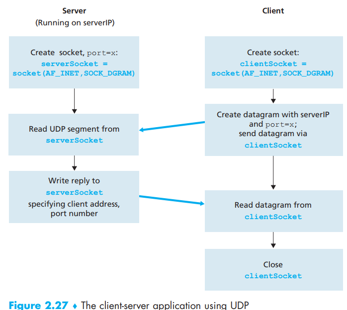
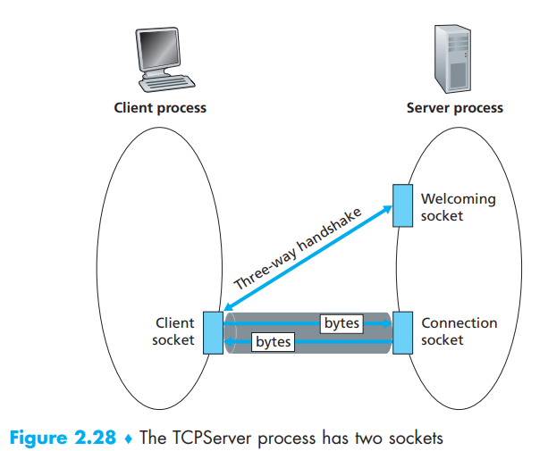
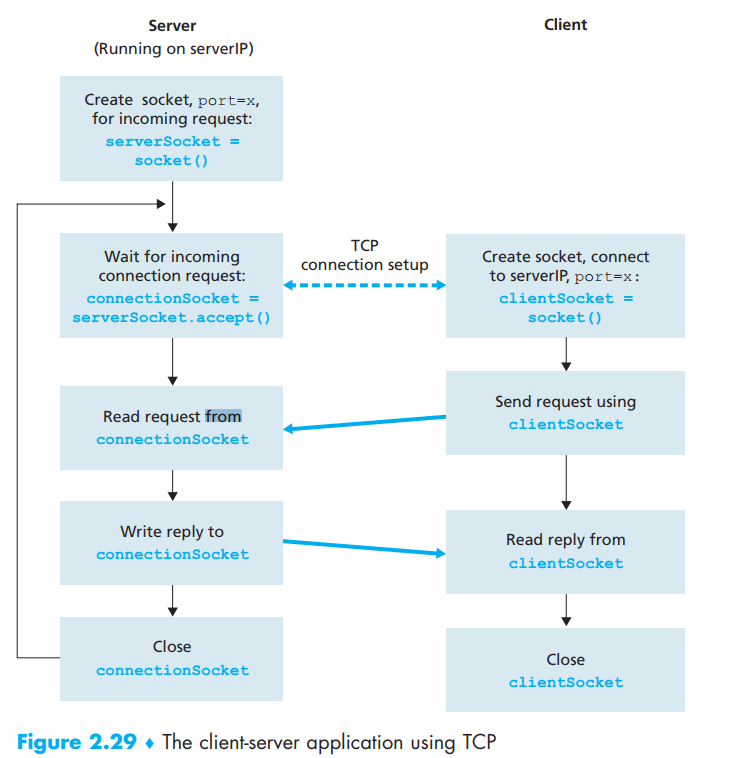

[toc]

The two type of network applications:

- “open”: implementation in this operation is specified in a protocol. For RFC 2616, all server and clients written carefully to satisfy this protocol can communicate with each other
- “proprietary”: other independent developers or so will not be able to develop code that interoperates with this app

In this section we will demonstrate code work as below:

1. The client reads a line of characters from its keyboard and sends the data to the server
2. The server receives the data and converts the characters to uppercase
3. The server sends the modified data to the client
4. The client receives the modified data and displays the line on its screen

# 1. Socket Programming with UDP

Let’s first know how UDP works:

1. Attach a destination address to the packet. 
2. Push the packet of data out of the socket door
3. The Internet route the packet through the Internet to the socket in the receiving process.
4. When the packet arrives at the receiving socket, the receiving process will retrieve the packet through the socket
5. The receiving process inspects the packet’s contents and take appropriate action

The address info UDP attached include IP addresses and ports of both the client and the server, but typically, the source address is done by the underlying operating system instead of UDP application

 # 2. Socket Programming with TCP

Compare with UDP:

- Same: the TCP server must be running as a process before the client attempts t initiate contact
- Different: the server program must have a special socket that welcomes some initial contact from a client process, and only after this special is knocked and answered by the server, the server will create **another** socket for connection

After creating its socket, the client initiates **a three-way handshake** and establishes a TCP connection with the server. The three-way handshake, which takes place within the transport layer, is completely **invisible** to the client and server programs

After the connection is built, it works as a double-way pipe that transmits bytes with reliability

# Translation & Glossary

- 