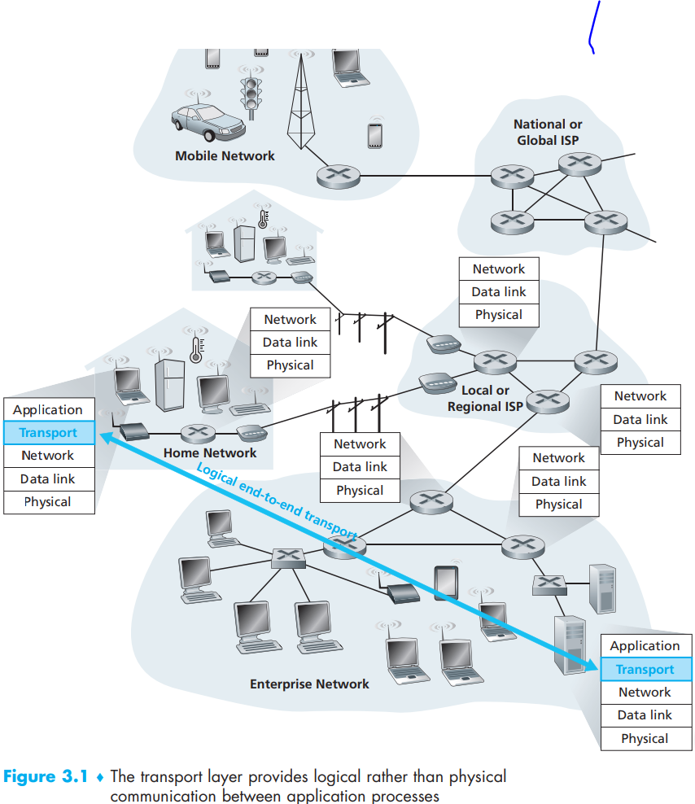

[toc]

A transport-layer protocol provides for logical communication between application processes running on different hosts which makes the hosts running the processes were directly connected instead of hundreds of routers between them. So applications do not to be afraid of the complexity of physical layer

Transport-layer packets, known as segments , are broken from messages in application-layer and then encapsulated within a network-layer packet(datagram) and sent to the destination. And routers that are only in network-layer do not examine the fields of segments

# 1. Relationship Between Transport and Network Layers

- transport-layer: provide logical communication between **processes** on different host
- network-layer: provide logical communication between **hosts**

Also, for other lower layers, transport layer’s ability is constrained such as transmission speed rate, bandwidth etc. However, transport layer can also guarantee the reliable data transfer and encryption when the network layer or other layers can not offer the corresponding service

# 2. Overview of the Transport Layer in the Internet

The ability to extend host-to-host delivery to process-to-process delivery is called transport-layer multiplexing(demultiplexing).

## UDP

Perform **error checking** and **process-to-process** transport those two basic transport layer service without the guarantee of the complete data sent from the host

## TCP

- TCP provides reliable data transfer. Using *flow control*, *sequence numbers*, *acknowledgments*, and *timers* (techniques we’ll explore in detail in this chapter), TCP ensures that data is delivered from sending process to receiving process, **correctly and in order**
- TCP provides **congestion control** that prevents any one TCP connection from swamping the links and routers between communicating hosts with an excessive amount of traffic and TCP strives to give each  connection traversing a congested link an equal share of the link bandwidth by regulating the rate at which the sending sides of TCP connections can send traffic into the network  
