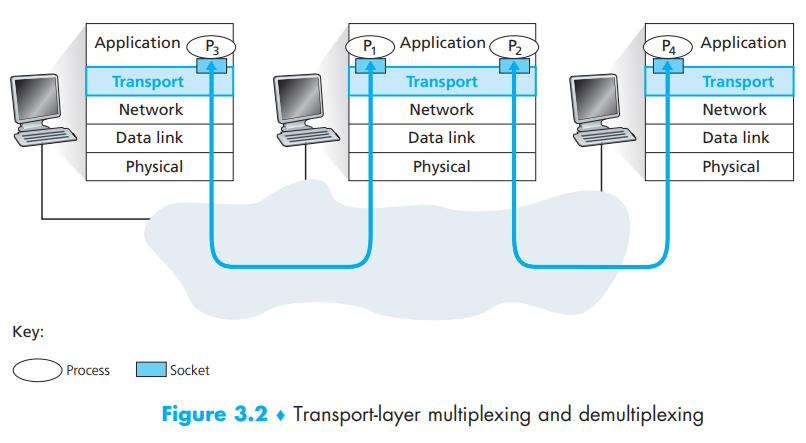
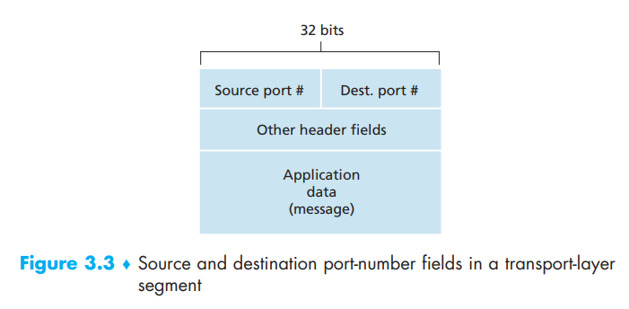
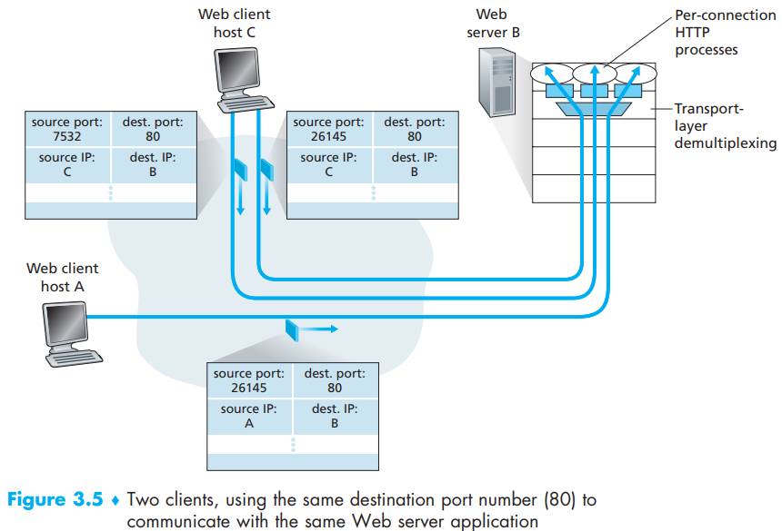

[toc]

- multiplexing: The job of gathering data chunks at the **source host** from different sockets, encapsulating each data chunk with header information (that will later be used in demultiplexing) to create segments, and passing the segments to the network layer
- demultiplexing: The job of delivering the data in a transport-layer segment to the correct socket in the receiving end (by examining the destination port number)

As you can see, there can be many sockets in one process, and each **socket** will be assigned by a port number

There are two requirements for demultiplexing and multiplexing:

1. the sockets have unique identifiers - **source port number field**
2. each segment have special fields that indicate the socket to which the segment is to be delivered - **destination port number field**

Also, you should learn a bit more about port number:

- each port number is a 16-bit number
- ranging from 0 to 65535
- *well-known port numbers* are ranging from 0 - 1023 which are restricted for well known application protocols such as HTTP(80) and FTP(21)

# Connectionless Multiplexing and Demultiplexing

This is for UDP in which the sockets are identified by two-tuple(destination IP address and destination port number)

The source host sends its segments(including destination and source port number), encapsulated by multiplexing and then delivered to the network layer. In the network layer the data will be attached with destination IP address and encapsulated as datagram to send to the client. After the client receive the datagram, it uses demultiplexing to check the port number of the segments and send each to its destination port

During this whole time, the UDP will send the segments from different IP address or port numbers to the same socket due to the two-tuple socket markup

# Connection-Oriented Multiplexing and Demultiplexing

This is for TCP in which the sockets are identified by four-tuple(source IP address, source port number, destination IP address and destination port number)

The procedure is nearly the same with UDP. However, during demultiplexing (recall in chapter 2 the TCP listens to a single port and then distributed segments to different sockets) the TCP will deliver segments in different source IP address or source port number to different socket. Or we say, only perfectly matched four-tuple will be delivered to the same socket (each socket has its own four-tuple)

In a relatively rare situation, two hosts(A, C) send data to B at the same time in the same port(26145). In this case, TCP will still demultiplexing the segments from those 2 segments to **different sockets**

# Web Servers and TCP

Here we will further discuss the situation in Web Servers

When a web server listens on port 80 for all HTTP connections, it does not assign a new socket for correspondence. Instead, the web server usually uses one process while creates  a new **thread **with a new connection socket for each new client connection.

Under the circumstance of web servers, non-persistent TCP connection can create a hell of burden for web servers as it constantly initiate and close TCP connection

# Translation & Glossary

- multiplexing: 多路复用
- demultiplexing: 多路分解