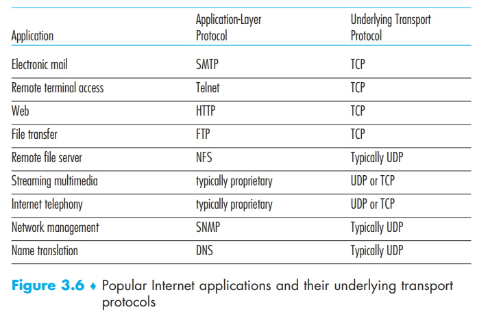
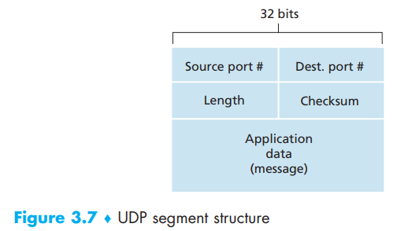
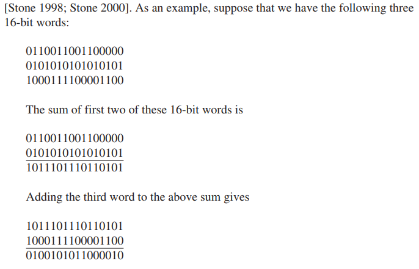

[toc]

UDP does the least as a protocol can do (nearly nothing): UDP **takes messages from the application process**, **attaches source and destination port number fields for the multiplexing/demultiplexing service**, **adds two other small fields**, and **passes the resulting segment to the network layer**

Because UDP has no handshake in it, we refer to UDP as *connectionless*. 

DNS is an example of an application-layer protocol that typically uses UDP. Here are reason to choose UDP over TCP:

- *Finer application-level control over what data is sent, and when*: UDP immediately packages the data and send it to the network layer without the possible interference of *congestion control* in TCP; And TCP will also continue to resend a segment until the receipt of the segment has been acknowledged by the destination, regardless of how long reliable delivery time is — for real time app, they’d rather choose UDP with some functionality implemented rather than time-costing TCP
- *No connection establishment*: UDP does not introduce any delay to establish a connection — for DNS, it will be much slower to run TCP; for Chrome, it chooses to use the QUIC protocol (Quick UDP Internet Connection) with implemented reliability
- *No connection state*: TCP maintains connection state in the end systems. This connection state includes receive and send buffers, congestion-control parameters, and sequence and acknowledgment number parameters. UDP give shit to all those and do not keep state — for this simplicity, servers can connect more UDP clients than TCP clients
- *Small packet header overhead*: UDP 8 bytes of overhead VS TCP’s 20 bytes header

Also due the lack of congestion control in UDP, the Internet may suffer a high congestion level and cause more data lose in UDP

# 1. UDP Segment Structure (RFC 768)

- Source port - 2 bytes
- Destination port - 2 bytes
- Length - 2 bytes: number of bytes in the UDP segment (header plus data)
- Checksum - 2 bytes

# 2. UDP Checksum

Provides error detection

Just know that the final result for checksum is upside down so we can deal with overflow and on the receiver side, it can sums up all words (including checksum) so if the result is 1111111111111111, then nothing wrong

UDP’s checksum satisfy the **end-end principle** as the layers below may not guarantee error checking and may cause bit error in occasion (router buffer)

So what will happen if UDP detects sth wrong? Nothing. Some will discard the polluted segment or send it to the application without any warning 

# Translation & Glossary

- end-end principle: 端对端原则