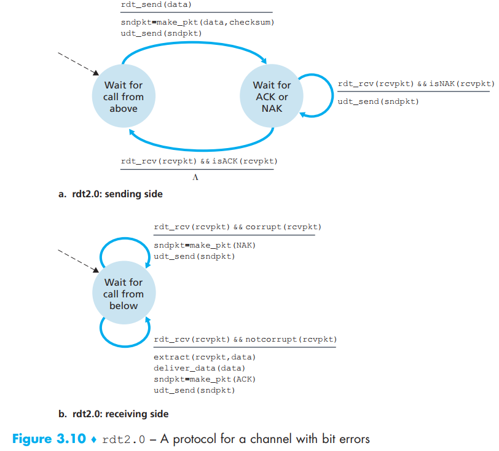
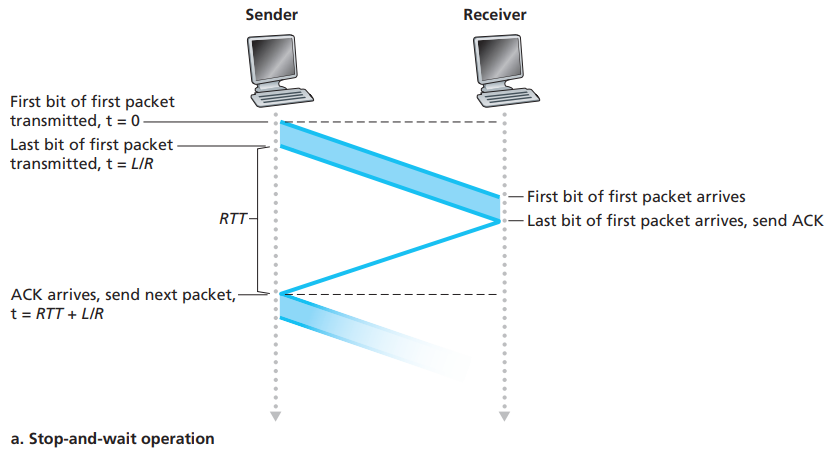
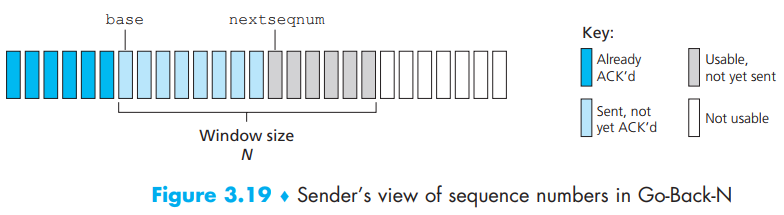

[toc]

Key words: sequence numbers, cumulative acknowledgments, checksums, and a timeout/retransmit operation

# 1. Building a Reliable Data Transfer Protocol

Series of protocol, each one becoming more complex, arriving at a flawless, reliable data transfer protocol

Now and alter we will use FSMs to represent those procedures

## Reliable Data Transfer over a Perfectly Reliable Channel: rdt1.0

There are different FSMs for sender and receiver and it’s important for us to identify their initial state

In this simple protocol, no error will happen as we assume that the receiver is able to receive data as fast as possible.

> The sending side of rdt simply accepts data from the upper layer via the rdt_send(data) event, creates a packet containing the data (via the action make_pkt(data)) and sends the packet into the channel. In practice, the rdt_send(data) event would result from a procedure call (for example, to rdt_send()) by the upper-layer application.
>
> On the receiving side, rdt receives a packet from the underlying channel via the rdt_rcv(packet) event, removes the data from the packet (via the action extract (packet, data)) and passes the data up to the upper layer (via the action deliver_data(data)). In practice, the rdt_rcv(packet) event would result from a procedure call (for example, to rdt_rcv()) from the lowerlayer protocol.  

## Reliable Data Transfer over a Channel with Bit Errors: rdt2.0

Bits error usually comes from the physical components and we use ARQ protocols to solve the problem from error messages

ARQ (Automatic Repeat reQuest) protocols need abilities required below：

- *Error detection*: we need to know that these techniques require that extra bits (beyond the bits of original data to be transferred) be sent from the sender to the receiver; these bits will be gathered into the packet **checksum **field of the rdt2.0 data packet.
- *Receiver feedback*: rdt2.0 protocol will similarly send ACK and NAK packets back from the receiver to the sender. In principle, these packets need only be one bit long; for example, a 0 value could indicate a NAK and a value of 1 could indicate an ACK
- *Retransmission*: A packet that is received in error at the receiver will be retransmitted by the sender

When the sender is in the **wait-for-ACK-or-NAK state**, it **cannot** get more data from the upper layer. Thus, the sender will not send a new piece of data until it is sure that the receiver has correctly received the current packet, so protocols such as rdt2.0 are known as **stop-and-wait** protocols  

The flaw is: if an ACK or NAK is corrupted, the sender has no way of knowing whether or not the receiver has correctly received the last piece of transmitted data. Now we will show you some situations for this problem

- If the packet is not recognizable, send back one. If corrupted again, then another and another one …
- Add enough big enough checksum so the sender could repair the ACK or NAK message
- The sender resend the packet and then confuses the receiver cause it doesn’t know it’s a new data or a retransmission

A simple solution (TCP) is to add a new field to the data packet and have the sender number its data packets by putting a **sequence number** into the field. The receiver then need only check this sequence number to determine whether or not the received packet is a retransmission

Now we can show our rdt2.1:

Now let’s cut the loose of NAK. If we give another ACK for the packet last corrected received, then the sender will receive the **duplicate ACKs** and know that the later packet needs retransmit. So see rdt2.2:

## Reliable Data Transfer over a Lossy Channel with Bit Errors: rdt3.0

After solving the problem of corrupting bits using retransmission, now let’s consider that there could be the loss of packets:

- how do we detect packet loss
- how do we solve packet loss

The second question question can be solve as a whole loss of bits so we can use all methods in rdt2.2 to solve this problem. Now the pressure comes to the first question

To use retransmission, we will set up a **countdown timer** this time. So now our sender will need to do these:

- start the timer each time a packet (either a first-time packet or a retransmission) is sent
- respond to a timer interrupt (taking appropriate actions)
- stop the timer

Now we can see the bigger picture:

Note:

- a receive time for a packet is necessarily later than the send time for
  a packet as a result of transmission and propagation delays. So if the sender receive a ACK during the time waiting for a call, it re-waits

- add time out when waiting  for ACK
- protocol rdt3.0 is sometimes known as the **alternating-bit protocol**(between 0 and 1)

# 2. Pipelined Reliable Data Transfer Protocols

First let’s see the time cost of stop-and-wait policy:

So now we have to abandon the stop-and-wait and embrace pipelining:

- The range of sequence numbers must be increased, since each in-transit packet (not counting retransmissions) must have a unique sequence number and there may be multiple, in-transit, unacknowledged packets
- The sender and receiver sides of the protocols may have to buffer more than one packet. Minimally, the sender will have to buffer packets that have been transmitted but not yet acknowledged
- The range of sequence numbers needed and the buffering requirements will depend on the manner in which a data transfer protocol responds to lost, corrupted, and overly delayed packets. Two basic approaches   toward pipelined error recovery can be identified: **Go-Back-N and selective repeat**  

# 3. Go-Back-N (GBN)

In a 3 Go-Back-N (GBN) protocol, the sender is allowed to transmit packets without waiting under the maximum number, N (related to congestion control). And we define some other params:

- base: the sequence number of the oldest unacknowledged packet
- nextseqnum: the smallest unused sequence number 

And then we can get this picture:

Now we can N both include the unacknowledged and ready in use packets in the sender. We often refer N to **window size** so GBN protocol **sliding-window protocol**

We call those *extended FSM* as we added variables for *base* and *nextseqnum* along with these related operations. But as there is only one state for both senders and receivers, they are rather very simple

The GNB sender must respond to 3 types of events:

- *Invocation from above*

  > If the window is not full, a packet is created and sent, and variables are appropriately updated. If the window is full, the sender simply returns the data back to the upper layer, an implicit indication that the window is full. The upper layer would presumably then have to try again later. In a real implementation, the sender would more likely have either buffered (but not immediately sent) this data, or would have a synchronization mechanism (for example, a semaphore or a flag) that would allow the upper layer to call rdt_send() only when the window is not full.  

- *Receipt of an ACK*

  > an acknowledgment for a packet with sequence number n will be taken to be a cumulative acknowledgment, indicating that all packets with a sequence number up to and including n have been
  > correctly received at the receiver  

- *A timeout event*

  > The protocol’s name, “Go-Back-N,” is derived from the sender’s behavior in the presence of lost or overly delayed packets. As in the stop-and-wait protocol, a timer will again be used to recover from lost data or acknowledgment packets. If a timeout occurs, the sender resends all packets that have been previously sent but that have not yet been acknowledged. Our sender uses only a single timer, which can be thought of as a timer for **the oldest transmitted but not yet acknowledged packet**. If an ACK is received but there are still additional transmitted but not yet acknowledged packets, the timer is restarted. If there are no outstanding, unacknowledged packets, the timer is stopped

Also, recall that the corrupt of the packet is also checked by two ACKs for the same packet.

About receiver we need to know that the receiver in GBN discard all out-of-order packet in order for **simplicity of buffering** (only for *expectedseqnum*) and at the cost of **more retransmission required**:

Above all, in such **event-based programming**, the various procedures are called (invoked) either by other procedures in the protocol stack, or as the result of an interrupt. We can see the main three types of events above

# 4. Selective Repeat (SR)

The SR receiver will acknowledge a correctly received packet whether or not it is in order. **Out-of-order packets are buffered** until any missing packets (that is, packets with lower sequence numbers) are received, at which point a batch of packets can be delivered **in order to the upper layer**:

SR sender events and actions:

1. **Data received from above.** When data is received from above, the SR sender checks the next available sequence number for the packet. If the sequence number is within the sender’s window, the data is packetized and sent; otherwise it is either buffered or returned to the upper layer for later transmission, as in GBN
2. **Timeout**. Timers are again used to protect against lost packets. However, each packet must now have its **own logical timer**, since only a single packet will be transmitted on timeout. A single hardware timer can be used to mimic the operation of multiple logical timers
3.  **ACK received**. If an ACK is received, the SR sender marks that packet as
   having been received, provided it is in the window. If the packet’s sequence number is equal to send_base, the window base is moved forward to the unacknowledged packet with the smallest sequence number. If the window moves and there are untransmitted packets with sequence numbers that now fall within the window, these packets are transmitted  

SR receiver events and actions:

1. . **Packet with sequence number in [rcv_base, rcv_base+N-1]is correctly received**. In this case, the received packet falls within the receiver’s window and a selective ACK packet is returned to the sender. If the packet was not previously received, it is buffered. If this packet has a sequence number equal to the base of the receive window (rcv_base in Figure 3.22), then this packet, and any previously buffered and consecutively numbered (beginning with rcv_base) packets are delivered to the upper layer. The receive window is then moved forward by the number of packets delivered to the upper layer. As an example in the picture later,when a packet with a sequence number of rcv_base=2 is received, it and packets 3, 4, and 5 can be delivered to the upper layer
2. **Packet with sequence number in [rcv_base-N, rcv_base-1]is correctly received**. In this case, an ACK must be generated, even though this is a packet that the receiver has previously acknowledged
3. Otherwise. Ignore the packet

Now we know that the receiver re-acknowledges (rather than ignores) already received packets with certain sequence numbers below the current window base (or the sender window will never forward!) as the sender and receiver **will not always have an identical view** of what has been received correctly and what has not

We can clearly know that **sequence numbers can be reused** the window size must be **less than or equal to half the size of the sequence number space** for SR protocols

> With packet reordering, the channel can be thought of as essentially buffering packets and spontaneously emitting these packets at any point in the future. Because sequence numbers may be reused, some care must be taken to guard against such duplicate packets. The approach taken in practice is to ensure
> that a sequence number is not reused until the sender is “sure” that any previously sent packets with sequence number x are no longer in the network. This is done by assuming that a packet cannot “live” in the network for longer than some fixed maximum amount of time. A maximum packet lifetime of approximately three minutes is assumed in the TCP extensions for high-speed networks [RFC 1323]  

# Translation & Glossary

- unidirectional data transfer: 单向数据传输
- bidirectional data transfer: 双向数据传输
- finite-state machine(FSM): 有限状态机
- Automatic Repeat reQuest: 自动重发请求
- ACK: positive acknowledgement
- NAK: negative acknowledgement
- alternating-bit protocol: 交替位协议
- cumulative acknowledgment: 累计式应答

