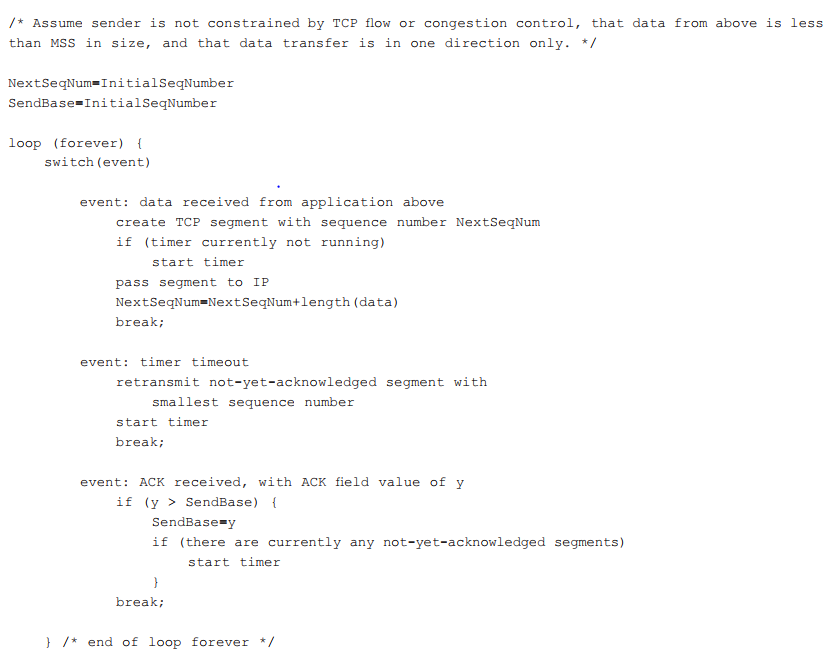

[toc]

# 1. The TCP Connection  

The TCP connection is a logical one, which means layers below are totally oblivious cause TCP connections see datagrams instead of connections

TCP is connection-oriented because it uses **three-way handshakes** (preliminary segments to each other to establish *parameters* of the ensuring data transfer). Now let’s see two key features for build-up TCP connections:

- **full-duplex service**: both sides can transmit data to each other in the same time
- **point-to-point**: one receiver corresponds to one receiver. Thus multi-casting is impossible in TCP

Visualize those and we will see more:

Remember those procedures can work both way. Aside from the buffers, segments and sockets etc, there are parameters that not allocated to network components:

- maximum segment size (MSS): The maximum amount of data that can be grabbed from the send buffer and placed in a segment into network layer (not including TCP header!)
- maximum transmission unit (MTU): the length of the largest link-layer frame that can be sent by the local sending host. 

Having those parameters, we can ensure a TCP segment (chunk of data + TCP header) plus IP header will fit into MTU

# 2. TCP Segment Structure

- 32-bit *sequence number field* and 32-bit *acknowledgement number field*: implementing reliable data transfer
- 16-bit *receive window field*: flow control
- 4-bit *header length field*: specifies the length of the TCP header in 32-bit words
- *options field*: used when a sender and receiver negotiate the MSS or as a window scaling factor for use in high-speed networks (A time-stamping option is also defined)
- 6-bit *flag field*:
  - ACK bit: indicate that the value carried in the acknowledgment field is valid (contains an acknowledgement for a segment that has been successfully received)
  - RST, SYN, FIN bits: used for connection setup and teardown
  - CWR, ECE bits: used in explicit congestion notification
  - PSH bit: indicate that the receiver should pass the data to the upper layer immediately; URG: the sending-side upper-layer entity has marked as ‘urgent’. Those are not used

## Sequence Numbers and Acknowledgment Numbers

The sequence number for a segment is **the byte-stream number of the first byte in the segment**, indicating that sequence numbers are over the stream of transmitted bytes

As for acknowledgement numbers, the acknowledgment number that *Host A puts in its segment is the sequence number of the next byte Host A is expecting from Host B* and they provide **cumulative acknowledgement** when A want to get following segments or intermediate segments from B. However, when A receives unordered segments, it does nothing and leave the job to programmers with commonly two choices:

- the receiver immediately discards out-of-order segments (which, as we discussed earlier, can simplify receiver design)
- the receiver keeps the out-of-order bytes and waits for the missing bytes to fill in the gaps

Notice that in truth, both sides of a TCP connection randomly choose an initial sequence number to avoid the mix up of already turned down TCP connection segments with currently existing TCP connection 

# 3. Round-Trip Time Estimation and Timeout

TCP use *SampleRTT* to estimate the RTT:

- SampleRTT is being estimated for only one of the transmitted but currently unacknowledged segments
- TCP only measures SampleRTT for segments that have been transmitted once (retransmitted segment will not be computed)

Easily  we can see the fluctuation of time in SampleRTT. TCP introduce us the *EstimatedRTT* to solve this problem:

$EstimatedRTT = (1 – α) * EstimatedRTT + α * SampleRTT$

The weight above is recommended to be 0.125, so:

$EstimatedRTT = 0.875 * EstimatedRTT + 0.125 * SampleRTT$

Anther measurement for variability will also be introduced:

$DevRTT = (1 – β) * DevRTT + β * | SampleRTT – EstimatedRTT |: β = 0.25$

## Setting and Managing the Retransmission Timeout Interval

One formula will combine the consideration of fluctuation and dynamic margin (variability) and give us the proper time to measure timeout:

$TimeoutInterval = EstimatedRTT + 4 * DevRTT  $

An initial TimeoutInterval value of 1 is recommended. Also, when a timeout occurs, the value of TimeoutInterval is doubled to avoid a premature timeout occurring for a subsequent segment that will soon be acknowledged. However, as soon as a segment is received and EstimatedRTT is updated, the TimeoutInterval is again computed using the formula above

# 4. Reliable Data Transfer

IP protocol in network-layer can come up with all kinds of problems but TCP can provide this reliable data transfer that makes everything possible to transmit the data in the same content and order from the sender to the receiver using only **a single timer** (although there could be many segments not recognized at this time)

We can clearly see the sender will deal with 3 main situations, and there is parameter we need to explain:

- the timer count down based on *TimeoutInterval*
- the SendBase = the sequence number of the oldest no-yet-acknowledged segment. Thus, *SendBase-1* is the sequence number of the last bytes before byte number y.

One very important part is the timer. It it helpful to think of the timer as being associated with the oldest unacknowledged segment as there is only one timer in a TCP component

Also notice that y in TCP works as *cumulate* flag. A bigger y received means that all former segments are received. Consider why and if you understand this then you can walk through  next chapters

## A Few Interesting Scenarios

> Host A sends one segment to Host B. Suppose that this segment has sequence number 92 and contains 8 bytes of data. After sending this segment, Host A waits for a segment from B with acknowledgment number 100. Although the segment from A is received at B, the acknowledgment from B to A gets lost. In this case, the timeout event occurs, and Host A retransmits the same segment. Of course, when Host B receives the retransmission, it observes from the sequence number that the segment contains data that has already been received. Thus, TCP in Host B will discard the bytes in the retransmitted segment.

This figure in fact give us a limited form of congestion control. We see in the picture that the timeout interval stays the same. But actually it’s  not the case, as every time the ACK is not received, the *TimeoutInterval* will also slowly increatse to avoid packets loss. But keep in mind that *TimeoutInterval* is always the most recent values of EstimatedRTT and DevRTT

TCP acts more politely, with each sender retransmitting after longer and longer intervals to avoid consistent retransmitting causing more serious congestion. When a segment is lost, this long timeout period forces the sender to delay resending the lost packet, thereby increasing the end-to-end delay  

## Fast Retransmit

Now let’s see what a receiver would react

Now, let’s see what would happen if duplicate ACKs is more than 2 (notice the receiver’s reaction):

At last let’s implement things below for the 3rd event in the sender:

So another difference between TCP and UDP is that TCP takes 3 duplicate ACKs to start a fast retransmit without start the timer like what UDP did

## Go-Back-N or Selective Repeat?

SR, because GBN will retransmit everything after the oldest unacknowledged while TCP will buffer not-in-order segments and only retransmit the missing piece at once

# 5. Flow Control

Flow control is a speed matching service—matching the rate at which the sender is sending against the rate at which the receiving application is reading so to avoid the sender overflowing the receiver’s buffer

The receiver will keep track of those two variables:

- *LastByteRead*: the number of the last byte in the data stream read from the buffer by the application process in B  
- *LastByteRcvd*: the number of the last byte in the data stream that has arrived from the network and has been placed in the receive buffer at B  

So to avoid overflowing:

*LastByteRcvd – LastByteRead <= RcvBuffer*

Now the receiver window can know the amount of spare room in the buffer, known as *rwnd*:

*rwnd = RcvBuffer - [LastByteRcvd - LastByteRead]*

So we know that *rwnd* is dynamic. Initially, Host B sets *rwnd = RcvBuffer*, and then set **the receive window field** of every segment it sends to A. And then out can finally check how to avoid overflow:

*LastByteSent – LastByteAcked <= rwnd*

A minor problem is that if the buffer in the receiver side is full and then send rwnd=0 to the sender and then lately emptied the buffer so no segment will be sent to A. Now that A might never send any other bit any more. So TCP will always send at least 1 data byte when B’s receive window is zero

And it’s **because** without this flow control so that UDP may lost data due to **overflow**

# 6. TCP Connection Management

When a TCP client wants to communicate with TCP server with **three-way handshakes**:

1. The client-side TCP send a SYN segment (empty data, SYN=1 and a random *client_isn* as a sequence number)
2. The server receives the SYN segment and then allocate buffers and variables to the connection. Then it sends a **SYNACK segment** to the client (empty data, SYN=1, acknowledgement field=client_isn+1 and a random *server_isn*), connection granted
3. Upon receiving the SYNACK segment, the client also allocate buffers and variables to the connection. Connection available. Then it send another segment (acknowledgment field=server_isn+1, can carry client-to-server payload) to the server

Now they can connect and transmit data segments between each other. Let’s see more about what will happen if the connection should be shout down:

Every FIN segment is set FIN=1. After two-way acknowledgement is down, the connection will be closed but, but, the connection is not officially closed after an interval. See states sequence below:

Average time for TIME_WAIT state to be closed is about 30 seconds

As for the server side, there is no such interval for server to be closed:

We can clearly see what happens in the client and the server. But all above discussions is built on the fact that both sides are ready (have the sockets and IP address to communicate to each other). What if, let’s say, the Web server on port 80 is shut down or do not even exist, what will happen then ? 

- For TCP: TCP send back with a special reset segment to the source with RST=1 to tell the source that do not resend any segments
- For UDP: the host will sends a special ICMP datagram

# Translation & Glossary

- exponential weighted moving average (EWMA): 指数加权移动平均