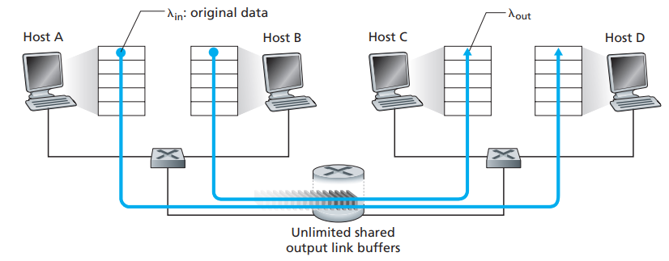
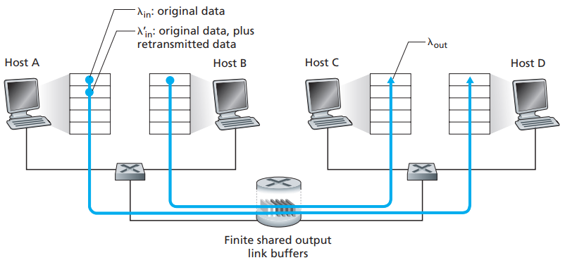

[toc]

First, this is a chapter that matches top10 most important problems, and then, you can continue

# 1. The Causes and the Costs of Congestion

Each scenario will be increasingly harder

## Scenario 1: Two Senders, a Router with Infinite Buffers

Now we assume there are two connections between Host A, B, C and D and they share the same router with a shared outgoing link of capacity R along with a unlimited shared output link buffer (thus no packets will be lost). So we can get picture below:

So there a upper limit for $\lambda_{out}$ (we should assume that Host A is also sending data to Host B in the link). What surprise us is the delay shown below:

Now, as the capacity of the transmission rate nearly reaches $R{/} 2$ (thus the max throughput capacity of the shared link reaches R), the delay will easily go up to infinity - even in this most simple situation

## Scenario 2: Two Senders and a Router with Finite Buffers

Now let’s see something a little bit more realistic - now data can be lost thus retransmission is needed and the buffer is finite:

If the Host A is clever enough that it never sends data when the buffers are full:

What if the Host A is not clever enough. More specifically, out of 0.5R units of data transmitted, 0.333 R bytes/sec are original and 0.166 bytes/sec are retransmitted:

We see here another cost of a congested network— *the sender must perform retransmissions in order to compensate for dropped (lost) packets due to buffer overflow*. Notice there there is another kind of lost packets - *Here then is yet another cost of a congested network—unneeded retransmissions by the sender in the face of large delays may cause a router to use its link bandwidth to forward unneeded copies of a packet*:

Here we assume that each packet will be retransmitted due to the large delay so only half of them are useful

## Scenario 3: Four Senders, Routers with Finite Buffers, and Multihop Paths

Finally, we can see a network with actual net. In this case, routers will compete with each other, and the winner will be the one with the biggest transmission rate. So next picture what will happen if the traffic with Host A to Host C gets larger and the Host B to Host D gets larger faster:

We can see that as the traffic in this network increasing badly, the throughput of $\lambda_{out}$ could be 0. *So here we see yet another cost of dropping a packet due to congestion—when a packet is dropped along a path, the transmission capacity that was used at each of the upstream links to forward that packet to the point at which it is dropped ends up having been wasted*

# 2. Approaches to Congestion Control

- End-to-end congestion control: for example, TCP will decreases its window size accordingly to the segments loss
- Network-assisted congestion control: the router will setback the explicit feedback the sender/receiver regarding the congestion state of the network. For example, Available Byte Rate(ABR) congestion control can make a router informs the sender of the maximum host sending rate it can support

Normally TCP and IP protocol only supports end-to-end congestion control, but now some of them can adopt network-assisted congestion control as well. There are currently 2 ways to provide feedback:

- Network feedback via receiver
- Direct network feedback

# Translation & Glossary