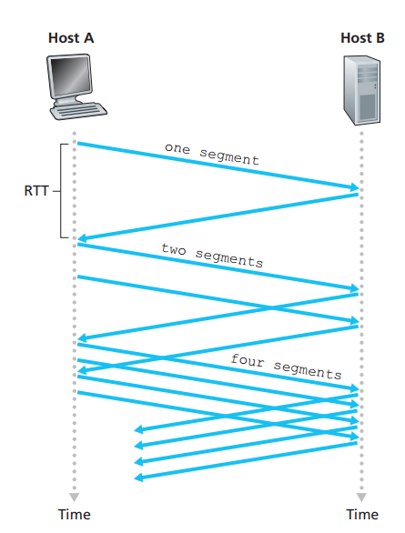
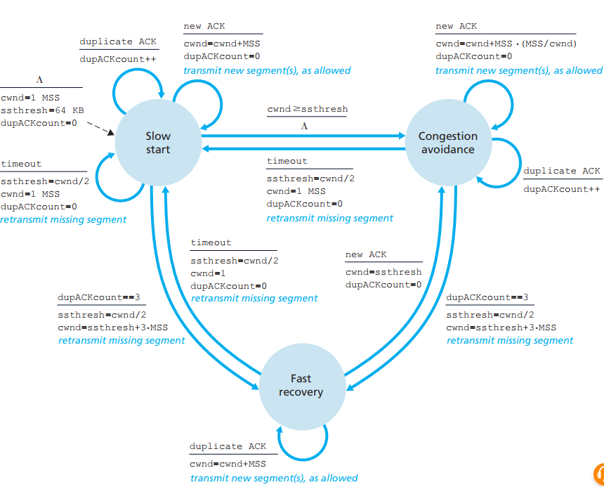
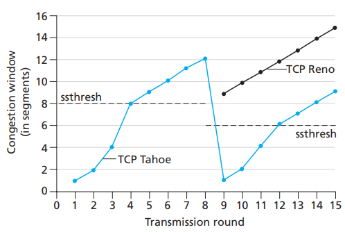
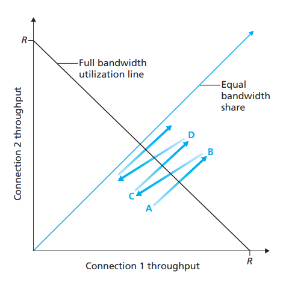
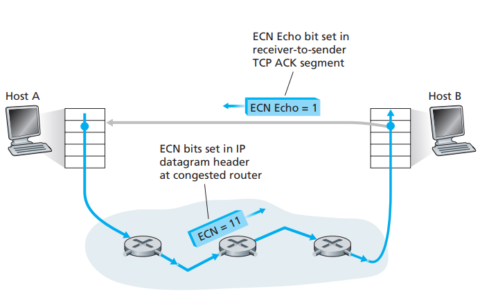

[toc]

As the IP layer provides no explicit feed back to the end systems regarding network congestion, TCP must use **end-to-end** congestion control so TCP will raise the transmission rate if there is no congestion and decrease the speed rate if it detects congestion control.

So:

1. how does a TCP sender limit the rate at which it sends traffic into its connection?
2. how does a TCP sender perceive that there is congestion on the path between itself and the destination?
3. what algorithm should the sender use to change its send rate as a function of perceived end-to-end congestion?

## how does a TCP sender limit the rate at which it sends traffic into its connection?

TCP use another variable congestion window (*cwnd*):

LastByteSent - LastByteAcked $\leq \min \{\text { cwnd, } \quad \text { rwnd }\}$ the sender’s send rate is roughly *cwnd/RTT bytes/sec*. By adjusting the value of cwnd, the sender can therefore adjust the rate at which it sends data into its connection.

Yeah, simple. But what should TCP do if the network is not congested so how can TCP knows how to increase the transmission?:

- *A lost segment implies congestion, and hence, the TCP sender’s rate should be decreased when a segment is lost*. See “loss event” below
- *An acknowledged segment indicates that the network is delivering the sender’s segments to the receiver, and hence, the sender’s rate can be increased when an ACK arrives for a previously unacknowledged segment*
- *Bandwidth probing*: TCP increases its transmission rate to probe “loss event”, and then probe again to probe if he network congestion changed,  and it keep doing thi

## how does a TCP sender perceive that there is congestion on the path between itself and the destination?

If the event will occur, simply “loss event” which could be **three duplicate ACKs** or a **timeout **in the sender

If the event is not triggered (the packets is acknowledged but the congestion exists), then TCP will increase the congestion window proportionally with the speed of the receiving acknowledged segments. This is also called **self-clocking**

## what algorithm should the sender use to change its send rate as a function of perceived end-to-end congestion?

**TCP congestion-control algorithm** has three major components:

1. slow start
2. congestion avoidance
3. fast recovery

### Slow Start

In this **slow-start** state, the value of cwnd begins at **1 MSS** and increases by 1 MSS every time a transmitted segment is **first acknowledged**

So when will this slowly increasing stop?

- if there is al loss event (congestion) indicated by a **timeout**, the TCP sender sets the value of cwnd to 1 and begins the slow start process anew
- another variable *sshresh* (slow start threshold) to *cwnd/2*, half of the value of the congestion window value when **congestion was last detected**. So when cwnd restarts from 1 and equals to *sshresh*, slow start ends and TCP transitions into *congestion avoidance mode*
- when three duplicate ACKs are detected, the TCP performs a fast retransmit and enters the *fast recovery state*. The *ssthresh* will be cut to half and renew cwnd (the same with slow state). But in fact the *fast recovery state* is not required, you can directly went into slow start (TCP Tahoe)

### Fast Recovery

As we know that fast recovery is not certainly required, but there is still great improvement *fast recovery* can make:

## retrospective - wrap up

TCP congestion control is often referred as **additive-increase, multiplicative-decrease (AIMD)** and it gives the “saw tooth” behavior as below:

After TCP Reno, TCP Vegas attempts to avoid congestion while maintaining good throughput:

1. detect congestion in the routers between source and destination before packet loss occurs
2. lower the rate linearly when the imminent packets loss is detected

## Macroscopic Description of TCP Throughput

Denote by W the value of w (window size) when a loss event occurs. The network drops a packet from the connection when the rate increases to W/RTT; the rate is then cut in half and then increases by MSS/RTT every RTT until it again reaches W/RTT. This process repeats itself over and over again. So easily we can see:

average throughput of a connection $=\frac{0.75 \cdot W}{R T T}$

## TCP Over High-Bandwidth Paths

Using formula: average throughput of a connection $=\frac{1.22 \cdot M S S}{R T T \sqrt{L}}$ we can compute that:

> in order to achieve a throughput of 10 Gbps, today’s TCP congestion-control algorithm can only tolerate a segment loss probability of 2 · 10–10 (or equivalently, one loss event for every 5,000,000,000 segments)—a very low rate. This observation has led a number of researchers to investigate new versions of TCP that are specifically designed for such high-speed environments; see [Jin 2004; Kelly 2003; Ha 2008; RFC 7323] for discussions of these efforts.  

# 1. Fairness

If the condition is ideal and stays the same for K TCP clients that share a common link with bottleneck speed R, each of the TCP client has a transmission rate of R/K. The demonstration for two TCP clients is below:

But in the real world, the TCP client with less RTT tends to grab more bandwidth to transmit segments

## Fairness and UDP

UDP gives shit about fairness, it just transmits data as much as it can. So there could be circumstances that UDP crowded out TCP connections

## Fairness and Parallel TCP Connections

Applications (many browsers) with Parallel TCP connections will attain more bandwidth (the more parallel connections, the more bandwidth)

# 2. Explicit Congestion Notification (ECN): Network-assisted Congestion Control

IP datagram uses two bits for ECN while TCP ACK segment use one bit for ECN (1 for congestion). The definition of congestion is decided by the network operator and is only recommended by RFC 3168 for **persistent connection**

The TCP sender, in turn, reacts to an ACK with an ECE (ECN Echo) congestion indication by halving the congestion window, as it would react to a lost segment using fast retransmit, and sets the *CWR (Congestion Window Reduced)* bit to 1 in the header of the next transmitted TCP sender-to-receiver segment  

# Translation & Glossary

-  Explicit Congestion Notification: 显式拥塞通知
- Congestion Window Reduced: 