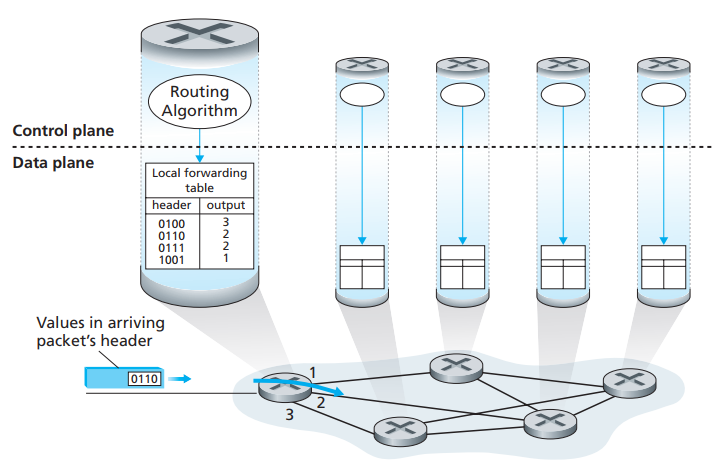
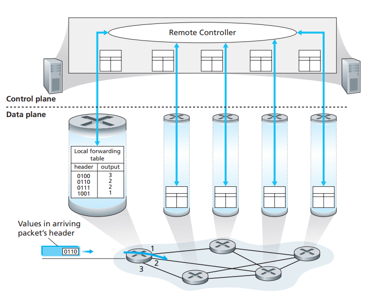

[toc]

# 1 Forwarding and Routing: The Data and Control Planes

Two very important functions the network layer would do:

- *forwarding* (in data plane)
- *routing* (in control plane)

Another key element in every network router is its **forwarding table**. 

A router forwards a packet by examining the value of one or more fields in the arriving packet’s header, and then using these header values to index into its forwarding table and then decide what to send to

## Control Plane: The Traditional Approach

If you are thinking how a router’s forwarding tables are configured in the first place

The routing algorithm function in one router communicates with the routing algorithm function in other routers to compute the values for its forwarding table  

**All networks have both a forwarding and a routing function**

## Control Plane: The SDN Approach

The remote controller might be implemented in a remote data center with high reliability and redundancy, and might be managed by the ISP or some third party. How might the routers and the remote controller communicate? By exchanging messages containing forwarding tables and other pieces of routing information.  

As we can see: the network is “software-defined” because the controller that computes forwarding tables and interacts with routers is implemented in software  

# 2. Network Service Model

The network service model defines the characteristics of end-to-end delivery of packets between sending and receiving hosts:

- Guaranteed delivery
- Guaranteed delivery with bounded delay
- In-order packet delivery
- Guaranteed minimal bandwidth
- Security

Above is only a partial list of services that a network could possibly provide

However, the networks provides a single service, known as **best-effort service**. With best-effort service, packets are neither guaranteed to be received in the order in which they were sent, nor is their eventual delivery even guaranteed. Of cause you can implement different network architectures to provide other functionality (such as network architecture)

## An Overview of Chapter 4

# Translation & Glossary

- data plane: 数据层
- control plane: 控制平面（控制层）
- software-defined networks (SDN): 软件定义网络

