[toc]

Four router components can be identified:

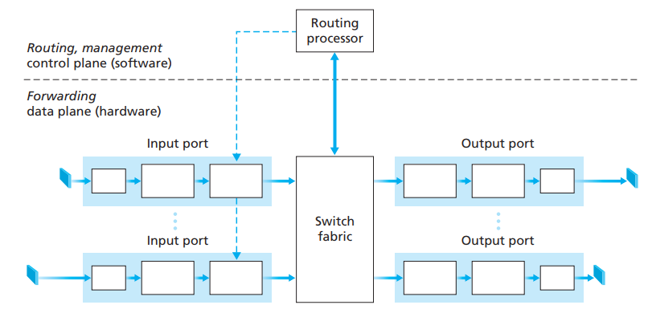

- *Input ports*: an **input port** performs the physical layer function of terminating an incoming physical link at a router; a lookup function is also performed at the input port; control packets (like packets carrying routing protocol information) are forwarded from an input port to the routing processor. Note that “port” here means **physical input and output router interfaces**
- *Switching fabric*: connects the router’s input ports to its output ports (a network inside another network)
- *Output ports*: **stores** packets receive from the switching fabric and transmits these packets on the outgoing link by perform the necessary **link-layer and physical-layer** functions
- *Routing processor*: performs **control-plane functions**. In traditional routers, it executes the routing protocols, maintains routing tables and attached link state information, and computes the forwarding table for the router. But in SDN routers, the routing processor is responsible for communicating with the **remote controller** in order to receive forwarding table entries in the router’s input ports

Components including Input ports, Switching fabric and output ports are implemented in hardware base because of the extremely high demand (ns) to process the datagram. The hardware design can be from the router vendor’s own designs or constructed purchased merchant-silicon chips

These **control plane functions** are usually implemented in software and execute on the routing processor because performing management functions operates at the millisecond or second timescale

Let’s take a car (data) entering a roundabout (switching fabric) to exit (output input) for an example :

- *Destination-based forwarding*: only the destination determines the exit
- *Generalized forwarding*: any number of factors may contribute to the attendant’s choice of the exit ramp for a given car (for examples, car with driver plate from Wuhan can not exit)

# 1. Input Port Processing and Destination-Based Forwarding

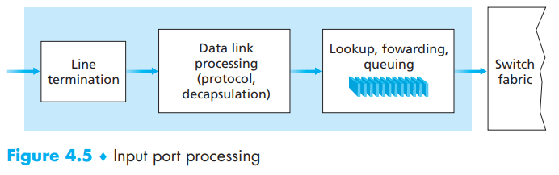

The **lookup **performed in the input port is central to the router’s operation—it is here that the router uses the **forwarding table** (computed in router processor or the remote SDN controller) to look up the output port to which an arriving packet will be forwarded via the switching fabric                                                        

The forwarding table is **copied **from the routing processor to the line cards over a separate bus (the dash line). *With such a shadow copy at each line card, forwarding decisions can be made locally, at each input port, without invoking the centralized routing processor on a per-packet basis and thus avoiding a centralized processing bottleneck*

Consider a real-world situation with billions of packets, there couldn’t be billions of entries, so there is a simplified way to do this:

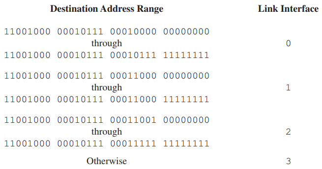

to:

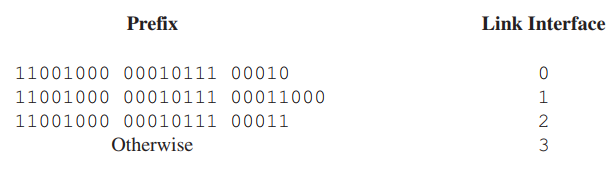

Packet’s with a duplicate **prefix** will take the **longest prefix matching rule**

There is usually two ways to solve the Gigabit problem:

-  using faster memory (DRAM and faster SRAM or TCAM)
- quicker lookup algorithms (yeah, that’s why data structures matter)

Also, there is more than just “lookup” should input port taken:

- physical-layer and link-layer processing
- the packet’s version number, checksum and time-to-live fields
- counters used for network management must be updated

At last, router’s input port is one of the **match plus action** devices. The **“match plus action”** abstraction is both powerful and prevalent in network devices today, and is central to the notion of **generalized forwarding** 

# 2. Switching

Switching in *switching fabric* can be done in a number of ways:

- *Switching via memory*: only one memory read/write can be done at a time over the shared system bus. If the memory bandwidth is such that a maximum of B packets per second can be written into, or read from, memory, then the overall forwarding throughput (the total rate at which packets are transferred from input ports to output ports) must be less than B/2. So the lookup of the destination address and the storing of the packet into the appropriate memory location are performed by  **processing on the input line cards  **
- *Switching via a bus*: a sufficient way in most cases by putting a header on packets and then send them to all output ports so certain output port can match the header and then receives and removes the header. This approach is limited by the bus speed but can transfer many packets at a time. However, if many packets arrive at the same time, packets have to wait in queue to get the header
- *Switching via an interconnection network*: crossbar switches are capable of forwarding multiple packets in parallel with 2N buses for N pair of input & output ports. So it can do *non-blocking*, which is the ability for different packets to send to the same output in the same time. However, if those packets come from the same input port, then they still have to wait until previous packet transfer is done

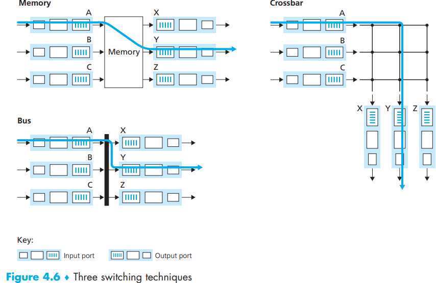

# 3. Output Port Processing

Take packets that have been stored in the output port’s memory and transmits them over the output link, including:

- selecting packets for transmission
- de-queuing packets for transmission
- performing the needed link-layer and physical-layer transmission functions

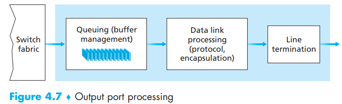

# 4. Where Does Queuing Occur?

The location and extent of queueing (either at the input port queues or the output port queues) will depend on:

- the traffic load
- the relative speed of the switching fabric
- and the line speed

**It is here, at these queues within a router, where such packets are actually dropped and lost**

In an ideal situation, if : $R_{switch}(SwitchingFabricTransmission rate) = N * R_{line}(PortTransmissionRate)$then there will be nearly no packets loss

## Input Queueing

In fact the switch fabric is not fast enough to transfer all arriving packets through the fabric without delay. If two packets at the front of two input queues are destined for the same output queue, then one of the packets will be blocked and must wait at the input queue—the switching fabric **can transfer only one packet to a given output port at a time**. So the light blue packet in the right also have to wait regardless of the availability of an empty output port. This is so called **head-of-the-line (HOL) blocking**

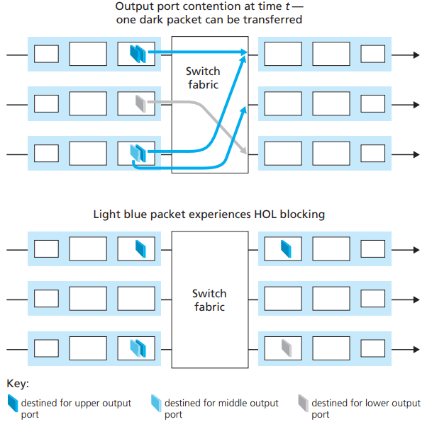

## Output Queueing

The output port can transmit only a single packet in a unit of time (the packet transmission time), the N arriving packets will have to queue (wait) for transmission over the outgoing link. Then N more packets can possibly arrive in the time it takes to transmit just one of the N packets that had just previously been queued and the number of queued packets can grow large enough to exhaust available memory

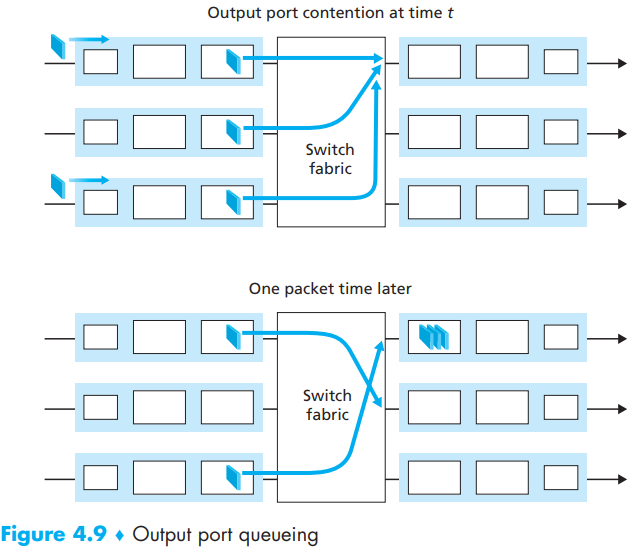

To solve this problem there could be:

- **drop tail**
- *remove already existed-queued packets to make room for the newly arrived packet*
- drop a packet **before** the buffer is full in order to provide a congestion signal to the sender (**active queue management (AQM)** which has **Random Early Detection (RED)**)

The most recent study shows that the buffer size (while many TCP flows can pass through one link), the amount of buffering: $B=R T T \cdot C / \sqrt{N}$(C)(link capacity)

# 5. Packet Scheduling

## First-in-First-Out (FIFO/FCFS)

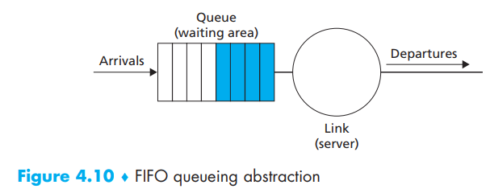

Yeah, just first-in-first-out, easy

## Priority Queuing

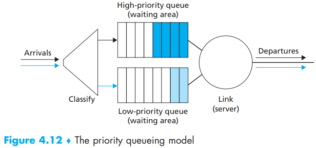

Using different queues for packets in different priority. If there is a jam in the link, the packet in the highest priority queue that is not empty will be transferred. Also, remember that there is a **non-preemptive priority queuing discipline**, the transmission of a packet is not interrupted once it has begun (so 4 will be after 2):

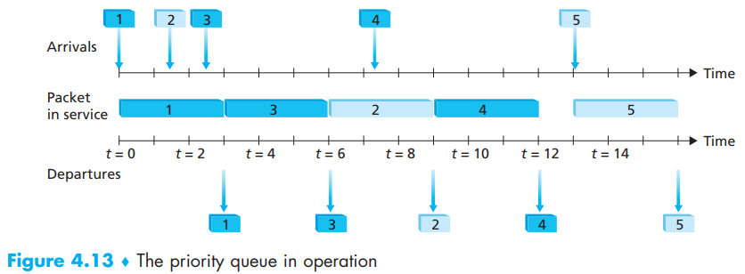

## Round Robin and Weighted Fair Queuing (WFQ)

For *work-conserving round robin discipline*, it means circle between the priority classes *existed in the queue* along with the same queue priority queue structure (that’s why 4 instead of 5 is behind 2) so there will be no idle time if there are packets in the queue:

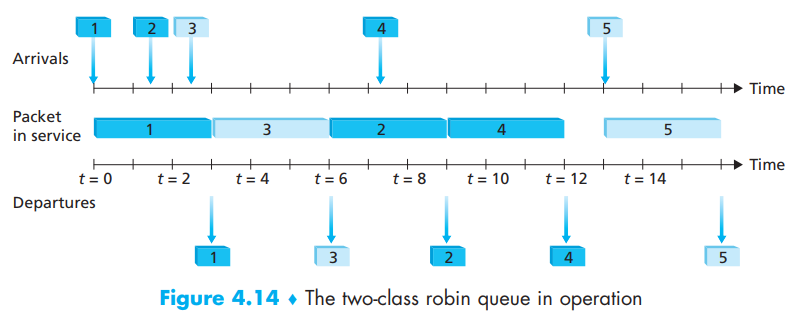

 WFQ follows the same discipline as round robin. However, there is still a critical difference between them: each priority queue has been assigned a different weight, so during the queue period, class i will then be guaranteed to receive a fraction of service equal to $w_{i} /\left(\sum w_{j}\right)$. Thus for a link with transmission rate R, class i will always achieve a throughput of at least $R \cdot w_{i} /\left(\sum w_{j}\right)$ (of course this is an ideal way, in reality this won’t be so accurate)

# Translation & Glossary

- input port: 输入口
- switching fabric: 交换结构
- output ports: 输出口
- routing processor: 路由处理器