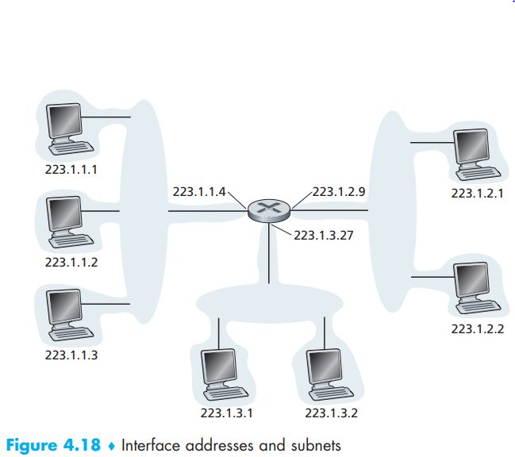

[toc]

# 1. IPv4 Datagram Format

- *Version number*: 4-bits, specify the IP protocol version. *Different versions of IP use different datagram formats*
- *Header length*: to determine where in the IP datagram the payload begins (there could be options in IP header)
- *Type of service*: TOS, allows different types of IP datagrams to be distinguished from each other, such as real-time datagrams VS non-real-time traffic
- *Datagram length*: total length of the IP datagram (header plus data), measured in bytes
- *Identifier, flags, fragmentation offset*: IP fragmentation (discussed later)
- *Time-to-live*: TTL field is included to ensure that datagrams do not circulate forever, decremented by one each time the datagram is processed by a router
- *Protocol*: only used when an IP datagram reaches its final destination because contains specific transport-layer protocol this IP datagram should be passed (17-UDP, 6-TCP, and more)
- *Header checksum*: aids a router in detecting bit error in a received IP datagram by computing each 2 bytes in the header as a number and summing these numbers using *1s complement*. Error checking exists both on the transport-layer and the network-layer because: 1st, there are checked for different sum; 2nd, principally,  transport-layer protocols can run on different network-layer protocols
- *Source and destination IP addresses*: ultimate address from beginning to the end (added when the datagram is created)
- *Options*: not included in IPv6 because this is rarely used and cause trouble
- *Data(payload)*: contains the transport-layer segment and other data like ICMP messages

Assuming no options, an IP datagram has a total of 20 bytes of headers (with TCP segment 20 bytes, totally could be 40 bytes header)

# 2. IPv4 Datagram Fragmentation  

The maximum amount of data that a link-layer frame can carry is called the maximum transmission unit (MTU)  

How are you going to squeeze this oversized IP datagram into the payload field of the link-layer frame? The solution is to fragment the payload in the IP datagram into two or more smaller IP datagrams, encapsulate each of these smaller IP datagrams in a **separate link-layer frame**; and send these frames over the outgoing link. Each of these smaller datagrams is referred to as a **fragment**. And the job to assemble comes to the **end systems**

Recall that there are 3 header areas for header to deal with this problem:

- *identification*: stamped for each datagram created by the sending host so the receiving host could know whether fragments come from the same datagram
- *flag*: last fragment has flag=0 while all others have flag=1 so the receiving host know they receivfe the last fragment of a datagram
- *offset field*: specifies where the fragments fits within the original IP datagram so the receiving end could know whether a fragment is missing and how to assemble them

# 3. IPv4 Addressing

IP requires each host and router interface to have its own IP address. Thus, an IP address is technically associated with an **interface**, rather than with the host or router containing that interface (*the boundary between the host and the physical link is called interface*)

**Each interface on every host and router in the global Interne must have an IP address that is globally unique** (except NATs); each IP address is 4 bytes (32 bits) long

We can those interfaces with no intermediate routers as cloud, or we say - **subnet (IP** network or network). There is always a *subnet mask* in subnet like - 223.1.1.0/24. /24 means all left 24 bits are the same (also known as *notation*). We can define subnet more clearly:

Now we know that picture below gets 6 subnets:

The Internet’s address assignment strategy is known as **Classless Interdomain
Routing (CIDR—pronounced cider)** [RFC 4632]. CIDR generates the notion of IP address with: a.b.c.d/x (x is the subnet mask) so it divides IP address into 2 parts:

- first x bits: any one outside the subnet (organization) can set datagrams to this subnet with the same first x bits and router only needs to know those x bits to determine which subnet to send to
- last 32-x bits: unique identifier for different interface in this subnet

Note there is another type of IP address - 255.255.255.255, *the IP broadcast address*. When a host sends a datagram with destination address 255.255.255.255, the message is delivered to all hosts on the same subnet. Routers optionally forward the message into neighboring subnets as well (although they usually don’t)  

## Obtaining a Block of Addresses

Organization (or a man) should contact with its ISP provider for a portion of it’s allocated IP addresses as below:

So where do IPS’s IP addresses come from? Internet Corporation for Assigned Names and Numbers (ICANN)! Not only does it allocate IP addresses, but also to manage DNS root servers. It also has the very contentious job of assigning domain names and resolving domain name dispute, The ICANN allocates addresses to regional Internet registries (for example, ARIN, RIPE, APNIC, and LACNIC, which together form the Address Supporting Organization of ICANN [ASO-ICANN 2016]), and handle the allocation/management of addresses within their regions

## Obtaining a Host Address: The Dynamic Host Configuration Protocol

Of course you can configure IP addresses by yourself in a subnet, but DHCP can do more: 

- allow a host to obtain an IP address automatically
- a host may be assigned a **temporary IP address** by DHCP
- allows a host to learn additional information, such as its subnet mask, the address of its first-hop router and the address of its local DNS server

So with features above, DHCP is also known as **plug-and-play** or **zeroconf** protocol. Also, DHCP is also **a client-server protocol**. A client is a newly arriving host wanting to **obtain network configuration information**. Usually, it takes four steps to do:

- *DHCP server discovery*: a client sends within a UDP packet to port 67, the DHCP client creates an IP datagram containing its DHCP discover message along with *the broadcast destination IP address of 255.255.255.255* and *a “this host” source IP address of 0.0.0.0*. The DHCP client **passes the IP datagram to the link layer**, which then broadcasts this frame to all nodes attached to the subnet 
- DHCP server offer: A DHCP server receiving a DHCP discover message responds to the client with a **DHCP offer message** that is broadcast to **all nodes on the subnet**, again using the IP broadcast address of 255.255.255.255. If there are many DHCP servers, an interface could receive many messages at the same time. But each server offer message  contains **the transaction ID of the received discover message**, the  proposed IP address for the client, the network mask, and an IP address lease time—the amount of time for which the IP address will be valid (hours or days)
- DHCP request: The newly arriving client will choose from among one or more server offers and respond to its selected offer with a **DHCP request message**, echoing back the **configuration parameters**
- DHCP ACK: The server responds to the DHCP request message with a **DHCP ACK message**, confirming the requested parameters  

After ACK received, this connection is done but the IP address’s release could be renewed(?). One very important shortcoming for DHCP is: a TCP connection to a remote application cannot be maintained as a mobile node moves between subnets (this will be solved in chapter 6)

# 4. Network Address Translation (NAT)

The address space 10.0.0.0/8 is one of three portions of the IP address space that is reserved in [RFC 1918] for **a private network or a realm with private addresses**, such as the home network：

NAT works perfectly to solve this problem:

- A NAT router acts as s *single service* with a *single IP address*. All traffic entering the home network must have the same destination address of 138.76.29.7
- A NAT-enabled router is hiding the details of the home network computers
- The router gets its IP address from the ISP’s DHCP server and also runs a DHCP server to provide addresses to computers within the NAT-DHCP-router-controlled home network’s address space

Another important feature for a NAT router is **NAT translation table**. It matches not only IP addresses between WAN side and LAN side, but also **port number** for communication. Those translation works both ways

> Suppose a user sitting in a home network behind host 10.0.0.1 requests a Web page on some Web server (port 80) with IP address 128.119.40.186. The host 10.0.0.1 assigns the (arbitrary) source port number 3345 and sends the datagram into the LAN. The NAT router receives the datagram, generates a new source port number 5001 for the datagram, replaces the source IP address with its WAN-side IP address 138.76.29.7, and replaces the original source port number 3345 with the new source port number 5001. When generating a new source port number, the NAT router can select any source port number that is not currently in the NAT translation table. (Note that because a port number field is 16 bits long, the NAT protocol can support over 60,000 simultaneous connections with a single WAN-side IP address for the router!) 

Although widely used, NAT is never lacking of detractor. Something serious is considered:

- *port numbers are meant to be used for addressing processes, not for addressing hosts*. Technical solutions to these problems include **NAT traversal tools** [RFC 5389] and **Universal Plug and Play (UPnP)**, a  protocol that allows a host to discover and configure a nearby NAT [UPnP Forum 2016]
- Here, the concern is that routers are meant to be layer 3 (i.e., network-layer) devices, and should process packets only up to the network layer. NAT violates this principle that hosts should be talking directly with each other, without interfering nodes modifying IP addresses, much less port numbers. But like it or not, NAT has not become an important component of the Internet, as have other so-called middleboxes [Sekar 2011] that operate at the network layer but have functions that are quite different from routers

# IPv6

We need those because there are nearly no IPv4 addresses to be allocated

## IPv6 Datagram Format

The most important changes introduced in IPv6 are evident:

- *Expanded addressing capabilities*: increases the size of the IP address from 32  to 128 bits with a new type of address - anycast address, that allows a datagram to be delivered to any one of a group of hosts
- *A steamlined 40-byte header*: as a number of IPv4 fields have been dropped or made optional. The resulting 40-byte **fixed-length header** allows for faster processing of the IP datagram by a router
- *Flow labeling*: “labeling of packets belonging to particular flows for which the sender requests special handling, such as a non-default quality of service or real-time service”. For example, videos and audios could be deemed as a flow, while files and emails will be not

Now let’s take a deep look to the 40-bytes fixed header:

- *Version*: 4-bit field identifiers the IP version number (exactly 6)
- *Traffic class*: can be used to give priority to certain datagrams within a flow, or it can be used to give priority to datagrams from certain  applications (for example, voice-over-IP) over datagrams from other applications (for example, SMTP e-mail)
- *Flow label*: 20-bit long, used to identify a flow of datagrams
- *Payload length*: an unsigned integer giving the number of bytes in the IPv6 datagram following the fixed-length, 40-byte datagram header
- *Next header*:  identifies the protocol to which the contents (data field) of
  this datagram will be delivered (for example, to TCP or UDP). The field uses the same values as the protocol field in the IPv4 header
- *Hop limit*: decremented by one by each router that forwards the datagram. When reaching 0, the datagram is discarded
- *Source and destination addresses*: the various formats of the IPv6 128-bit address are described in RFC 4291
- *Data*: payload. Removed and passed on to the protocol specified in the next header field

So there are some fields discarded:

- *Fragmentation/reassembly*: the router will not need to do fragmentation or reassembly as they are required to be done in the sender and the receiver. The router will send an ICMP error message for big datagrams that need fragmentation to the sender
- *Header checksum*: as there is checksum on the transport-layer, there is no need for every router to run checksum for each datagram
- *Options*: this is gone but not disappear from the datagram. Instead, the options field is one of the possible next headers pointed to from within the IPv6 header

## Transitioning from IPv4 to IPv6

So how should we do this transition while most routers can not handle IPv6?

- a flag day - a given time for all Internet machines to be turned off and upgraded from IPv4 to IPv6
- *tunneling*: we refer the intervening set of IPv4 routers between two IPv6 routers as a *tunnel*. With tunneling, IPv6 router on the sender side take the entire IPv6 datagram in the IPv4 data field and then the IPv4 router will receive and transmit it to the sender side while the receiver side IPv6 router will recognize the IPv6 datagram

After all, IPv6 experience tells us that it’s enormously difficult to change network-layer protocols!

# Translation & Glossary

- maximum transmission unit(MTU): 最大传输单元
- subnet: 子网
- Classless Interdomain Routing: 无类别域间路由
- Dynamic Host Configuration Protocol (DHCP): 动态主机配置协议