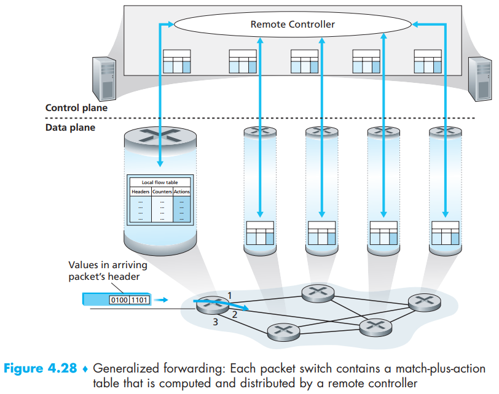
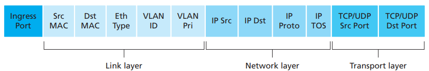
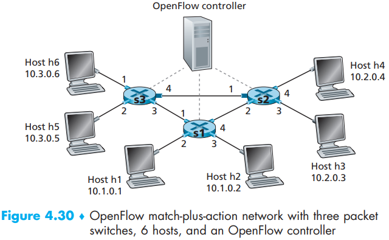
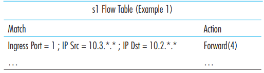
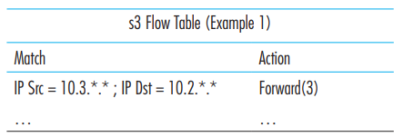
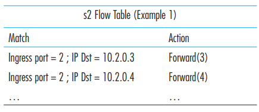
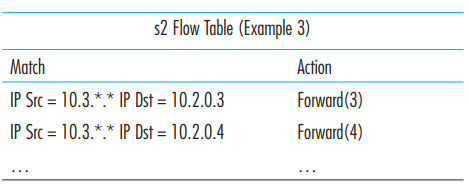

[toc]

Generalized forwarding always involves packets with a match-plus-action table. This table surely can be computed and distributed by a remote controller

Each entry in the math-plus-action forwarding table, known as a **flow table** in OpenFlow (a link-layer protocol) includes:

- *A set of header field values*: hardware-based matching is most rapidly performed in TCAM memory, with more than a million destination address entries being possible. A packet that matches no flow table entry can be dropped or sent to the remote controller for more processing. In practice, a flow table may be implemented by multiple flow tables for performance or cost reasons
- *A set of counters*: updated as packets are matched to flow table entries. These counters might include the number of packets that have been matched by that table entry, and the time since the table entry was last updated
- *A set of actions to be taken*: These actions might be to forward the packet to a given output port, to drop the packet, makes copies of the packet and sent them to multiple output ports, and/or to rewrite selected header fields  

# 1. Match

- Ingress port: refers to the input port at the packets switch on which a packets is received
- Not all fields in IP header can be matched. For example: OpenFlow does not allow matching on the basis of TTL field or datagram length field
- There is also associated priority in some fields.If a packet matches multiple flow table entries, the selected match and corresponding action will be that of the highest priority entry with which the packet matches 
- An entry can match many kinds of packets. For example: an IP address of 128.119.\*.\* in a flow table will match the corresponding address field of any datagram that has 128.119 as the first 16 bits of its address

How to decide some fields will be matched while some others will be not. This is totally an art of abstraction. Let’s take *Butler Lampson*’s words:

> Do one thing at a time, and do it well. An interface should capture the minimum essentials of an abstraction. Don’t generalize; generalizations are generally wrong.

# 2. Action

Among the most important possible actions are:

- **Forwarding**. An incoming packet may be forwarded to a particular physical output port, broadcast over all ports (except the port on which it arrived) or multicast over a selected set of ports. The packet may be encapsulated and sent to the remote controller for this device. *That controller then may (or may not) take some action on that packet*, including *installing new flow table entries*, and may *return the packet to the device for forwarding* under the *updated set of flow table rules*.
- **Dropping**. A flow table entry with no action indicates that a matched packet should be dropped.
- **Modify-field**. The values in ten packet header fields may be re-written before the packet is forwarded to the chosen output port.  

# 3. OpenFlow Examples of Match-plus-action in Action

## Simple Forwarding

Let’s see what the flow tables will be if h5 and h6 will be send packets to h3 and h4 without passing interface 1 in s2:

## Firewall

Let’s see S2 only wants to receive packets from S3:

After those simple but basic scenarios, one can learn how to set flow tables under various conditions

# Translation & Glossary

- TCAM: 远程通信存取法