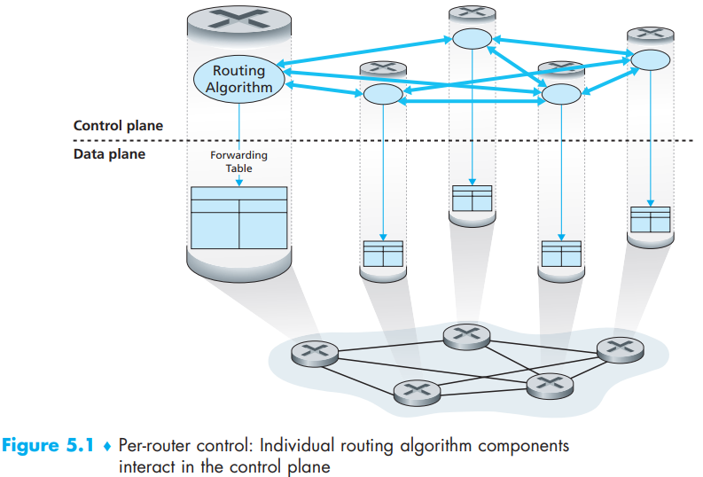
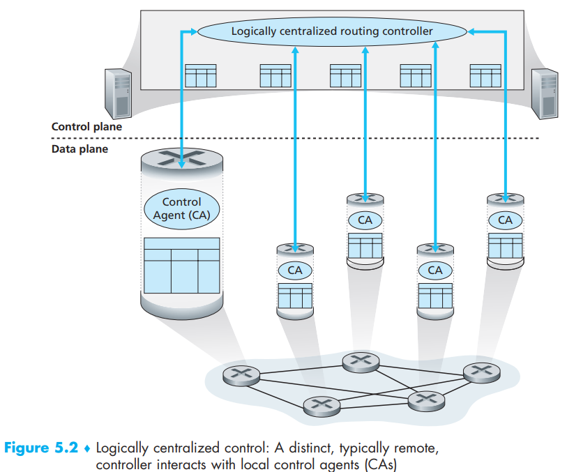

[toc]

In this chapter,  we’ll study how those forwarding and flow tables are computed, maintained and installed. There are two ways for doing so:

- *Per-router control*: Figure 5.1 illustrates the case where a routing algorithm runs in each and every router, *both a forwarding and a routing function are contained within each router*. Each router has a routing component that communicates with the routing components in other routers to compute the values for its forwarding table  

  

- *Logically centralized control*: a logically centralized controller computes and distributes the forwarding tables to be used by each and every  router, the generalized match-plus action abstraction allows the router to perform traditional IP forwarding as well as a rich set of other  functions (load sharing, firewalling, and NAT) that had been previously implemented in separate middleboxes

  

  The controller interacts with a *control agent (CA)* in each of the routers via a well-defined protocol to configure and manage that router’s flow table, CA has minimum functionality; its job is to communicate with the controller, and to do as the controller commands. Unlike the routing algorithms in Figure 5.1, *the CAs do not directly interact with each other nor do they actively take part in computing the forwarding table*

# Translation & Glossary

