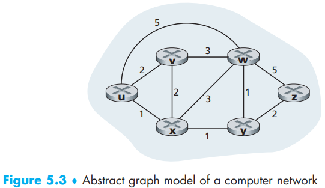
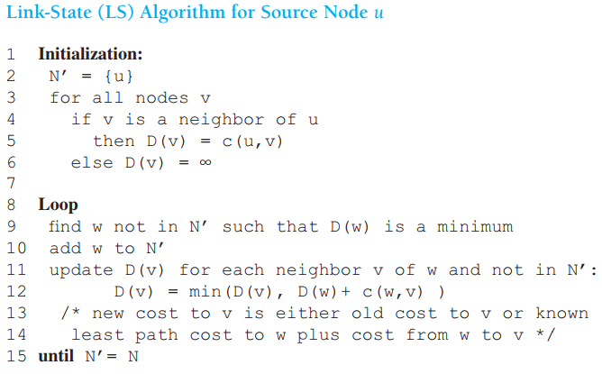
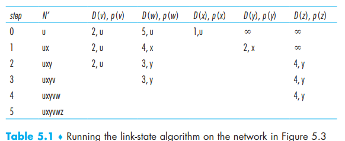
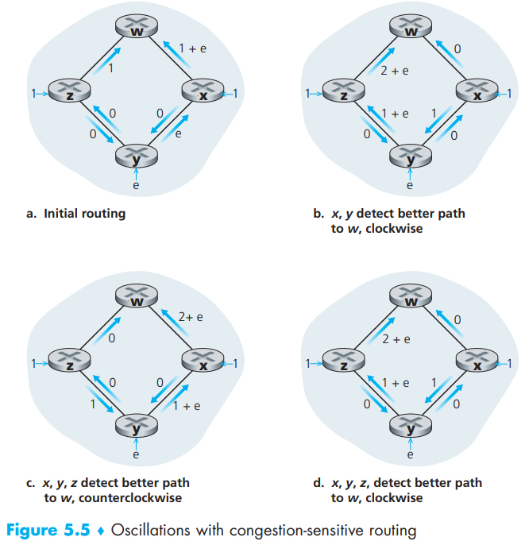
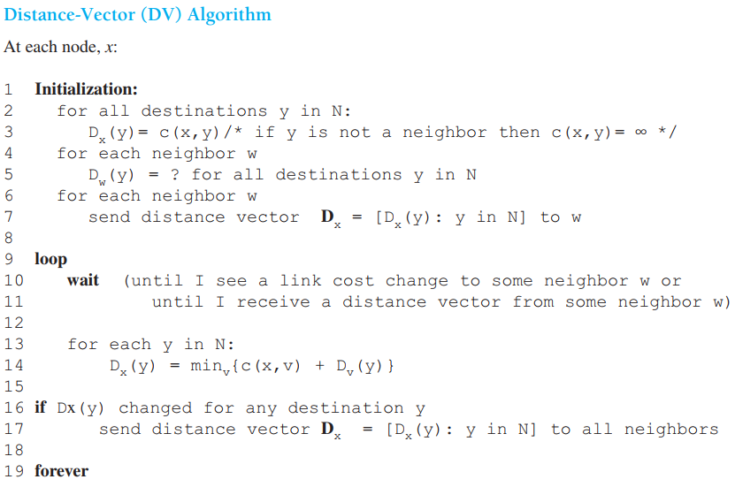
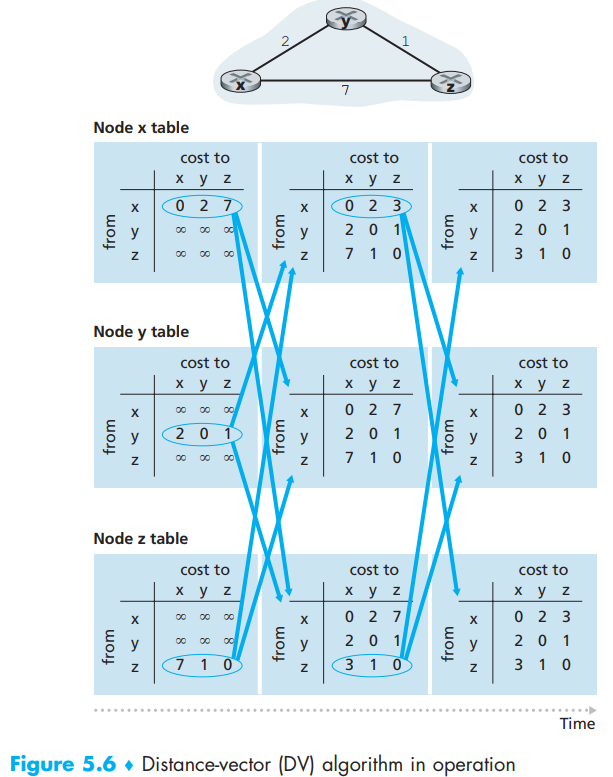
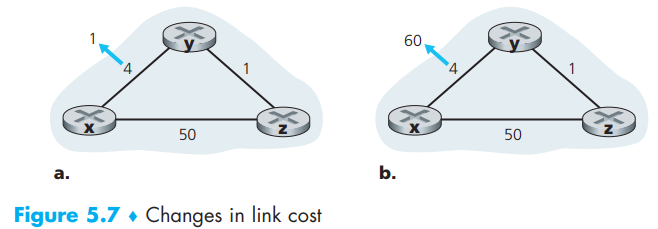

[toc]

This is another TOP10 topic

graph G = (N, E) is a set N of nodes and a collection E of edges, there are some important features:

- c(x, y) = cost of the edge between nodes  x and y
- c(x, y) –> infinity if pair(x, y) not belong to G
- c(x, y) = c(y, x)
- if c(x, y) belongs to G, we call y the **neighbor** of x

The job of routing algorithm is to calculate the **path** (sequence of nodes) with the least cost (cost on all edged in the path), which we call a **least-cost path**. If all some paths are equally cost, we choose the **shortest path**

The calculation differs in routing modes:

- A **centralized routing algorithm** computes the least-cost path between a source and destination using complete, global knowledge about the network. Algorithms with global state information are often referred to as **link-state (LS) algorithms**, since the algorithm must be aware of the cost of each link in the network
- In a **decentralized routing algorithm**, the calculation of the least-cost path is carried out in an iterative, distributed manner by the routers. The decentralized routing algorithm we’ll study below is called a **distance-vector (DV) algorithm**, because each node maintains a vector of estimates of the costs (distances) to all other nodes in the  network

In the static or dynamic view:

- In **static routing algorithms**, routes change very slowly over time, often as a result of human intervention
- **Dynamic routing algorithms** change the routing paths as the network
  traffic loads or topology change. While dynamic algorithms are more responsive to network changes, they are also more susceptible to problems such as routing loops and route oscillation

Last is the load-sensitive or not view:

- In a **load-sensitive algorithm**, link costs vary dynamically to reflect the current level of congestion in the underlying link
- Today’s Internet routing algorithms (such as RIP, OSPF, and BGP) are **load-insensitive**, as a link’s cost does not explicitly reflect its current (or recent past) level of congestion

# 1. The Link-State (LS) Routing Algorithm

In practice this is accomplished by having each node **broadcast link-state packets** to all other nodes in the network, with **each link-state packet containing the identities and costs of its attached links**, which is also accomplished by a **link-state broadcast** algorithm - here we use *Dijksta’s algorithm*

In *Dijksta’s algorithm*, there are k least-cost paths created by k iterations with k smallest costs for k destination nodes. And we define following notation:

- *D(v)*: cost of the least-cost path from the source node to destination v as of this iteration of the algorithm
- *p(v)*: previous node (neighbor of v) along the current least-cost path from the source to v
- *N′*: subset of nodes; v is in N′ if the least-cost path from the source to v is definitively known  

The number of times the loop (iteration) is executed is equal to the number of nodes in the network. The number of times the loop is executed is equal to the number of nodes in the network:

Now let’s combine this with the Figure 5.3 to illustrate details:

1. In the initialization step, the currently known least-cost paths from u to its directly attached neighbors, v, x, and w, are initialized to 2, 1, and 5, respectively
2. In the first iteration, we look among those nodes not yet added to the set N′ and find that node with *the least cost as of the end of the previous iteration*
3. In the second iteration, nodes v and y are found to have the least-cost paths (2), and we break the tie arbitrarily and add y to the set N′ so that N′ now contains u, x, and y
4. so on…

Yes, this algorithm is totally the same in data structure. The different is about destinations while LS finds all shorted way for all possible destination nodes. Also, LS algorithm is **synchronous**, meaning that the remote controller will do this and send those forward table to all routers at the same time

However, there still could be a problem for LS algorithm. Think about this: what will happen if the links between routers have directions and all routers thinks congestion (packets units send from on router to another in one direction) as costs, aren’t they gonna all dumps there packets to the link where have the fewest packets and make that line congested? Yes, they will:

Two way to solve this problem:

- routers not taking congestion (link load) as costs
- routers not running LA algorithm at the same time. One way to avoid such self-synchronization is for each router to randomize the time it sends out a link advertisement  

# 2. The Distance-Vector (DV) Routing Algorithm

- *asynchronous*: it does not require all of the nodes to operate in
  lockstep with each other  
- *iterative*: this process continues on until no more information is exchanged between neighbors  
- *self-terminating*: there is no signal that the computation should stop; it just stops  
- *distributed*: It is distributed in that each node receives some information from one or more of its directly attached neighbors, performs a calculation, and then distributes the results of its calculation
  back to its neighbors  

DV algorithm is built upon *Bellman-Ford equation* ($d_{x}(y)=\min _{v}\left\{c(x, v)+d_{v}(y)\right\}$). Then we refer $\boldsymbol{D}_{x}=\left[D_{x}(y): y \text { in } N\right]$ as node x’s distance vector with information:

- For each neighbor v, the cost c(x,v) from x to directly attached neighbor, v 
- Node x’s distance vector, that is, Dx = [Dx(y): y in N], containing x’s estimate of its cost to all destinations, y, in N
- The distance vectors of each of its neighbors, that is, Dv = [Dv(y): y in N] for each neighbor v of x  

When a node x receives a new distance vector from any of its neighbors w, it saves w’s distance vector, and then uses the Bellman-Ford equation to update its own distance vector as follows: 

$$D_{x}(y)=\min _{v}\left\{c(x, v)+D_{v}(y)\right\} \quad \text { for each node } y \text { in } N$$

If router’s distance vector changes, it will send its updated distance vector to each of its neighbors. As long as all the nodes continue to exchange there distance vectors in this asynchronous fashion, each cost estimate Dx(y) converges to dx(y), the actual cost of the least-cost path from node x to node y  

This could be tricky but understandable. *The next-hop router v\*(y) (all possible v with least-cost path to y) is the neighbor v that achieves the minimum in Line 14 of the DV algorithm*. For each destination y, node x also determines v*(y) and updates its forwarding table for destination y

Now let’s finish this with an example:

As you can see,  those asynchronous steps will not last forever and all of them will enter a *quiescent* state if they updated their routing table to the same with least-cost paths. This state will only change when *a link cost changes*

## Distance-Vector Algorithm: Link-Cost Changes and Link Failure

Now let’s consider seriously about the link when they change, combining pictures above:

- when link decreases (from 4 to 1)

  1. At time $t_0$, y detects the link-cost change (the cost has changed from 4 to 1), updates its distance vector, and informs its neighbors of this change *since its distance vector has changed*

  2. At time $t_1$, z receives the update from y and updates its table. It computes a new least cost to x (it has decreased from a cost of 5 to a cost of 2) and sends its new distance vector to its neighbors

  3. At time $t_2$, y receives z’s update and updates its distance table. y’s least costs do not change and hence y does not send any message to z. The algorithm comes to a quiescent state

- when link cost increases (from 4 to 60):

  1. Before changes, $Dy(x) = 4, Dy(z) = 1, Dz(y) = 1, Dz(x) = 5$. At time t 0, y detects the link-cost change (the cost has changed from 4 to 60). y computes its new minimum-cost path to x to have a cost of $D_{y}(x)=\min \left\{c(y, x)+D_{x}(x), c(y, z)+D_{z}(x)\right\}=\min \{60+0,1+5\}=6$
  2.  At time $t_1$, since node y has computed a new minimum cost to x, it informs z of its new distance vector
  3. At $t_2$, z receives y’s new distance vector, which indicates that y’s minimum cost to x is 6. z knows it can get to y with a cost of 1 and hence computes a new least cost to x ($D_{7}(x)=\min \{50+0,1+6\}=7$). Since z’s least cost to x has increased, it then informs y of its new distance vector
  4. after receiving z’s new distance vector, y determines $Dy(x) = 8$and sends z its distance vector. z then determines $Dz(x) = 9$ and sends y its distance vector, and so on

  Indeed, now we expect to see at least 44 loops between y and z. Such scenarios is sometimes referred to as the *count-to-infinity problem*

## Distance-Vector Algorithm: Adding Poisoned Reverse

>  Does poisoned reverse solve the general count-to-infinity problem? It does not. You should convince yourself that loops involving three or more nodes (rather than simply two immediately neighboring nodes) will not be detected by the poisoned reverse technique

So why should I know this, is there a better solution for this problem? Maybe I just need to quote the words:

> The specific looping scenario just described can be avoided using a technique known as poisoned reverse. The idea is simple—if z routes through y to get to destination x, then z will advertise to y that its distance to x is infinity, that is, z will advertise to y that D z(x) = ∞ (even though z knows Dz(x) = 5 in truth). z will continue telling this little white lie to y as long as it routes to x via y. Since y believes that z has no path to x, y will never attempt to route to x via z, as long as z continues to route to x via y (and lies about doing so)  

## A Comparison of LS and DV Routing Algorithms

- *Message complexity*: 
  - LS: requires each node to know the cost of each link in the network. This requires O(|N| |E|) messages to be sent
  - DV: requires message exchanges between directly connected neighbors at each iteration. When link costs change, the DV algorithm will propagate the results of the changed link cost only if the new link cost results in a changed least-cost path for one of the nodes attached to that link. So we have seen that the time needed for the algorithm to converge can depend on many factors
- *Speed of convergence*: 
  - LS: an O(|N|2) algorithm requiring O(|N| |E|)) messages
  - DV: suffers from the count-to-infinity problem and converges slowly
- *Robustness*
  - LS: an LS node is computing only its own forwarding tables; other nodes are performing similar calculations for themselves. This means route calculations are somewhat separated under  LS, **providing a degree of robustness**  
  - DV: erroneous routing information can cause other routers to flood the malfunctioning router with traffic and caused large portions of the Internet to become disconnected for up to several hours. So an incorrect node calculation can be diffused through the entire network under DV

No one if the absolute winner. Both algorithms are used in the Internet

# Translation & Glossary

- Distance-vector routing protocol: 距离向量路由协定
- The Link-State (LS) Routing Algorithm: 链路状态路由算法
- Bellman-Ford equation: 贝尔曼.福特等式