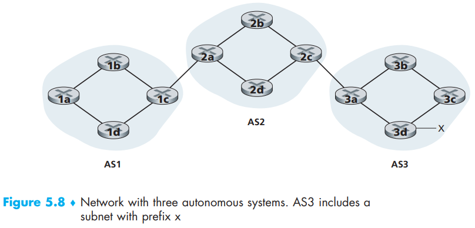
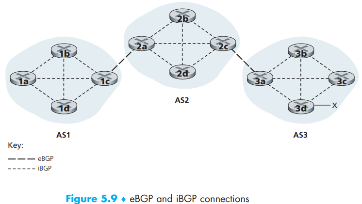
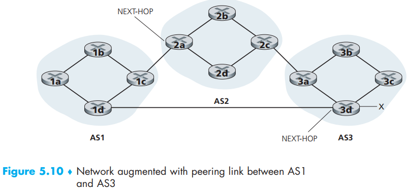
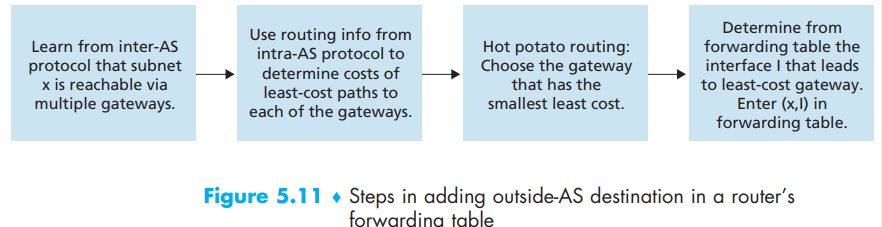
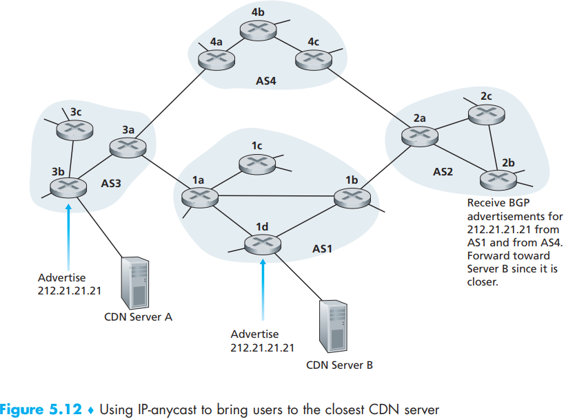
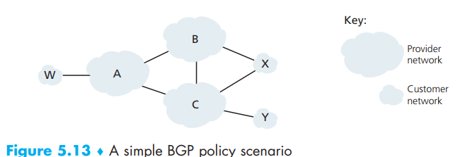

[toc]

In the Internet, all ASs run the same **inter-autonomous system routing protocol**, called the **Border Gateway Protocol - BGP**, to communicate among different ASs.

# 1. The Role of BGP

For destinations that are within the same AS, the entries in the router’s forwarding table are determined by the AS’s intra-AS routing protocol. But for destinations that are outside of the AS, we need BGP.

In BGP, packets are not routed to a specific destination address, but instead to *CIDRized* prefixes, with each prefix representing a **subnet **or a **collection of subnets** (In the form 138.16.68/22). Thus, a router’s forwarding table will have entries of the form *(x, I)*, where *x* is a prefix (such as 138.16.68/22) and *I* is an interface number for one of the router’s interfaces.

As an inter-AS routing protocol, BGP provides each router a means to:

1. *Obtain prefix reachability information from neighboring ASs*.
2. *Determine the “best” routes to the prefixes*.

# 2. Advertising BGP Route Information

In this example, each router is either a **gateway router** (*on the edge of an AS that directly connects to one or more routers in other ASs*) or an **internal router** (*connects only to hosts and routers within its own AS*).

Consider the task of advertising reachability information for prefix x to all of the routers shown. For AS2, AS3 send BGP message to AS2 which we denote as “AS3 x” and for AS3, it’s “AS2  AS3 x”. And this job is not done by ASs, but routers which exchange routing information over **BGP connection** (semi-permanent TCP connections using port 179) such as:

- **external BGP (eBGP)**: a BGP connection that spans two ASs.
- **internal BGP (iBGP)**: a BGP session between routers in the same AS.

All connections are shown below:

> Consider again advertising the reachability information for prefix x to all routers in AS1 and AS2. In this process, gateway router 3a first sends an eBGP message “AS3 x” to gateway router 2c. Gateway router 2c then sends the iBGP message “AS3 x” to **all** of the other routers in AS2, including to gateway router 2a. Gateway router 2a then sends the eBGP message “AS2 AS3 x” to gateway router 1c. Finally, gateway router 1c uses iBGP to send the message “AS2 AS3 x” to all the routers in AS1. After this process is complete, each router in AS1 and AS2 is aware of the existence of x and is also aware of an AS path that leads to x.  

For something more like a net, it’s still **gateway routers** in charge of sending BGP messages from As3 to As1 as “AS3 x”:

# 3. Determining the Best Routes

After getting paths from a given router to a destination subnet, how do we choose among these paths? To solve this problem, first we have to know a bit more terminologies:

- When a router advertises a prefix across a BGP connection, it includes with the prefix several **BGP attributes**.
- a prefix along with its attributes is called a **route**.
- attribute 1 - **AS-PATH**: contains the list of ASs through which the advertisement has passed (“A2 A3 x”). To generate the ASPATH value, when a prefix is passed to an AS, the AS adds its *ASN* to the existing list in the AS-PATH. If a router sees that its own AS is contained in the path list, it will reject the advertisement to avoid loop.
- attribute 2 - **NEXT-HOP**: *the IP address of the router interface that begins the AS-PATH*.

With those attributes, in Figure 5.10, AS1 becomes aware of two BGP routes to prefix x in the form of **NEXT-HOP; ASPATH; destination prefix**:

- IP address of leftmost interface for router 2a; AS2 AS3; x
- IP address of leftmost interface of router 3d; AS3; x

There could be more attributes in the prefix in practice.

Last but importantly: When adding an outside-AS prefix into a forwarding table, both the inter-AS routing protocol (BGP) and the intra-AS routing protocol (e.g., OSPF) are used.

## Hot Potato Routing

Hot potato routing is a selfish algorithm—it tries to **reduce the cost in its own AS** while ignoring the other components of the end-to-end costs outside its AS:

With this algorithm, routers in the same AS could choose different path, only if it’s the **least-cost gateway** for itself.

So we can say:

- **reduce the cost in its own AS** between routers inside its AS.
- choose the **least-cost gateway** for gate routers between different ASs.

## Route-Selection Algorithm

In practice, BGP use more complicated algorithm which incorporates hot potato routing. If there are two or more routes to the same prefix, then BGP sequentially invokes the following elimination rules until one route remains:

1. A route is assigned a **local preference** value as one of its attributes. The local preference of a route could have been set by the router or could have been learned from another router in the same AS. The value of the local preference attribute is a policy decision that is left entirely up to the AS’s network administrator. The routes with the highest local preference values are selected.
2. From the remaining routes (all with the same highest local preference value), the route with the **shortest AS-PATH** is selected (like **DV algorithm**).
3. From the remaining routes (all with the same highest local preference value and the same AS-PATH length), hot potato routing is used, that is, the route with the **closest NEXT-HOP** router is selected.
4. If more than one route still remains, the router uses BGP identifiers to select the
   route, see [Stewart 1999].

Now BGP is no longer a selfish algorithm—it first looks for routes with short AS paths (thereby likely reducing end-to-end delay)

# 4. IP-Anycast

In addition to being the Internet’s inter-AS routing protocol, BGP is often used to implement the **IP-anycast service** [RFC 1546, RFC 7094], which is commonly used in DNS for:

- replicating the same content on different servers in many different dispersed  geographical locations
- having each user access the content from the server that is closest  

DNS, as the CDN distribute replicated content, can also have replicant records throughout the world. When a user wants to access this replicate content, it is desirable to point the user to the “nearest” server with the replicated content.

  

This is how BGP gonna finish this job:

1. The CDN company **assigns the same IP address** to each of its servers, and uses standard  BGP to advertise this **IP address** from each of the servers.
2. When a BGP router receives multiple route advertisements for this IP address, it treats these advertisements as providing different paths to the **same physical location** (when, in fact, the advertisements are for different paths to different physical locations).
3. When configuring its routing table, each router will locally use the BGP route-selection algorithm to pick the “**best**” (for example, closest, as determined by AS-hop counts) route to that IP address.  

Anyway, the key trick here is to treat IP addresses distributed among different servers as the same “place”

IP-anycast is extensively used by the DNS system to direct DNS queries to the **closest root DNS server**. 

# 5. Routing Policy

In the route-selection algorithm, routes are first selected according to the local-preference attribute, whose value is fixed by the policy of the local AS, so the AS routing policy can trump all other considerations, such as shortest AS path or hot potato routing.

W, X, Y are access ISPs and A, B, C are backbone provider networks:

- For W-to-Y, just set that B will not deliver packets from W but only B will receive the packets from X. Problems solved.
- For C-W, just set that C will not deliver data to B. Problems solved.

However, a rule of thumb followed by commercial ISPs is that any traffic flowing across an ISP’s backbone network must have either a source or a destination (or both) in a network that is a customer of that ISP; otherwise the traffic would be getting a free ride on the ISP’s network. 

There are also some confidential stuff (individual peering agreements that I don’t know).

# 6. Putting the Pieces Together: Obtaining Internet Presence

Check out the really fun stuff to start a company!