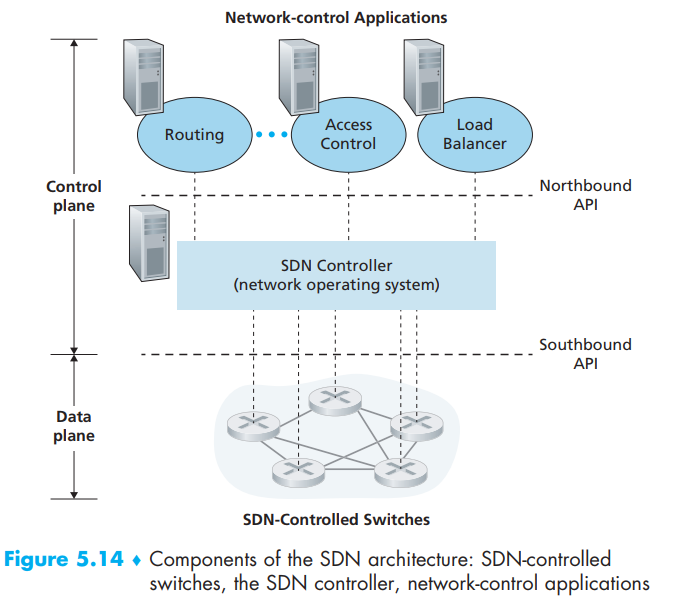
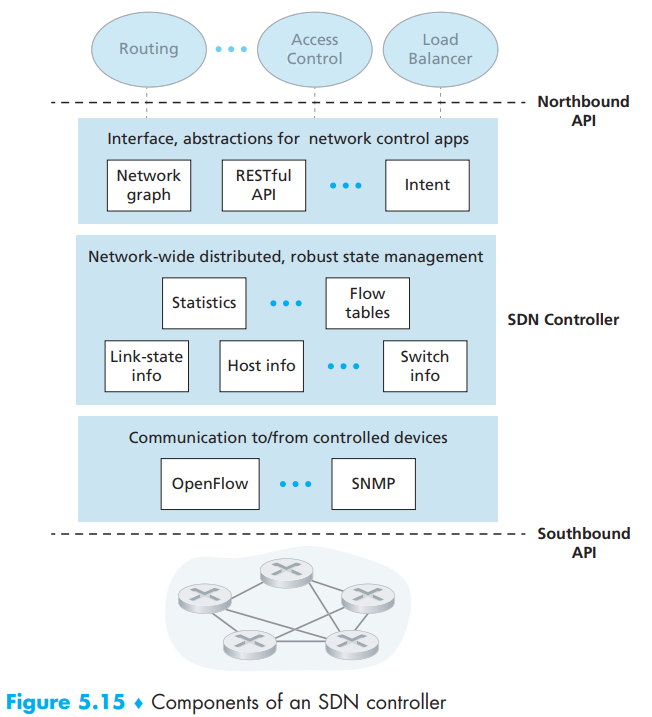
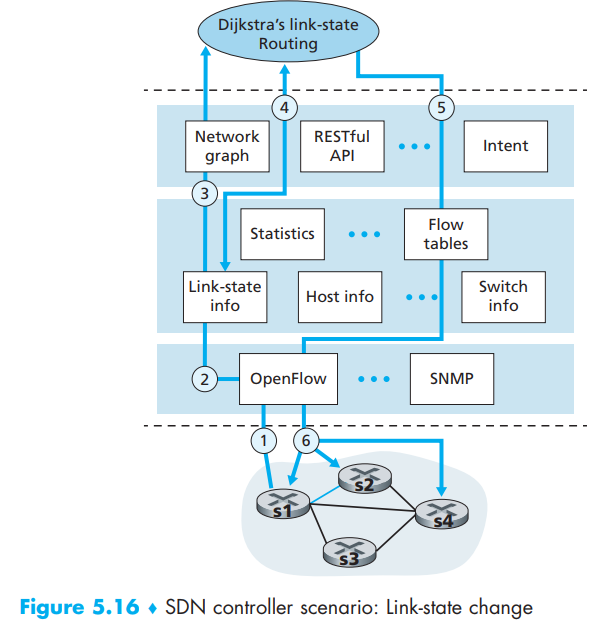

[toc]

Here we will discuss SDN and recognize the forwarding devices as *packet switches* again. You can review the content in 4.4 and 5.1 before this chapter.

Four key characteristics of an SDN architecture can be identified [Kreutz 2015]:

- *Flow-based forwarding*. Packet forwarding by SDN-controlled switches can be based on any number of header field values in the transport-layer, network-layer, or link-layer header. Packet forwarding rules are specified in a switch’s flow table; it is the job of the SDN control plane to compute, manage and install flow table entries in all of the network’s switches.
- *Separation of data plane and control plane*. Recall Figure 5.2 and 5.14.
- *Network control functions: external to data-plane switches*. Recall Figure 5.14.
- *A programmable network*. Using the APIs provided by the SDN controller to specify and control the data plane in the network devices.

With above, SDN plays a ‘unbundling’ role in network functionality. The SDN control plane divides broadly into two components:

- the SDN controller
- the SDN network-control applications

# 1. The SDN Control Plane: SDN Controller and SDN Network-control Applications

## SDN Controller

A controller’s functionality can be broadly organized into three layers - bottom up:

- **A communication layer: communicating between the SDN controller and controlled network devices**. A protocol is needed to transfer information between the controller and that device. In addition, a device must be able to communicate locally-observed events to the controller. These events provide the SDN controller with an up-to-date view of the  network’s state.
- **A network-wide state-management layer**. The ultimate control decisions made by the SDN control plane will require that the controller have up-to-date information about state of the networks’ hosts, links, switches, and other SDN controlled devices.
- **The interface to the network-control application layer**. The controller interacts with network-control applications through its “*northbound*” interface which allows network-control applications to read/write network state and flow tables within the state-management layer. Applications can register to be notified when state-change events occur, so that they can take actions in response to network event notifications sent from SDN-controlled devices.

After all, an SDN controller can be considered to be “*logically centralized*” (be viewed externally as a single, monolithic service) but its services and the databases used to hold state information are implemented in practice by a **distributed **set of servers for fault tolerance, high availability, or for performance reasons. For this reason, the example of controller operation (between itself) will be discussed in 5.5.3.

# 2. OpenFlow Protocol

The OpenFlow protocol operates over TCP, with a default port number of 6653, usually in the communication layer. 

Among the important messages flowing from the controller to the controlled switch are the following:

- **Configuration**: allows the controller to query and set a switch’s configuration parameters.
- **Modify-State**: used by a controller to add/delete or modify entries in the switch’s flow table, and to set switch port properties.
- **Read-State**: used by a controller to collect statistics and counter values from the switch’s flow table and ports.
- **Send-Packet**: used by the controller to send a specific packet out of a specified port at the controlled switch. The message itself contains the packet to be sent in its payload.

Among the messages flowing from the SDN-controlled switch to the controller are the following:

- **Flow-Removed**: informs the controller that a flow table entry has been removed, for example by a timeout or as the result of a received modify-state message.
- **Port-status**: used by a switch to inform the controller of a change in port status.
- **Packet-in**: used to send such packets (matched packets may also be sent to the controller, as an action to be taken on a match) to the controller.

# 3. Data and Control Plane Interaction: An Example

- Dijkstra’s algorithm is executed as a separate application, outside of the packet switches.
- Packet switches send link updates to the SDN controller and not to each other.
- OpenFlow is used as the communication layer protocol, and that the control plane  performs no other function other than link-state routing.

Now what will happen s2 lose connection with s2:

1. Switch s1, experiencing a link failure between itself and s2, notifies the SDN controller of the link-state change using the **OpenFlow port-status message**.
2. The SDN controller receives the OpenFlow message indicating the link-state change, and notifies the **link-state manager**, which updates a link-state database.
3. The **network-control application** that implements Dijkstra’s link-state routing has previously **registered** to be notified when link state changes. That application receives the notification of the link-state change.
4. The **link-state routing application** interacts with the **link-state manager** to get updated link state; it might also consult other components in the state- management layer. It then computes the new least-cost paths.
5. The **link-state routing application** then interacts with the **flow table manager**, which determines the flow tables to be updated.
6. The **flow table manager** then uses the OpenFlow protocol to update flow table entries at affected switches—s1 (which will now route packets destined to s2 via s4), s2 (which will now begin receiving packets from s1 via intermediate switch s4), and s4 (which must now forward packets from s1 destined to s2).  

Since the controller can tailor the flow tables as it pleases, it can implement any form of forwarding that it pleases—simply by changing its application-control software.

# 4. SDN: Past and Future

Include some case study in PRINCIPLES IN PRACTICE (ODL and ONOS)

