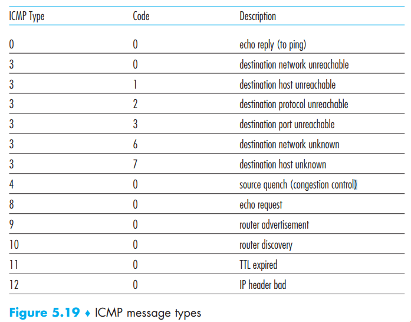

The Internet Control Message Protocol (ICMP), specified in [RFC 792], is used by hosts and routers to communicate **network-layer information** to each other.

ICMP is often considered part of IP, but architecturally it lies just above IP, as ICMP messages are carried inside IP datagrams as **payload** and hosts will demultiplexes the datagram’s content to ICMP.

ICMP messages have a **type **and a **code **field, and contain the header and the first 8 bytes of the IP datagram that caused the ICMP message to be generated in the first place (so that the sender can determine the datagram that caused the error):

Now we can see ICMP can do more than **error reporting**. But some  types such as source quench are hardly used as TCP has its own congestion control.

Interestingly, Traceroute in Chapter 1 is implemented with ICMP messages:

> To determine the names and addresses of the routers between source and destination, Traceroute in the source sends a series of ordinary IP datagrams to the destination. Each of these datagrams carries a UDP segment with an unlikely UDP port number. The first of these datagrams has a TTL of 1, the second of 2, the third of 3, and so on. The source also starts **timers **for each of the datagrams. When the nth datagram arrives at the nth router, the nth router observes that the **TTL of the datagram has just expired**. According to the rules of the IP protocol, the router discards the datagram and sends an **ICMP warning message** to the source (type 11 code 0). This warning message includes the **name of the router** and its **IP address**.

> How does a Traceroute source know when to stop sending UDP segments? Recall that the source increments the TTL field for each datagram it sends. Thus, one of the datagrams will eventually make it all the way to the destination host. Because this datagram contains a UDP segment with an unlikely port number, the destination. host sends a port unreachable ICMP message (type 3 code 3) back to the source. When the source host receives this particular ICMP message, it knows it does not need to send additional probe packets. (The standard Traceroute program actually sends sets of three packets with the same TTL; thus the Traceroute output provides three results for each TTL.)   

In addition to reorganizing the existing ICMP type and code definitions, ICMPv6 also added new
types and codes required by the new IPv6 functionality. These include the “*Packet Too Big*” type and an “*unrecognized IPv6 options*” error code.  