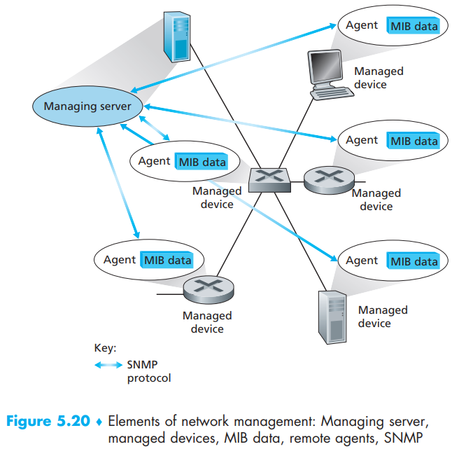
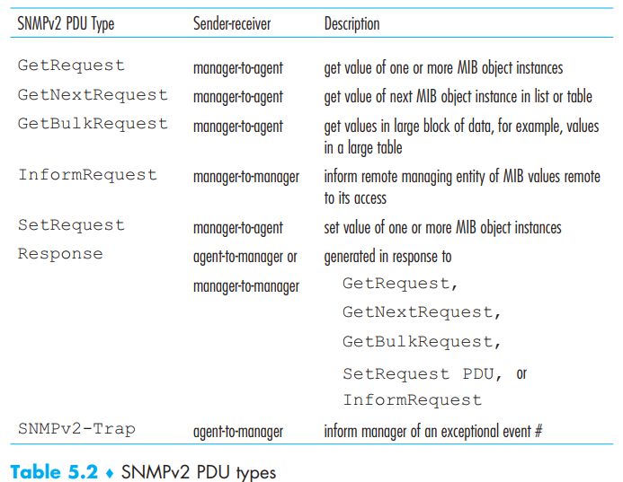
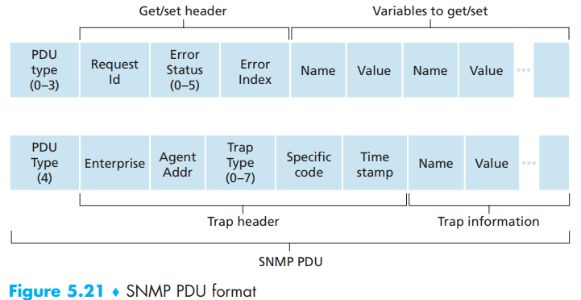

[toc]

> Network management includes the deployment, integration, and coordination of the hardware, software, and human elements to monitor, test, poll, configure, analyze, evaluate, and control the network and element resources to meet the real-time, operational performance, and Quality of Service requirements at a reasonable cost.  

Here we will only study about the rudiments of network management without administrator’s decision-making processes.

# 1. The Network Management Framework

- **managing server**: an application, typically with a human in the loop, running in a **centralized network management station** in the **network operations center** (NOC). it controls the collection, processing, analysis, and/or display of network management information. It is here that actions are initiated to control network behavior and here that the human network administrator interacts with the network’s devices.
- **managed device**: a managed device might be a host, router, switch, middlebox, modem, thermometer, or other network-connected device and contains **managed objects**, which are the actual pieces of **hardware** within a managed device, and **configuration parameters** for these hardware and software components.
- **Management Information Base (MIB)**: resident in each manage device and collect associated information from its manage object. we’ll see that the values of these pieces of information are available to (and in many cases able to be set by) the managing server. It could be a counter, number of UDP/TCP segments, descriptive information such as version of DNS server, status information such as whether a particular device is functioning correctly or protocol-specific information. MIB objects are specified in a data description language known as SMI (Structure of  Management Information).
- **network management agent**: resident in each managed device, a process running in the managed device that communicates with the managing server, taking **local actions** at the managed device under the command and control of the managing server, which is similar to routing agent.
- **network management protocol**: runs between the managing server and the managed devices, allowing the managing server to query the status of managed devices and indirectly take actions at these devices via its agents. Agents can use the network management protocol to inform the managing server of exceptional events. It’s important to note that the network management protocol does **not **itself manage the network.  Instead, it provides capabilities that a network administrator can use to manage the
  network.

# 2. The Simple Network Management Protocol (SNMP)

the Simple Network Management Protocol version 2 (SNMPv2) [RFC 3416] is an **application-layer protocol** used to convey network-management control and information messages between a managing server and an agent executing on behalf of that managing server:

- **request-response mode**. An SNMP managing server sends a request to an SNMP agent, who receives the request, performs some action, and sends a reply to the request. A request will be used to query (retrieve) or modify (set) **MIB object** values associated with a managed device.
- **An agent sends an unsolicited message, known as a trap message, to a managing server**. Trap messages are used to notify a managing server of an **exceptional **situation (e.g., a link interface going up or down) that has resulted in changes to MIB object values.  

Also SNMPv2 defines seven types of messages, known generically as **protocol data units—PDUs** (typically in UDP): 

- *GetRequest*, *GetNextRequest*, and *GetBulkRequest* differ in the *granularity* of their data requests. GetRequest can request an **arbitrary set of MIB values**; multiple GetNextRequest can be used to **sequence through a list or table of MIB objects**; GetBulkRequest allows a large block of data to be returned, avoiding the overhead incurred if multiple GetRequest or GetNextRequest messages were to be sent. In all three cases, the agent responds with a Response PDU containing the object identifiers and their associated values.
- The *SetRequest* PDU is used by a managing server to set the value of one or more MIB objects in a managed device. An agent replies with a Response PDU with the “noError” error status to confirm that the value has indeed been set.
- The *InformRequest* PDU is used by a managing server to notify another managing server of MIB information that is remote to the receiving server.
- The Response PDU is typically sent from a managed device to the managing server in response to a request message from that server, returning the requested information.
- Trap messages are generated **asynchronously**; that is, they are not generated in response to a received request but rather in response to an event for which the managing server requires notification.

Above all, SNMP only requires that the managing server “*needs to act responsibly in respect to the frequency and duration of retransmissions*” without specify retransmission etc.  And the request ID field can be used by the managing server to detect lost requests or replies.  

