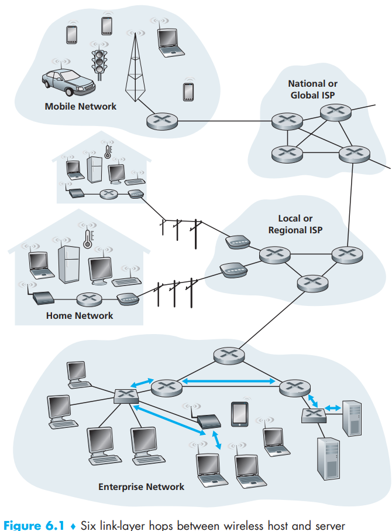
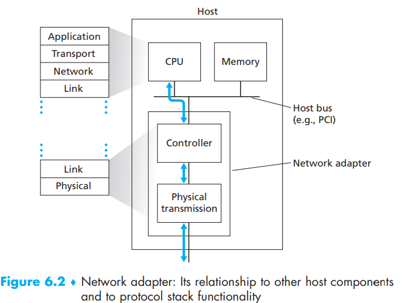

[toc]

In this chapter we refer to any device that runs a link-layer protocol as a **node**, including hosts, routers, switches and WiFi access points and refer to the communication channels that connect adjacent nodes along the communication path as **links**.

The blue lines shows how many links (including wireless WiFi) to transport between a host and a server. Note that the three transportation segments are managed by different companies and use entirely different transportation modes (limousine, plane, and train).

# 1. The Services Provided by the Link Layer

- **Framing**: Almost all link-layer protocols encapsulate each network-layer datagram within a link-layer frame before transmission over the link. A **frame **consists of a data field, in which the network-layer datagram is inserted, and a number of header fields.
- **Link access**: A **medium access control (MAC) protocol** specifies the rules by which a frame is transmitted onto the link. For point-to-point links that have a single sender at one end of the link and a single receiver at the other end of the link, the MAC protocol is simple (or nonexistent)—the sender can send a frame whenever the link is idle. The more interesting case is when multiple nodes share a single broadcast link—the so-called multiple access problem. Here, the MAC protocol serves to coordinate the frame transmissions of the many nodes.  
- **Reliable delivery**: When a link-layer protocol provides reliable delivery service, it guarantees to move each network-layer datagram across the link without error. **However**, link-layer reliable delivery can be considered an unnecessary overhead for low bit-error links, including fiber, coax, and many twisted-pair copper links. For this reason, many wired link-layer protocols do not provide a reliable delivery service.
- **Error detection and correction**: Because there is no need to forward a datagram that  has an error, many link-layer protocols provide a mechanism to detect such bit errors. This  is done by having the transmitting node include **error-detection bits** in the frame, and having the receiving node perform an **error check**.

# 2. Where Is the Link Layer Implemented?

While most of the link layer is implemented in **hardware**, part of the link layer is implemented in **software **that runs on the host’s CPU.

- The software components of the link layer implement higher level link-layer functionality such as *assembling link-layer addressing information* and *activating the controller hardware*.
- On the receiving side, link-layer software responds to controller interrupts (e.g., due to the receipt of one or more frames), *handling error conditions* and *passing a datagram* up to the network layer.     

For the most part, the link layer is implemented in a **network adapter**, also sometimes known as a **network interface card (NIC)**.

At the heart of the network adapter is the **link-layer controller**, usually a single, special-purpose chip that implements many of the link-layer services (framing, link access, error detection, and so on).   

Increasingly, network adapters are being integrated onto the host’s motherboard—a so-called *LAN-on-motherboard configuration*.

> On the sending side, the controller takes a datagram that has been created and stored in host memory by the higher layers of the protocol stack, encapsulates the datagram in a link-layer frame (filling in the frame’s various fields), and then transmits the frame into the communication link, following the link-access protocol. On the receiving side, a controller receives the entire frame, and extracts the networklayer datagram. If the link layer performs error detection, then it is the sending controller that sets the error detection bits in the frame header and it is the receiving controller that performs error detection.  