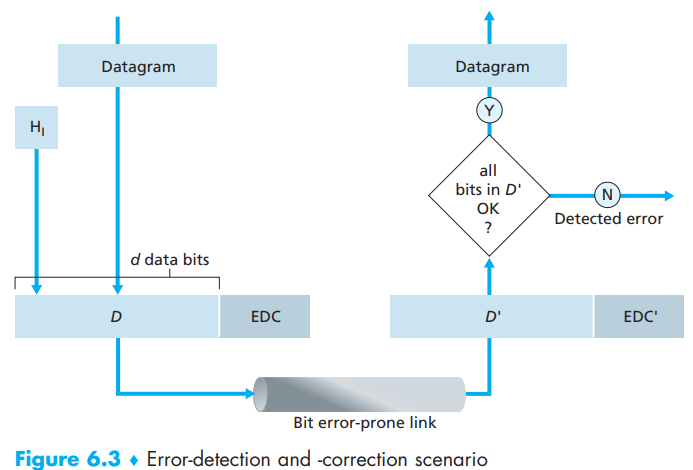
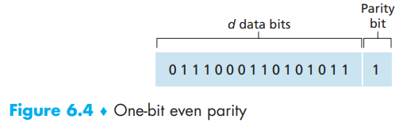
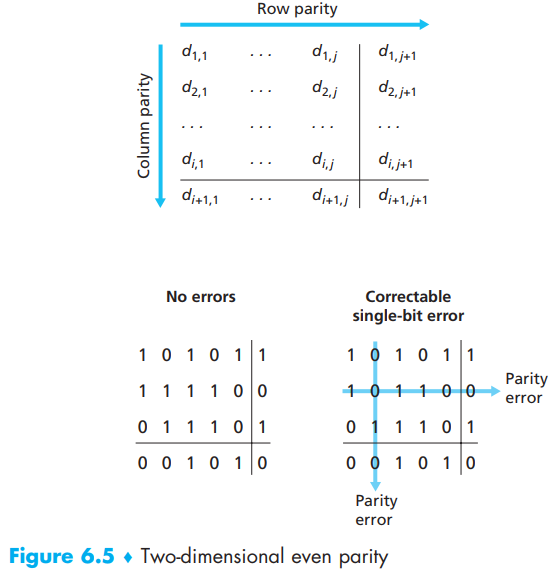
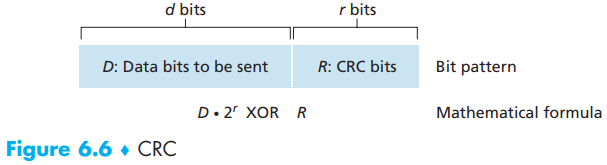
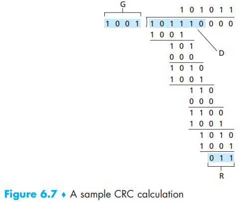

[toc]

Link layer provides **bit-level error detection** and **correction** - EDC.

Error-detection and -correction techniques allow the receiver to sometimes, but **not always**, detect that bit errors have occurred. So even with the use of error-detection bits there still may be **undetected bit errors**. And we can use some advanced methods to let those errors be as small as possible.

Let’s now examine three techniques for detecting errors in the transmitted data— **parity checks** (to illustrate the basic ideas behind error detection and correction), **check summing** methods (which are more typically used in the transport layer), and **cyclic redundancy checks** (which are more typically used in the link layer in an adapter).

# 1. Parity Checks

In an even parity scheme, the sender simply includes **one additional bit** and chooses its value such that the total number of 1s in the d + 1 bits (the original information plus a parity bit) is **even**.

Errors are often clustered together in “bursts.” Under burst error conditions, the probability of undetected errors in a frame protected by single-bit parity can approach 50 percent (even number of bits error will be undetected).

To improve this, we can use **two-dimensional** parity scheme, which means turning data into two-dimensional matrix first:

By checking both columns and rows for parity error, we can now not only know there is an error, but also recognize where the error occurs. The ability of the receiver to both detect and correct errors is known as **forward error correction (FEC)**. FEC techniques are valuable because they can *decrease the number of sender retransmissions* required. Perhaps more important, they allow for *immediate correction of errors* at the receiver.

# 2. Checksumming Methods

The Internet checksum is based on this approach—bytes of data are treated as 16-bit integers and summed.   

If any of the bits are 0, an error is indicated. RFC 1071 discusses the Internet checksum algorithm and its implementation in detail.

Checksumming methods require relatively little packet overhead. However, they provide relatively weak protection against errors as compared with cyclic redundancy check, which is
discussed below and which is often used in the link layer.

- checksumming used at the transport layer (software).
- cyclic redundancy check used at the link layer (Error detection at the link layer is implemented in dedicated **hardware **in adapters, which can rapidly perform the more complex CRC operations).

# 3. Cyclic Redundancy Check (CRC)

Based on **cyclic redundancy check (CRC) codes**, CRC codes are also known as **polynomial codes** since it is possible to view the bit string to be sent as a polynomial whose coefficients are the 0 and 1 values in the bit string, with operations on the bit string interpreted as polynomial arithmetic.

All CRC calculations are done in **modulo-2 arithmetic** without carries in addition or borrows in subtraction. This means that addition and subtraction are identical, and both are equivalent to the bitwise exclusive-or (XOR) of the operands.   

> Consider the d-bit piece of data, D, that the sending node wants to send to the receiving node. The sender and receiver must first agree on an **r + 1** bit pattern, known as a **generator**, which we will denote as **G**. We will require that the most significant (leftmost) bit of G be a 1. The key idea behind CRC codes is shown in Figure 6.6. For a given piece of data, D, the sender will choose r additional bits, R, and append them to D such that the resulting d + r bit pattern (interpreted as a binary number) is exactly divisible by G (i.e., has no remainder) using modulo-2 arithmetic. The process of error checking with CRCs is
> thus simple: *The receiver divides the d + r received bits by G. If the remainder is nonzero, the receiver knows that an error has occurred; otherwise the data is accepted as being correct.*

Multiplication and division are the same as in **base-2 arithmetic**, except that any required addition or subtraction is done **without** carries or borrows.  

This equation tells us that if we divide D # 2r by G, the value of the remainder
is precisely R. In other words, we can calculate R as: $R=$ remainder $\frac{D \cdot 2^{r}}{G}$.

Now let’s see an example:

D = 101110, d = 6, G = 1001, and r = 3.   

**International standards** have been defined for 8-, 12-, 16-, and 32-bit generators,
G. The CRC-32 32-bit standard, which has been adopted in a number of link-level
IEEE protocols, uses a generator of

$G_{CRC32} = 100000100110000010001110110110111$  