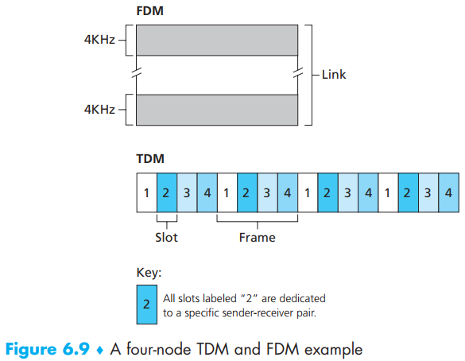
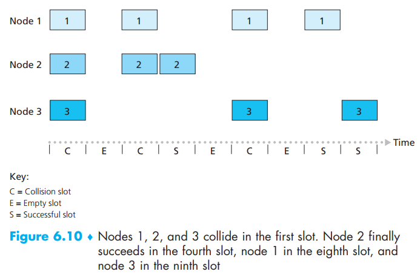
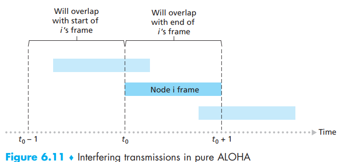
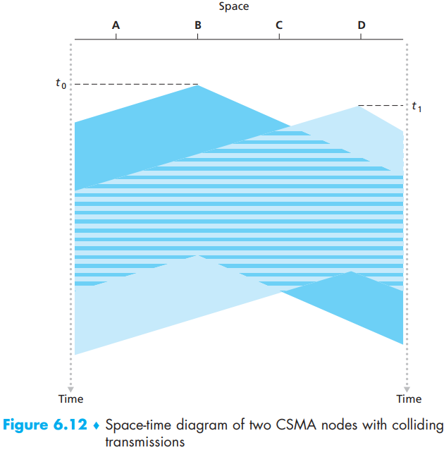
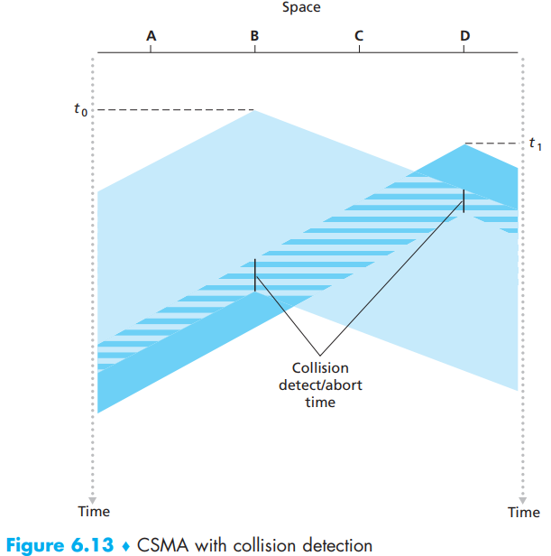
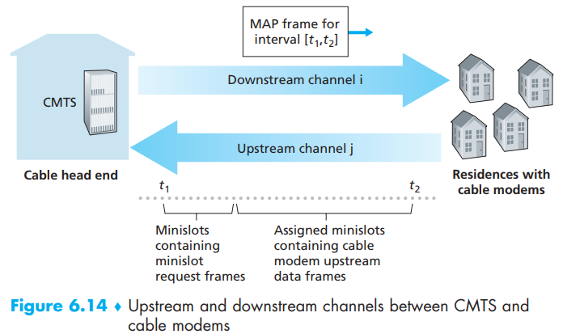

[toc]

- **point-to-point link**: consists of a single sender at one end of the link and a single receiver at the other end of the link (point-to-point protocol (PPP) and high-level data link control (HDLC) are two such protocols).
- **broadcast link**: when any one node transmits a frame, the channel broadcasts the frame and each of the other nodes receives a copy.  

How to coordinate the access of multiple sending and receiving nodes to a shared broadcast channel—the **multiple access** problem., 

When more than two nodes transmit frames at the same time; that is, the transmitted frames **collide **at all of the receivers. Typically, when there is a collision, none of the receiving nodes can make any sense of any of the frames that were transmitted.

This coordination job is the responsibility of the multiple access protocol, like those typical ones:

- **channel partitioning protocols **
- **random access protocols**
- **and taking-turns protocols **

All of them do jobs below:

- When only one node has data to send, that node has a throughput of R bps.
- When M nodes have data to send, each of these nodes has a throughput of R/M bps. This need not necessarily imply that each of the M nodes always has an instantaneous rate of R/M, but rather that each node should have an **average **transmission rate of R/M over some suitably defined interval of time.
- The protocol is **decentralized**; that is, there is no master node that represents a single point of failure for the network.
- The protocol is simple, so that it is inexpensive to implement.

# 1. Channel Partitioning Protocols

- **time-division multiplexing TDM**: divides time into time frames and further divides each **time frame** into N **time slots**.   Each time slot is then assigned to one of the N nodes. Whenever a node has a packet to send, it transmits the packet’s bits during its assigned time slot in the revolving TDM frame. This totally fair method is its advantage and drawback.
- **frequency-division multiplexing FDM**: divides the R bps channel into **different  frequencies** (each with a bandwidth of R/N) and creates N smaller channels of R/N bps out of the single, larger R bps channel. FDM shares both the advantages and drawbacks of TDM. It avoids collisions and divides the bandwidth fairly among the N nodes. However, FDM also shares a principal disadvantage with TDM—*a node is limited to a bandwidth of R/N, even when it is the only node with packets to send.*
- **code division multiple access(CDMA)**: assigns a different **code** to each node. Each node then uses its unique code to encode the data bits it sends. If the codes are chosen carefully, CDMA networks have the wonderful property that different nodes can transmit simultaneously and yet have their respective receivers correctly receive a sender’s encoded  data bits (assuming the receiver knows the sender’s code) in spite of interfering transmissions by other nodes.

# 2. Random Access Protocols

In a random access protocol, a transmitting node always transmits at the **full rate** of the channel, namely, R bps. When there is a collision, each node involved in the collision **repeatedly retransmits** its frame (*it waits a random delay before retransmitting the frame*) until its frame gets through without a collision.  

Each node involved in a collision chooses independent **random delays**. Because the random delays are independently chosen, it is possible that one of the nodes will pick a delay that is sufficiently less than the delays of the other colliding nodes and will therefore be able to **sneak **its frame into the channel without a collision.

## Slotted ALOHA

If we assume time is divided into **slots **of size L/R seconds (that is, a slot equals the time to
transmit one frame) and all nodes **synchronize **their transmissions to start at the beginning of a slot.   

Let p be a probability, that is, a number between 0 and 1. The operation of slotted ALOHA in each node is simple:

-  When the node has a fresh frame to send, it waits until the beginning of the next slot and transmits the entire frame in the slot.
- If there isn’t a collision, the node has successfully transmitted its frame and thus need not consider retransmitting the frame. (The node can prepare a new frame for transmission, if it has one.)
- If there is a collision, the node detects the collision before the end of the slot. The node **retransmits **its frame in each subsequent slot with probability p until the frame is transmitted without a collision.  

Slotted ALOHA is also highly **decentralized**, because each node detects collisions and **independently **decides when to retransmit.  

But we still can see some wastes (wasted nodes and empty frames), A slot in which exactly one node transmits is said to be a **successful **slot. The **efficiency **of a slotted multiple access protocol is defined to be the long-run fraction of successful slots in the case when there are a large number of active nodes, each always having a large number of frames to send.  

- When there are N active nodes, the efficiency of slotted ALOHA is $N p(1-p)^{N-1}$, the maximum efficiency of the protocol is given by 1/e = 0.37 (37 percent of the slots go empty and 26 percent of slots have collisions).

## ALOHA  

When a frame first arrives, the node **immediately **transmits the frame in its entirety into the
broadcast channel. If a transmitted frame experiences a collision with one or more other transmissions, the node will then **immediately **(after completely transmitting its collided frame) retransmit the frame with **probability p**.  

To determine the maximum efficiency of pure ALOHA:

- the probability that a given node has a successful transmission is p(1 - p)2(N - 1). The maximum efficiency of the pure ALOHA protocol is only 1/(2e)—exactly half that of slotted ALOHA (this then is the price to be paid for a **fully decentralized** ALOHA protocol).

## Carrier Sense Multiple Access (CSMA)

Two major abilities in **carrier sense multiple access (CSMA) and CSMA with collision detection (CSMA/CD)**:

- **carrier sensing**: Listen before speaking.
- **collision detection**: If someone else begins talking at the same time, stop talking.

Then how the hell would there be colliding with carrier sensing?

It is evident that the end-to-end **channel propagation** delay of a broadcast channel—the time it takes for a signal to propagate from one of the nodes to another—will play a crucial role in determining its performance. The longer this propagation delay, the larger the chance that a carrier-sensing node is not yet able to sense a transmission that has already begun at another node in the network.  

## Carrier Sense Multiple Access with Collision Detection (CSMA/CD)

The two nodes **each **abort their transmission a short time after detecting a collision. Clearly, adding collision detection to a multiple access protocol will help protocol performance by **not **transmitting a useless, damaged (by interference with a frame from another node) frame in its entirety.

Let us now summarize its operation from the perspective of an adapter (in a node) attached to a broadcast channel:

- The adapter obtains a datagram from the network layer, prepares a link-layer frame, and puts the frame adapter **buffer**.
- If the adapter senses that the channel is idle (that is, there is no signal energy entering the adapter from the channel), it starts to transmit the frame. If, on the other hand, the adapter senses that the channel is busy, it **waits **until it senses no signal energy and then starts to transmit the frame.
- While transmitting, the adapter **monitors **for the presence of signal energy coming from other adapters using the broadcast channel.
- If the adapter transmits the entire frame without detecting signal energy from other adapters, the adapter is finished with the frame. If, on the other hand, the adapter detects signal energy from other adapters while transmitting, it **aborts **the transmission (that is, it stops transmitting its frame).
- After aborting, the adapter waits a **random **amount of time and then returns to step 2.

The **binary exponential backoff** algorithm, used in Ethernet as well as in DOCSIS cable network multiple access protocols [DOCSIS 2011], elegantly solves the problem when the random time does not match the number of colliding nodes.

> Specifically, when transmitting a frame that has already experienced *n collisions*, a node chooses the value of K at random from {0,1,2, . . . . 2n -1}. Thus, *the more collisions experienced by a frame, the larger the interval from which K is chosen*. For Ethernet, the actual amount of time a node waits is **K * 512 bit times** (i.e., K times the amount of time needed to send 512 bits into the Ethernet) and the maximum value that n can take is capped at 10. 
>
> If the node chooses K = 1, it waits 512 bit times (e.g., 5.12 microseconds for a 100 Mbps Ethernet) before beginning the sense-and-transmit-when-idle cycle. After a second collision, K is chosen with equal probability from {0,1,2,3}. After three collisions, K is chosen with equal probability from {0,1,2,3,4,5,6,7}. After 10 or more collisions, K is chosen with equal probability from {0,1,2,…, 1023}.

The **efficiency **of CSMA/CD:

- $d_{trans}$ be the time to transmit a maximum-size frame. (bigger the better)
- $d_{prop}$ denote the maximum time it takes signal energy to propagate between any two adapters. (less the better)

Efficiency $=\frac{1}{1+5 d_{\text {prop }} / d_{\text {trans }}}$.

# 3. Taking-Turns Protocols

- when only one node is active, the active node has a throughput of R bps
- when M nodes are active, then each active node has a throughput of nearly R/M bps.

The ALOHA and CSMA protocols have this first property but not the second. This has motivated researchers to create another class of protocols—the taking-turns protocols:

- **polling protocol**: requires one of the nodes to be designated as a **master **node which **polls **each of the nodes in a round-robin fashion.

  > the master node first sends a message to node 1, saying that it (node 1) can transmit up to some maximum number of frames. After node 1 transmits some frames, the master node tells node 2 it (node 2) can transmit up to the maximum number of frames. (The master node can determine **when **a node has finished sending its frames by **observing **the lack of a signal on the channel).
  >
  > Drawbacks:
  >
  > 1. introduces a **polling delay**.
  > 2. if the master node fails, the entire channel becomes inoperative.

- **token-passing protocol**: A **small, special-purpose** frame known as a **token **is exchanged among the nodes in some fixed order.

  > For example, node 1 might always send the token to node 2, node 2 might always send the token to node 3, and node N might always send the token to node 1. When a node receives a token, it holds onto the token only if it has some frames to transmit; otherwise, it immediately forwards the token to the next node. If a node does have frames to transmit when it receives the token, it sends up to a maximum number of frames and then forwards the token to the next node. Token passing is decentralized and highly efficient.
  >
  > Drawbacks:
  >
  > 1. the failure of one node can crash the entire channel.
  > 2. if a node accidentally neglects to release the token, then some recovery procedure must be invoked to get the token back in circulation.

# 4 DOCSIS: The Link-Layer Protocol for Cable Internet Access

- **FDM**: The Data-Over-Cable Service Interface Specifications (DOCSIS) [DOCSIS 2011] specifies the  cable data network architecture and its protocols and uses **FDM **to divide the **downstream (CMTS to modem)** and **upstream (modem to CMTS)** network segments into multiple frequency channels. Each downstream channel is 6 MHz wide, with a maximum throughput of approximately 40 Mbps per channel (although this data rate is seldom seen at a cable modem in practice); each upstream channel has a maximum channel width of 6.4 MHz, and a maximum upstream throughput of approximately 30 Mbps. Each upstream and downstream channel is a **broadcast channel**. The upstream direction, however, is more interesting and technically challenging, since multiple cable modems share the same upstream channel (frequency) to the CMTS, and thus collisions can potentially occur (there is just a single CMTS transmitting into the downstream channel).  

- **IDM**: Each upstream channel is divided into **intervals of time (TDM-like)**, each containing a sequence of **mini-slots** during which cable modems can transmit to the CMTS. The CMTS explicitly **grants permission** to individual cable modems to transmit during specific mini-slots. 

- **centrally allocated time slots**: The CMTS accomplishes this by sending a control message known as a **MAP message** on a downstream channel to specify which cable modem (with data to send) can transmit during which mini-slot for the interval of time **specified** in the control message. Since mini-slots are explicitly allocated to cable modems, the CMTS can ensure there are **no **colliding transmissions during a mini-slot.

- **random access**: But how does the CMTS know which cable modems have data to send in the first place? This is accomplished by having cable modems send **mini-slot-request frames** to the CMTS during a special set of interval mini-slots that are dedicated for this purpose. A cable modem can neither sense whether the upstream channel is busy nor detect collisions. Instead, the cable modem **infers **that its mini-slot-request frame experienced a collision if it does not receive a **response** to the requested allocation in the next downstream control message. When a collision is inferred, a cable modem uses **binary exponential backoff** to defer the **retransmission **of its mini-slot-request frame to a future time slot. When there is little traffic on the upstream channel, a cable modem may actually transmit data frames during slots nominally assigned for mini-slot-request frames (and thus avoid having to wait for a mini-slot assignment)  

