[toc]

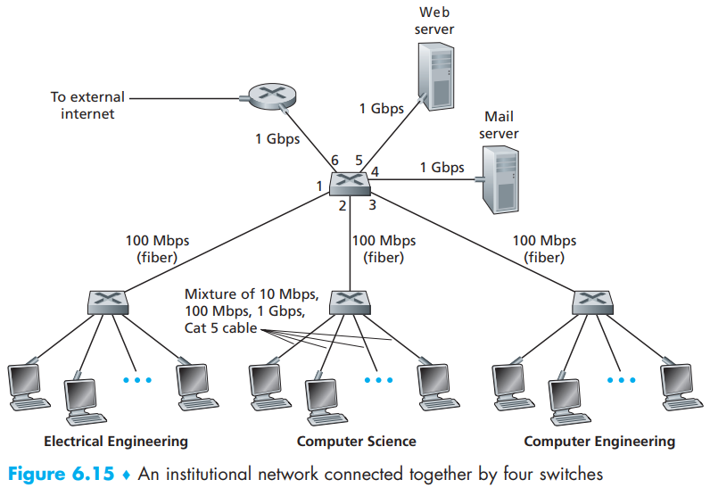

Those switches operate at the link layer, they switch link-layer frames (rather than network-layer datagrams), **don’t **recognize network layer addresses, and **don’t **use routing algorithms like RIP or OSPF to determine paths through the network of layer-2 switches. Instead of using IP addresses, we will soon see that they use **link-layer addresses** to forward link-layer frames through the network of switches.

# 1. Link-Layer Addressing and ARP

Why in the world do we need to have addresses at both the network and link layers?  

## MAC Addresses

A link layer address is variously called a **LAN address**, a **physical address**, or a **MAC
address**, which is 6 bytes long, giving 248 possible MAC addresses.

It is not hosts and routers that have link-layer addresses but rather their **adapters **(that is, network interfaces) that have link-layer addresses. A host or router with **multiple **network interfaces will thus have **multiple **link-layer addresses associated with it, just as it would also have **multiple **IP addresses associated with it.

the **IEEE **manages the MAC address space. In particular, when a company wants to manufacture adapters, it **purchases **a chunk of the address space consisting of 224 addresses for a nominal fee. IEEE allocates the chunk of 224 addresses by fixing the first 24 bits of a MAC address and letting the company create **unique **combinations of the last 24 bits for each adapter.

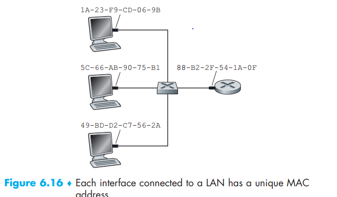

However, the link layer switches do **not **have MAC addresses on interfaces!

An adapter’s MAC address is analogous to a person’s social security number, which also has a **flat addressing structure** and which **doesn’t change** no matter where the person goes (An IP address is analogous to a person’s postal address).

When an adapter receives a frame, it will check to see whether the destination MAC address in the frame matches its own MAC address

- If there is a match, the adapter **extracts **the enclosed datagram and passes the datagram up the protocol stack.
- If there isn’t a match, the adapter **discards **the frame, without passing the network-layer datagram up.

However, sometimes a sending adapter does want all the other adapters on the LAN to receive and process the frame it is about to send. In this case, the sending adapter inserts a special **MAC broadcast address** into the destination address field of the frame. For LANs that use 6-byte addresses (such as Ethernet and 802.11), the broadcast address is a string of 48 consecutive 1s (that is, FF-FF-FF-FF-FF-FF in hexadecimal notation).

## Address Resolution Protocol (ARP)

To **translate **between network-layer addresses (for example, Internet IP addresses) and link-layer addresses (that is, MAC addresses) on the **same **subnet.

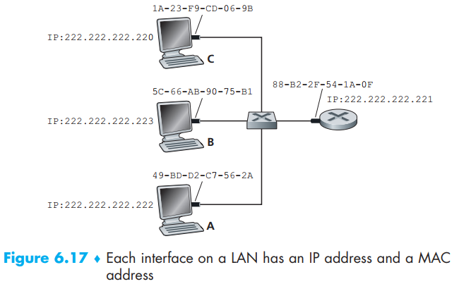

Each host and router has an ARP table in its memory, which contains mappings of IP addresses
to MAC addresses:

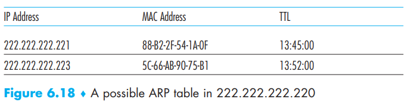

Note that a table does not necessarily contain an entry for every host and router on the subnet; some may have never been entered into the table, and others may have expired (time-to-live (TTL) value, typically 20 minutes).

So what if the switch we want to send to is not in the ARP table? The sender constructs a special packet called an **ARP packet**. An ARP packet has several fields, including the **sending and receiving IP and MAC addresses**. Both ARP query and response packets have the same format. The purpose of the ARP query packet is to *query all the other hosts and routers on the subnet to determine the MAC address corresponding to the IP address* that is being resolved.

Say host 222.222.222.220 wants to send a datagram to 222.222.222.222:

1. 222.222.222.220 passes an **ARP query packet** to the adapter along with an indication that the adapter should send the packet to the **MAC broadcast address**.
2. The adapter encapsulates the ARP packet in a link-layer frame, uses the broadcast address for the frame’s destination address, and transmits the frame into the subnet.
3. The frame containing the ARP query is received by **all **the other adapters on the subnet.
4. Each adapter passes the ARP packet within the frame up to its ARP module.
5. Each of these ARP modules checks to see if its IP address matches the destination IP address in the ARP packet.
6. The one with a match sends back to the querying host a **response ARP packet** with the **desired** mapping.
7. The querying host 222.222.222.220 can then **update **its ARP table and send its IP datagram, encapsulated in a link-layer frame whose destination MAC is that of the host or router responding to the earlier ARP query.

Note:

- The query ARP message is sent within a **broadcast frame**, whereas the response ARP message is sent within a **standard frame**.
- ARP is **plug-and-play**; that is, an ARP table gets built automatically—it doesn’t have to be configured by a system administrator.
- If a host becomes disconnected from the subnet, its entry is eventually deleted from the
  other ARP tables in the subnet.

## Sending a Datagram off the Subnet

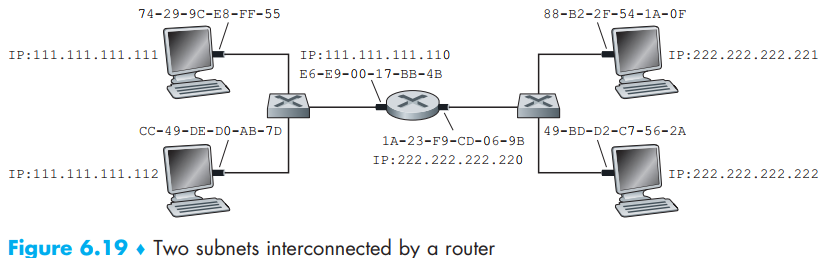

For each router interface there is also an ARP module (in the router) and an adapter. Because the router in Figure 6.19 has **two **interfaces, it has **two **IP addresses, **two **ARP modules, and **two **adapters.   

suppose that host 111.111.111.111 wants to send an IP datagram to a host 222.222.222.222:

> If we look carefully at Figure 6.19, we see that in order for a datagram to go from 111.111.111.111 to a host on Subnet 2, the datagram must first be sent to the router
> interface 111.111.111.110, which is the IP address of the first-hop router on the path to the final destination. Thus, the appropriate MAC address for the frame is the address of the adapter for **router **interface 111.111.111.110, namely, E6-E9-00-17- BB-4B. How does the sending host acquire the MAC address for 111.111.111.110? By using ARP, of course! Once the sending adapter has this MAC address, it creates a frame (containing the datagram addressed to 222.222.222.222) and sends the frame into Subnet 1. The router adapter on Subnet 1 sees that the link-layer frame is addressed to it, and therefore **passes the frame to the network layer of the router**. Hooray—the IP datagram has successfully been moved from source host to the router! But we are not finished. We still have to move the datagram from the router to the destination. The router now has to determine the correct interface on which the datagram is to be forwarded. As discussed in Chapter 4, this is done by consulting a forwarding table in the router. The forwarding table tells the router that the datagram is to be forwarded via router interface 222.222.222.220. This interface then passes the datagram to its adapter, which encapsulates the datagram in a new frame and sends the frame into Subnet 2. This time, the destination MAC address of the frame is indeed the MAC address of the ultimate destination. And how does the router obtain this destination MAC address? From ARP, of course! 

# 2. Ethernet

1. mid-1970s: coaxial **bus**. Ethernet with a bus topology is a broadcast LAN  
2. late 1990s: most companies and universities had replaced their LANs with Ethernet installations using a hub-based star topology. A **hub **is a physical-layer device that acts on **individual bits** rather than frames.
3. early 2000s: Ethernet installations continued to use a star topology, but the hub at the center was replaced with a **switch** (“collision-less” but is also a bona-fide store-and-forward packet switch).

## Ethernet frame structure

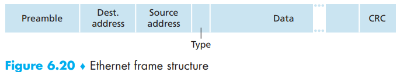

- **Data field (46 to 1,500 bytes)**. This field carries the IP datagram. The maximum transmission unit (MTU) of Ethernet is 1,500 bytes (minimum 46 bits). This means that if the IP datagram is less than 46 bytes, the data field has to be “stuffed” to fill it out to 46 bytes. Data passed to the network layer contains the stuffing as well as an IP datagram. The network layer uses the length field in the IP datagram header to **remove **the stuffing.
- **Destination address (6 bytes)**. When adapter B receives an Ethernet frame whose destination address is its MAC addresses or the MAC broadcast address, it passes the contents of the frame’s data field to the network layer; if it receives a frame with any other MAC address, it discards the frame.
- **Source address (6 bytes)**. This field contains the MAC address of the adapter that transmits the frame onto the LAN.
- **Type field (2 bytes)**. The type field permits Ethernet to **multiplex **network-layer protocols.  *To understand this, we need to keep in mind that hosts can use other network-layer protocols besides IP*. IP and other network-layer protocols (for example, Novell IPX or AppleTalk) each have their own, standardized type number. Furthermore, the ARP protocol (discussed in the previous section) has its own type number, and if the arriving frame contains an ARP packet (i.e., has a type field of 0806 hexadecimal), the ARP packet will be demultiplexed up  to the ARP protocol.
- **Cyclic redundancy check (CRC) (4 bytes)**. The purpose of the CRC field is to allow the receiving adapter, adapter B, to detect **bit errors** in the frame.
- **Preamble (8 bytes)**. Each of the first 7 bytes of the preamble has a value of 10101010; the last byte is 10101011. The first 7 bytes of the preamble serve to “wake up” the receiving  adapters and to synchronize their clocks to that of the sender’s clock. Keep in mind that adapter A aims to transmit the frame at 10 Mbps, 100 Mbps, or 1 Gbps, depending on the type of Ethernet LAN. However, because nothing is absolutely perfect, adapter A will not transmit the frame at exactly the target rate; there will always be some **drift **from the target rate, a drift which is not known a priori by the other adapters on the LAN. A receiving adapter can lock onto adapter A’s clock simply by locking onto the bits in the first 7 bytes of the preamble. The last 2 bits of the eighth byte of the preamble (the first two consecutive 1s) alert adapter B that the “important stuff” is about to come.

Ethernet technologies provide an **unreliable **service to the network layer. When a frame fails the CRC check, adapter B simply **discards **the frame. Thus, adapter A has no idea whether its transmitted frame reached adapter B and passed the CRC check.

If the application is using UDP, then the application in Host B will indeed see gaps in the data. On the other hand, if the application is using TCP, then TCP in Host B will not acknowledge the data contained in discarded frames, causing TCP in Host A to retransmit. Ethernet does retransmit data, although Ethernet is **unaware** of whether it is transmitting a brand-new datagram with brand-new data, or a datagram that contains data that has already been transmitted at least once.

## Ethernet Technology

In fact, Ethernet comes in many **different **flavors, with somewhat bewildering acronyms such as 10BASE-T, 10BASE-2, 100BASE-T (**standardized **over the years by the IEEE 802.3 CSMA/CD (Ethernet)):

- The first part of the acronym refers to the **speed **of the standard: 10, 100, 1000, or 10G, for 10 Megabit (per second), 100 Megabit, Gigabit, 10 Gigabit and 40 Gigibit Ethernet.
- “BASE” refers to **baseband **Ethernet, meaning that the physical media only carries Ethernet traffic; almost all of the 802.3 standards are for baseband Ethernet.
- The final part of the acronym refers to the **physical media** itself; Ethernet is **both **a link-layer and a physical-layer specification and is carried over a variety of physical media including coaxial cable, copper wire, and fiber. Generally, a “T” refers to twisted-pair copper wires.  

A **repeater**—a physical-layer device that receives a signal on the input side, and regenerates the signal on the output side—is used for longer runs.

In most installations today, nodes are connected to a switch via point-to point segments made of twisted-pair copper wires or fiber-optic cables:

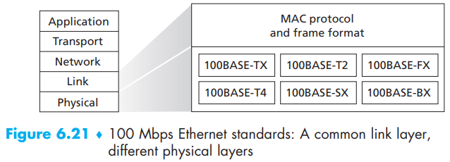

The standard for Gigabit Ethernet, referred to as IEEE 802.3z, does the following:

- Uses the standard Ethernet frame format (Figure 6.20) and is backward compatible with 10BASE-T and 100BASE-T technologies.
- Uses the standard Ethernet frame format (Figure 6.20) and is backward compatible with 10BASE-T and 100BASE-T technologies. In Gigabit Ethernet jargon, hubs are called buffered distributors.
- Uses CSMA/CD for shared broadcast channels. In order to have acceptable efficiency, the  **maximum distance** between nodes must be severely restricted.
- Allows for full-duplex operation at 40 Gbps in both directions for point-to-point channels.  

In the days of bus topologies and hub-based star topologies, Ethernet was clearly a broadcast link (as defined in Section 6.3) in which frame collisions occurred when nodes transmitted at the same time. To deal with these collisions, the Ethernet standard included the CSMA/CD protocol, which is particularly effective for a wired broadcast LAN spanning a small geographical region.

But if the prevalent use of Ethernet today is a switch-based star topology, using **store-and-forward** packet switching, is there really a need anymore for an Ethernet MAC protocol? As we’ll see shortly, **a switch coordinates its transmissions and never forwards more than one frame onto the same interface at any time**. Furthermore, modern switches are **full-duplex**, so that a switch and a node can each send frames to each other at the same time without interference. In other words, in a switch-based Ethernet LAN there are no collisions and, therefore, there is no need for a MAC protocol!  

Perhaps the Ethernet’s frame format is the one true and timeless centerpiece of the Ethernet standard.  

# 3. Link-Layer Switches

- The role of the switch is to **receive **incoming link-layer frames and **forward **them onto outgoing links.
- It’s **transparent**, meaning that both senders and receivers don’t know its existence when communicating.
- switch output interfaces have **buffers **to accommodate the problem of congestion

## Forwarding and Filtering

- **Filtering **is the switch function that determines whether a frame should be forwarded to some interface or should just be dropped.
- **Forwarding **is the switch function that determines the interfaces to which a frame should be directed, and then moves the frame to those interfaces.   

Switch filtering and forwarding are done with a switch table. The switch table contains entries for some, but not necessarily all, of the hosts and routers on a LAN, which combines:

1. a MAC address
2. the switch interface that leads toward that MAC address
3. the time at which the entry was placed in the table

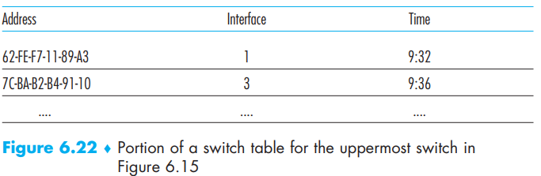

Three situations can occur in a frame with destination address DD-DD-DD-DD-DD-DD arrives  on interface x:

- There is **no entry **in the table for DD-DD-DD-DD-DD-DD. If there is no entry for the destination address, the switch **broadcasts **the frame.
- There is an entry in the table, associating DD-DD-DD-DD-DD-DD with interface x. There being no need to forward the frame to any of the other interfaces, the switch performs the filtering function by **discarding **the frame.
- There is an entry in the table, associating DD-DD-DD-DD-DD-DD with interface y≠x. The switch performs its **forwarding function** by putting the frame in an output buffer that precedes interface y.  

It should be clear from this example that as long as the switch table is complete and accurate, the switch forwards frames toward destinations without any broadcasting.

## Self-learning

Switches are **self-learning**. A switch has the wonderful property (particularly for the already-overworked network administrator) that its table is built automatically, dynamically, and autonomously— **without **any intervention from a network administrator or from a configuration protocol:

1. The switch table is initially **empty**.

2. For each incoming frame received on an interface, the switch stores in its table:

   1. the **MAC address** in the frame’s source address field.
   2. the **interface **from which the frame arrived.
   3. the current time.

   If every host in the LAN eventually sends a frame, then every host will eventually get
   recorded in the table.

3. The switch **deletes **an address in the table if no frames are received with that address as the source address after some period of time (the **aging time**)

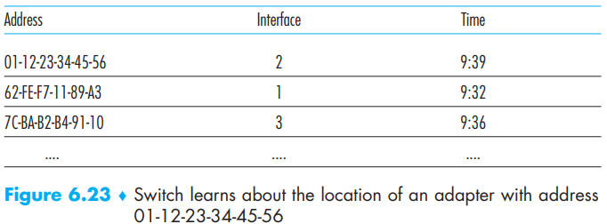

So switches are **plug-and-play** devices because they require no intervention from a network administrator or user.

Switches are also **full-duplex**, meaning any switch interface can send and receive at the
same time.

## Properties of Link-Layer Switching

We can identify several advantages of using switches, rather than broadcast links such as buses or hub-based star topologies:

- **Elimination of collisions**. The switches buffer frames and never transmit more than **one **frame on a segment at any one time. As with a router, the maximum aggregate throughput of a switch is the sum of all the switch interface rates. Thus, switches provide a significant performance improvement over LANs with broadcast links.
- **Heterogeneous links**. Because a switch **isolates **one link from another, the different links in the LAN can operate at different speeds and can run over different media.
-  **Management**. . For example, if an adapter malfunctions and continually sends Ethernet frames (called a jabbering adapter), a switch can detect the problem and internally disconnect the malfunctioning adapter without administrators. Similarly, a cable cut disconnects only that host that was using the cut cable to connect to the switch. Switches also gather statistics on bandwidth usage, collision rates, and traffic types, and make this information available to the network manager.   

## Switches Versus Routers

- Both of them are **store and forward**.
- Modern switches using the “**match plus action**” operation can be used to forward a layer-2 frame based on the frame's destination **MAC address**, as well as a layer-3 datagram using the datagram's destination **IP address**.
- A router is a layer-3 packet switch, a switch is a layer-2 packet switch.
- Switches are **plug-and-play,** but routers need configurations.

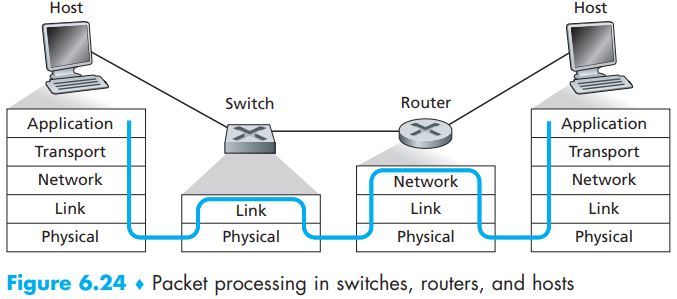

==Given that both switches and routers are candidates for interconnection devices, what are the pros and cons of the two approaches?==

Switch:

- Pro
  - plug-and-play.
  - relatively high filtering and forwarding rates.
  - have to process frames only up through layer 2.

- Con
  - to prevent the cycling of broadcast frames, the active topology of a switched network is restricted to a **spanning tree**.
  - a large switched network would require large ARP tables in the hosts and routers and would generate substantial ARP traffic and processing.
  - susceptible to broadcast storms: if one host goes haywire and transmits an endless stream of Ethernet broadcast frames, the switches will forward all of these frames, causing the entire network to collapse.

Router:

- Pro
  - packets do not normally cycle through routers even when the network has redundant paths.
  - packets are not restricted to a spanning tree and can use the best path between source and destination. So to allowed the Internet to be built with a rich topology that includes.
  - provide firewall protection against layer-2 broadcast storms.

- Con
  - they are not plug-and-play. They and the hosts that connect to them need their IP addresses to be configured.  
  - routers often have a larger per-packet processing time than switches. 

Institutional:

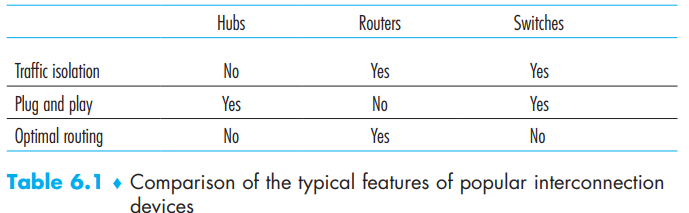

- Typically, small networks consisting of a few hundred hosts have a few LAN segments. Switches suffice for these small networks, as they localize traffic and increase aggregate throughput without requiring any configuration of IP addresses.
- But larger networks consisting of thousands of hosts typically include routers within the network (in addition to switches). The routers provide a more robust isolation of traffic, control broadcast storms, and use more “intelligent” routes among the hosts in the network.  

# 4. Virtual Local Area Networks (VLANs)  

First let’s see the drawbacks of Figure 6.15 in reality:

- **Lack of traffic isolation**: Limiting the scope of broadcast traffic would improve LAN performance. Perhaps more importantly, it also may be desirable to limit LAN broadcast traffic for security/privacy reasons.
- **Inefficient use of switches**. If instead of three groups, the institution had 10 groups, then 10 first-level switches would be required. If each group were small, say less than 10 people, then a single 96-port switch would likely be large enough to accommodate everyone, but this single switch would not provide traffic isolation.
- **Managing users**. If an employee moves between groups, the physical cabling must be changed to connect the employee to a different switch in Figure 6.15. Employees  belonging to two groups make the problem even harder.  

Fortunately, switch that supports **virtual local area networks **(VLANs) allows multiple virtual local area networks to be defined over a single physical local area network infrastructure.   

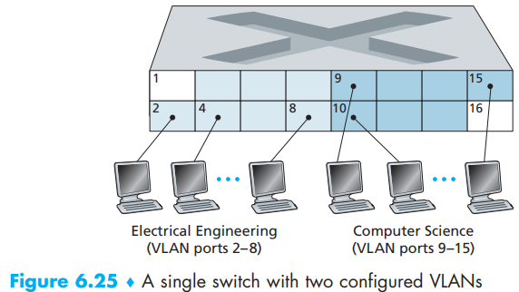

A single switch with 16 ports. Ports 2 to 8 belong to the EE VLAN, while ports 9 to 15 belong to the CS VLAN (ports 1 and 16 are unassigned).  

The network manager declares a port to belong to a given VLAN (with undeclared ports belonging to a default VLAN) using **switch management software,** a table of port-to-VLAN mappings is maintained within the switch; and switch hardware only delivers frames between ports belonging to the same VLAN.  

*How can traffic from the EE Department be sent to the CS Department?* One way to handle this would be to connect a VLAN switch port (e.g., port 1 in Figure 6.25) to an **external **router (vendors tend to give device that contains both a switch and a router) and configure that port to belong both the EE and CS VLANs. In this case, even though the EE and CS departments share the same physical switch, the logical configuration would look as if the EE and CS departments had separate switches connected via a router.

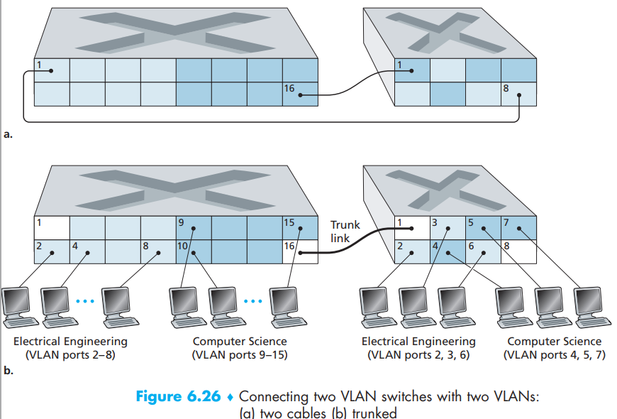

Now let’s see there is a separate department want access to the CS and EE VLAN. And how should we configure this?

- Use two cables to connect each other. In this case, the more sub VLANs, the less interfaces in the main router for use.
- **VLAN trunking**. A special port on each switch (port 16 on the left switch and port 1 on the right switch) is configured as a **trunk port** to interconnect the two VLAN switches.  

The trunk port belongs to **all **VLANs, and frames sent to any VLAN are **forwarded **over the trunk link to the other switch.   

*How does a switch know that a frame arriving on a trunk port belongs to a particular VLAN?*

The IEEE has defined an extended Ethernet frame format, 802.1Q, for frames crossing a **VLAN
trunk**. As shown in Figure 6.27, the 802.1Q frame consists of the standard Ethernet frame with a four-byte **VLAN tag** added into the header that carries the identity of the VLAN to which the frame belongs.

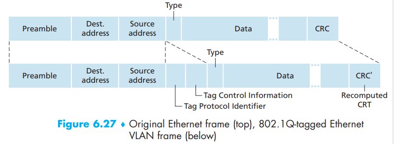

The VLAN tag itself consists of:

-  a 2-byte Tag Protocol Identifier (TPID) field (with a fixed hexadecimal value of 81-00)
- a 2-byte Tag Control Information field that contains a 12-bit VLAN identifier field, and a 3-bit priority field that is similar in intent to the IP datagram TOS field.

Lastly, VLANs can do more:

- In MAC-based VLANs, the network manager specifies the set of MAC addresses that belong to each VLAN; whenever a device attaches to a port, the port is connected into the appropriate VLAN based on the MAC address of the device.
- VLANs can also be defined based on network-layer protocols (e.g., IPv4, IPv6, or Appletalk) and other criteria.
- VLANs to be extended across IP routers, allowing islands of LANs to be connected together to form a single VLAN that could span the globe  

