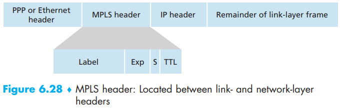
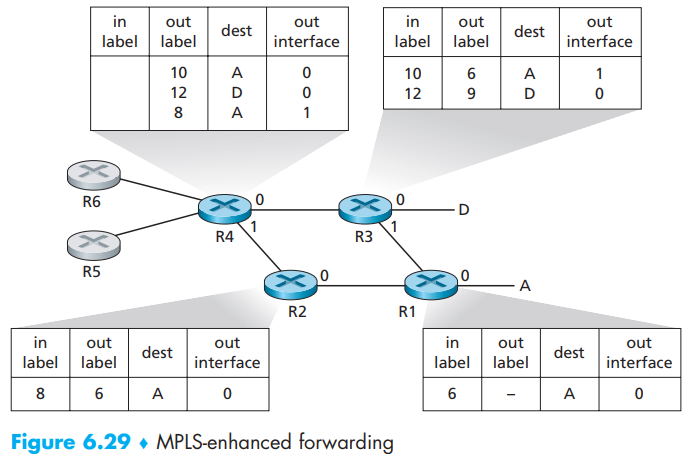

[toc]

Unlike the circuit-switched telephone network, MPLS is a packet-switched, virtual-circuit network in its own right. It has its own packet formats and forwarding behaviors. Thus, from a pedagogical viewpoint, a discussion of MPLS fits well into a study of either the network layer or the link layer.

# 1. Multiprotocol Label Switching (MPLS)

The goal was not to abandon the destination-based IP datagram-forwarding infrastructure for
one based on fixed-length labels and virtual circuits, but to augment it by selectively labeling datagrams and allowing routers to forward datagrams based on **fixed-length **labels (rather than destination IP addresses) when possible.

An MPLS-enhanced frame can only be sent between **routers **that are both MPLS capable. 

An MPLS-capable router is often referred to as a **label-switched router**, since it forwards an MPLS frame by looking up the MPLS label in its forwarding table and then immediately passing the datagram to the appropriate output interface. The MPLS-capable router need **not** extract the destination IP address and perform a lookup of the longest prefix match in the forwarding table.   

We assume R1, R2, R3, R4 are all MPLS capable routers. The MPLS-capable routers R1 through R4 do so without ever touching the IP header of a packet.

An extension of the RSVP protocol, known as RSVP-TE [RFC 3209], will be the focus of its efforts for MPLS signaling.

Thus far, the emphasis of our discussion of MPLS has been on the fact that MPLS performs switching based on **labels**, without needing to consider the IP address of a packet. But the new traffic management capabilities that MPLS enables matters more. . This is one simple form of traffic engineering using MPLS: 

> If forwarding were performed up at the IP layer on the basis of IP address, the IP routing protocols we studied in Chapter 5 would specify only a single, least-cost path to A. Thus, MPLS provides the ability to forward packets along routes that would not be possible using standard IP routing protocols.   

It is also possible to use MPLS for many other purposes as well:

- perform fast restoration of MPLS forwarding paths

- reroute traffic over a precomputed failover path in response to link failure

- MPLS can, and has, been used to implement so-called *virtual private networks (VPNs)*:

  > In implementing a VPN for a customer, an ISP uses its MPLS-enabled network to connect together the customer’s various networks. MPLS can be used to isolate both the resources and addressing used by the customer’s VPN from that of other users crossing the ISP’s network  