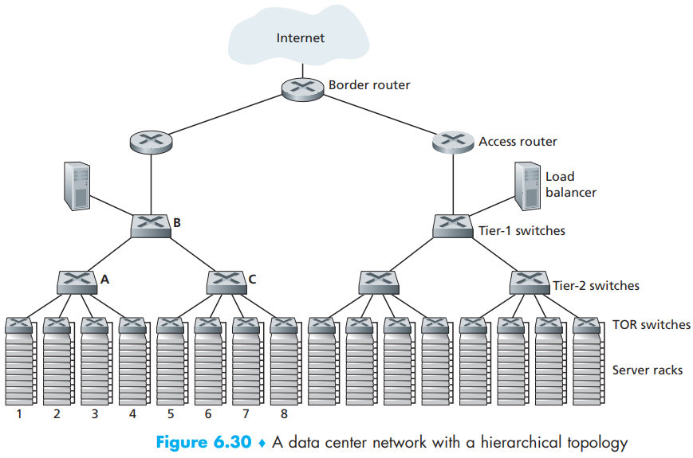
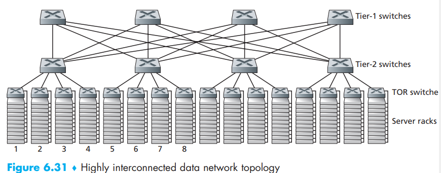

[toc]

**Data center network** can cause a shit ton of many:

- 45 percent can be attributed to the hosts themselves (which need to be replaced every 3–4 years).
- 25 percent to infrastructure, including transformers, uninterruptable power supplies (UPS) systems, generators for long-term outages, and cooling systems.
- 15 percent for electric utility costs for the power draw.
- 15 percent for **networking**, including network gear (switches, routers and load balancers), external links, and transit traffic costs.

The hosts in data centers, called **blades **and resembling pizza boxes, are generally commodity hosts that include CPU, memory, and disk storage.   

The hosts are stacked in racks, with each rack typically having 20 to 40 blades. At the top of each rack there is a switch, aptly named the **Top of Rack (TOR) switch**, that interconnects the hosts in the rack with each other and with other switches in the data center. Specifically, each host in the rack has a network interface card that connects to its TOR switch, and each TOR switch has additional ports that can be connected to other switches.  

Today hosts typically have 40 Gbps Ethernet connections to their TOR switches [Greenberg 2015]. Each host is also assigned its own *data-center-internal IP address*.

The data center network supports two types of traffic:

- *traffic flowing between external clients and internal hosts*. The data center network includes one or more **border routers**, connecting the data center network to the public Internet.
- *traffic flowing between internal hosts*. The data center network therefore interconnects the racks with each other and connects the racks to the border routers.

**Data center network design** is the art of designing the interconnection network and protocols that connect the racks with each other and with the border routers.

## Load Balancing

Inside the data center, the external requests are first directed to a **load balancer** whose job it is to distribute requests to the hosts, balancing the load across the hosts as a function of their current load. A large data center will often have several load balancers, each one devoted to a set of specific **cloud **applications. Such a load balancer is sometimes referred to as a “layer-4 switch” since it makes decisions based on the **destination port number** (layer 4) as well as **destination IP address** in the packet.

The load balancer not only balances the work load across hosts, but also provides a **NAT-like** function, translating the public external IP address to the internal IP address of the appropriate host, and then translating back for packets traveling in the reverse direction back to the clients.   

## Hierarchical Architecture

A data center often employs a **hierarchy of routers and switches**. All links typically use Ethernet for their link-layer and physical-layer protocols, with a mix of copper and fiber cabling. With such a hierarchical design, it is possible to scale a data center to hundreds of thousands of hosts.  

Observe that the hosts below each access router form a single subnet. In order to localize **ARP **broadcast traffic, each of these subnets is further partitioned into smaller **VLAN** subnets, each comprising a few hundred hosts [Greenberg 2009a].  

Although the conventional hierarchical architecture just described solves the problem of scale, it suffers from *limited host-to-host capacity* [Greenberg 2009b].

## Trends in Data Center Networking

When using highly interconnected topologies, one of the major issues is designing **routing algorithms** among the switches. One possibility [Greenberg 2009b] is to use a form of random routing. Another possibility [Guo 2009] is to deploy multiple network interface cards in each host, connect each host to multiple low-cost commodity switches, and allow the hosts themselves to intelligently route traffic among the switches. Variations and extensions of these approaches are currently being deployed in contemporary data centers.  

### *new interconnection architectures and network protocols*

This overcomes the drawbacks of the traditional hierarchical designs. One such approach is to replace the hierarchy of switches and routers with a fully connected topology.

In this design, each tier-1 switch connects to all of the tier-2 switches so that:

- host-to-host traffic never has to rise above the switch tiers.
- with n tier-1 switches, between any two tier-2 switches there are n disjoint paths. Such a design can significantly improve the host-to-host capacity.

 ### *shipping container–based modular data centers*

> Each container has up to a few thousand hosts, stacked in tens of racks, which are packed closely together. At the data center location, multiple containers are interconnected with each other and also with the Internet. Once a prefabricated container is deployed at a data center, it is often difficult to service. Thus, each container is designed for graceful performance degradation: as components (servers and switches) fail over time, the container continues to operate but with degraded performance. When many components have failed and performance has dropped below a threshold, the entire container is removed and replaced with a fresh one.

### building or customizing just about everything that is in their data centers

Includes network adapters, switches routers, TORs, software, and networking protocols   

### improve reliability with “availability zones,”

Replicate distinct data centers in different nearby buildings. By having the buildings nearby (a few kilometers apart), transactional data can be synchronized across the data centers in the same **availability zone** while providing fault tolerance [Amazon 2014].

