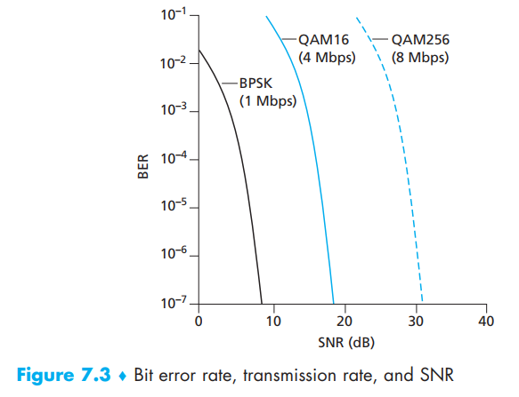
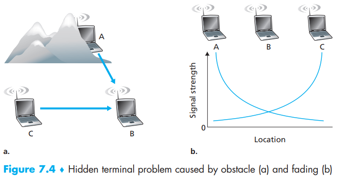
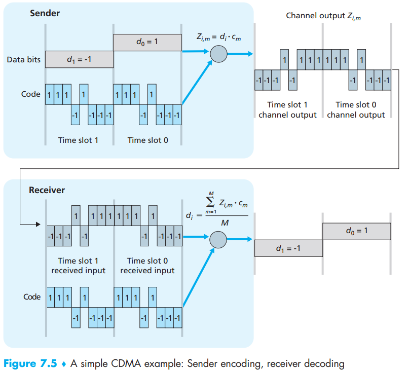
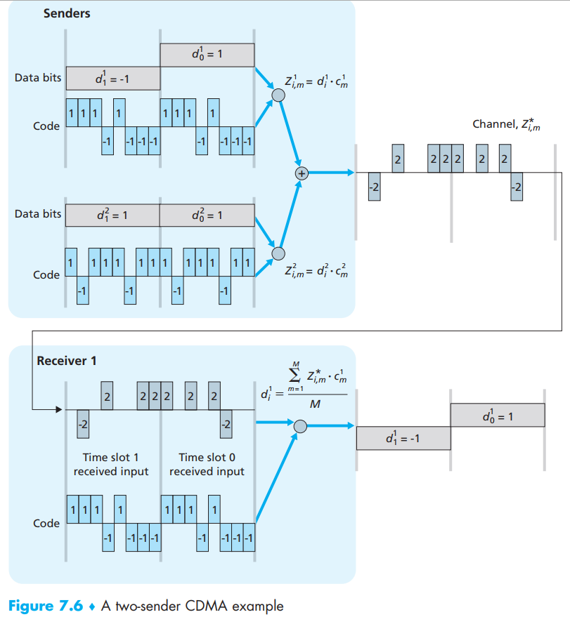

[toc]

We can find a number of important differences between a wired link and a wireless link:  

- **Decreasing signal strength**. Even in free space, the signal will **disperse**, resulting in decreased signal strength (sometimes referred to as **path loss**) as the distance between sender and receiver increases.  
- **Interference from other sources.** Radio sources transmitting in the same frequency
  band will interfere with each other.
- **Multipath propagation.** Occurs when portions of the electromagnetic wave **reflect** off objects and the ground, taking paths of different lengths between a sender and receiver.   

The discussion above suggests that **bit errors** will be more common in wireless links than in wired links. Wireless link protocols employ not only powerful **CRC error detection codes**, but also **link-level reliable-data-transfer protocols** that retransmit corrupted frames.

- **signal-to-noise ratio (SNR)** is a *relative* measure of the strength of the received signal (i.e., the information being transmitted) and this noise. The SNR is typically measured in units of decibels (dB). We need only know that a **larger **SNR makes it **easier **for the receiver to extract the transmitted signal from the background noise.
- bit error rate (BER)— roughly speaking, the probability that a transmitted bit is received in error at the receiver.

Several physical-layer characteristics that are important in understanding higher-layer wireless communication protocols:

- *For a given modulation scheme, the higher the SNR, the lower the BER.* 
- *For a given SNR, a modulation technique with a higher bit transmission rate
  (whether in error or not) will have a higher BER.*
- *Dynamic selection of the physical-layer modulation technique can be used to
  adapt the modulation technique to channel conditions.*

Besides bit errors, there are other differences:

- **hidden terminal problem**: physical obstructions in the environment (for example, a mountain or a building) may prevent A and C from hearing each other’s transmissions, even though A’s and C’s transmissions are indeed interfering at the destination, B.
- **fading**: . Figure 7.4(b) illustrates the case where A and C are placed such that their signals are not strong enough to detect each other’s transmissions, yet their signals are strong enough to interfere with each other at station B.

# 1. CMDA

**Code division multiple access (CDMA)** belongs to the family of **channel partitioning protocols.**

In a CDMA protocol, each bit being sent is encoded by multiplying the bit by a signal (the code) that changes at a much faster rate (known as the **chipping rate**) than the original sequence of data bits.  

But under reality, how can a CDMA receiver recover a sender’s original data bits when those data bits are being tangled with bits being transmitted by other senders?  

In practice a number of difficult issues must be addressed:

1. in order for the CDMA receivers to be able in order for the CDMA receivers to be able, the CDMA codes must be **carefully chosen**.
2. Our discussion has assumed that the received signal strengths from various senders are the same; in reality this can be difficult to achieve. There is a considerable body of literature addressing these and other issues related to CDMA  