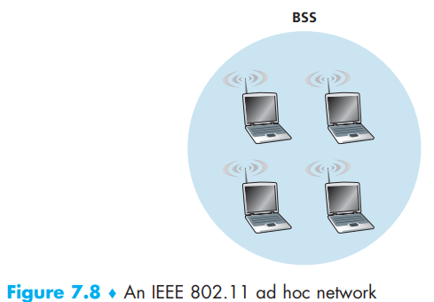
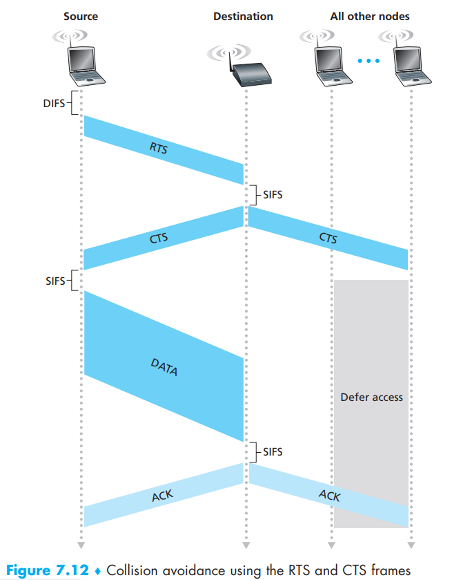
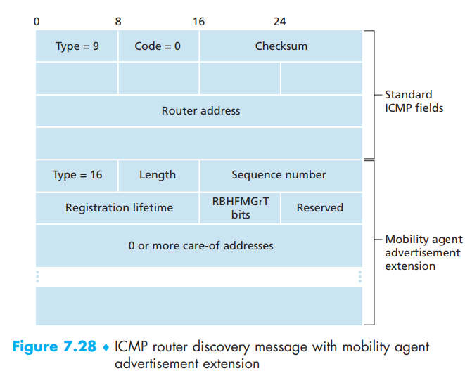

[toc]

The **IEEE 802.11 wireless LAN**, also known as **WiFi**.  

- *2.4–2.485 GHz (referred to as the 2.4 GHz range)*: The 2.4 GHz range is an unlicensed frequency band, where 802.11 devices may compete for frequency spectrum with 2.4 GHz phones and microwave ovens.
- *5.1 – 5.8 GHz (referred to as the 5 GHz range)*: 802.11 LANs have a shorter transmission distance for a given power level and suffer more from multipath propagation.

# 1. The 802.11 Architecture

The fundamental building block of the 802.11 architecture is the **basic service set (BSS)** which contains one or more wireless stations and a central **base station**, known as an **access point (AP)** in 802.11 parlance.

Wireless LANs that deploy APs are often referred to as **infrastructure wireless LANs**, with the “infrastructure” being the APs along with the wired Ethernet infrastructure that interconnects the APs and a router.

Also, there could be ad hoc network without access to the global Internet:

## Channels and Association

When a network administrator installs an AP, the administrator assigns a one or two-word **Service Set Identifier (SSID)** to the access point. 

The administrator must also assign a **channel number** to the AP. To understand channel numbers. Within the range of 2.4 GHz to 2.4835 GHz, 802.11 defines **11 **partially overlapping channels. 1, 6, and 11 is the **only **set of three non-overlapping channels.   

A **WiFi jungle** is any **physical location** where a wireless station receives a sufficiently strong signal from two or more APs. To gain Internet access, your wireless device needs to join exactly one of the subnets and hence needs to **associate **with exactly one of the APs.

Associating means the wireless device creates a **virtual wire** between itself and the AP. Specifically, only the associated AP will send data frames to your wireless device, and your wireless device will send data frames into the Internet only through the associated AP.

How can one do that? The 802.11 standard requires that an AP periodically send **beacon frames**, each of which includes the AP’s SSID and MAC address. Having learned about available APs from the beacon frames, you (or your wireless device) select one of the APs for
association.

How your device choose AP depends on the designer of the device. Typically, the device chooses the AP whose beacon frame is received with the **highest signal strength**.

-  **passive scanning**: The process of scanning channels and listening for beacon frames.

- **active scanning**: broadcasting a probe frame that will be received by all APs within the wireless device’s range.

After selecting the AP with which to associate, 

1. the wireless device sends an *association request frame* to the AP, and the AP responds with an *association response frame* (active scanning). 
2. Once associated with an AP, the device will want to join the subnet to which the AP belongs. 
3. The device will typically send a *DHCP discovery message* into the subnet via the AP in order to obtain an IP address on the subnet.

Now the device is the same thing as a host to the Internet. Also, there could be authentication during these process.

# 2. The 802.11 MAC Protocol

The designers of 802.11 chose a random access protocol - **CSMA (carrier sense multiple access) with collision avoidance**, or more succinctly as **CSMA/CA** along with some differences:  

- instead of using collision detection, 802.11 uses **collision-avoidance techniques**.
- because of the relatively high bit error rates of wireless channels, 802.11 (unlike Ethernet) uses a link-layer **acknowledgment/ retransmission (ARQ)** scheme.

Why not collision detection, two reasons for this:

- The ability to detect collisions requires the ability to send (the station’s own signal) and receive (to determine whether another station is also transmitting) at the same time. Because the strength of the received signal is typically very small compared to the strength of the transmitted signal at the 802.11 adapter, it is *costly* to build hardware that can detect a collision.
- More importantly, even if the adapter could transmit and listen at the same time (and presumably abort transmission when it senses a busy channel), the adapter would still not be able to detect all collisions, due to the *hidden terminal problem and fading*.

The 802.11 MAC protocol uses **link-layer acknowledgments** when a station in a wireless LAN sends a frame and the frame may not reach the destination station intact for a variety of reasons:

1. when the destination station receives a frame that passes the CRC, it waits a short
   period of time known as the **Short Inter-frame Spacing (SIFS) **and then sends back an acknowledgment frame.
2. If the transmitting station does not receive an acknowledgment within a given amount of time, it assumes that an error has occurred and **retransmits **the frame, using the CSMA/CA protocol to access the channel.
3. If an acknowledgment is not received after some fixed number of retransmissions, the transmitting station gives up and **discards **the frame.

Now totally speaking:

1. If initially the station senses the channel **idle**, it transmits its frame after a short period of time known as the **Distributed Inter-frame Space (DIFS)**.
2. Otherwise, the station chooses a random **backoff** value using binary exponential backoff and counts down this value after DIFS when the channel is sensed **idle**. While the channel is sensed busy, the counter value remains frozen.
3. When the counter reaches zero (note that this can only occur while the channel is sensed **idle**), the station transmits the entire frame and then waits for an acknowledgment.
4. If an acknowledgment is received, the transmitting station knows that its frame has been correctly received at the destination station. If the station has another frame to send, it begins the CSMA/CA protocol at step 2. If the acknowledgment isn’t received, the transmitting station reenters the backoff phase in step 2, with the random value chosen from a larger interval.

The interval break before transmitting is to use binary random method to stop the collision from happening rather than abort the transmission. Of course, if the binary time two senders choose is the same, there is still could be collision.

## Dealing with Hidden Terminals: RTS and CTS

In order to avoid collision caused by hidden terminals, the IEEE 802.11 protocol allows a station to use a short **Request to Send (RTS)** control frame and a short **Clear to Send (CTS)** control frame to **reserve **access to the channel.   

It can first send an RTS frame to the AP, indicating the total time required to transmit the DATA frame and the acknowledgment (ACK) frame. When the AP receives the RTS frame, it responds by broadcasting a CTS frame. This CTS frame serves two purposes: *It gives the sender explicit permission to send and also instructs the other stations not to send for the reserved duration.*

The use of the RTS and CTS frames can improve performance in two important ways:

- The hidden station problem is mitigated, since a long DATA frame is transmitted only after the channel has been reserved.
- Because the RTS and CTS frames are short, a collision involving an RTS or CTS frame will last only for the duration of the short RTS or CTS frame. Once the RTS and CTS frames are correctly transmitted, the following DATA and ACK frames should be transmitted without collisions.

Although the RTS/CTS exchange can help reduce collisions, it also introduces delay and consumes channel resources. For this reason, the RTS/CTS exchange is only used (if at all) to reserve the channel for the transmission of a **long **DATA frame.

## Using 802.11 as a Point-to-Point Link

Given the low cost of commodity 802.11 hardware, the use of directional antennas and an increased transmission power allow 802.11 to be used as an **inexpensive **means of providing wireless **point-to-point** connections over tens of kilometers distance.   

# 3.The IEEE 802.11 Frame

## Payload and CRC Fields

Typically consists of an IP datagram or an ARP packet. Although the field is permitted to be as long as 2,312 bytes, it is typically fewer than 1,500 bytes, holding an IP datagram or an ARP packet.

As the Ethernet, WiFi includes a 32-bit cyclic redundancy check (CRC) so that the receiver can detect bit errors in the received frame.

## Address Fields

Three address fields are needed for **internetworking** purposes—specifically, for moving the network-layer datagram from a wireless station through an AP to a router interface. The fourth address field is used when APs forward frames to each other in *ad hoc mode.*

-  Address 2 is the MAC address of the station that transmits the frame. hus, if a wireless station transmits the frame, that station’s MAC address is inserted in the address 2 field. Similarly, if an AP transmits the frame, the AP’s MAC address is inserted in the address 2 field.

- Address 1 is the MAC address of the wireless station that is to receive the frame. Thus if a mobile wireless station transmits the frame, address 1 contains the MAC address of the destination AP. Similarly, if an AP transmits the frame, address 1 contains the MAC address of the destination wireless station.

- To understand address 3, recall that the BSS (consisting of the AP and wireless stations) is *part of a subnet*, and that this subnet connects to other subnets via some router interface. Address 3 contains the MAC address of this **router interface**.

  ​	

Address 3 plays a crucial role for internetworking the BSS with a wired LAN.  

Let’s learn R1 can move a datagram to H1:

- The router, which knows the IP address of H1 (from the destination address of the datagram), uses *ARP* to determine the MAC address of H1, just as in an ordinary Ethernet LAN. After obtaining H1’s MAC address, router interface R1 encapsulates the datagram within an **Ethernet frame**. *The source address field of this frame contains R1’s MAC address, and the destination address field contains H1’s MAC address.*
- When the Ethernet frame arrives at the AP, the AP **converts **the 802.3 Ethernet frame to an 802.11 frame before transmitting the frame into the wireless channel. The AP fills in address 1 and address 2 with H1’s MAC address and its own MAC address, respectively, as described above. For address 3, the AP inserts the MAC address of R1. In this manner, *H1 can determine (from address 3) the MAC address of the router interface that sent the datagram into the subnet.*

From H1 to R1:

- H1 creates an 802.11 frame, filling the fields for address 1 and address 2 with the AP’s MAC address and H1’s MAC address, respectively, as described above. For address 3, H1 inserts R1’s MAC address.
- When the AP receives the 802.11 frame, it converts the frame to an Ethernet frame. The source address field for this frame is H1’s MAC address, and the destination address field is R1’s MAC address. Thus, address 3 allows the AP to determine the appropriate destination MAC address when constructing the Ethernet frame.  

## Sequence Number, Duration, and Frame Control Fields

The use of sequence numbers allows the receiver to distinguish between a newly transmitted frame and the retransmission of a previous frame.  

802.11 protocol allows a transmitting station to reserve the channel for a period of time that includes the time to transmit its data frame and the time to transmit an acknowledgment. This duration value is included in the frame’s duration field (both for data frames and for the RTS and CTS frames).

- **type** and **subtype **fields are used to distinguish the association, RTS, CTS, ACK, and data frames.
- **to **and **from **fields are used to define the meanings of the different address fields.
- WEP field indicates whether encryption is being used or not.

# 4. Mobility in the Same IP Subnet

As H1 wanders away from AP1, H1 detects a **weakening **signal from AP1 and starts to scan for a stronger signal. H1 receives beacon frames from AP2 (which in many corporate and university settings will have the same SSID as AP1). H1 then disassociates with AP1 and associates with AP2, while keeping its IP address and maintaining its ongoing TCP sessions.  

Once H1 associates with BSS2, however,its frames should be directed to AP2. One solution (a bit of a hack, really) is for AP2 to send a **broadcast Ethernet frame** with H1’s source address to the switch just after the new association. When the switch receives the frame, it updates its forwarding table, allowing H1 to be reached via AP2. The 802.11f standards group is developing an inter-AP protocol to handle these and related issues.  

Mobility among base stations within such a VLAN can be handled in exactly the same manner as above.

# 5. Advanced Features in 802.11

## 802.11 Rate Adaptation

Some 802.11 implementations have a *rate adaptation capability* that adaptively selects the underlying physical-layer modulation technique to use based on current or recent channel characteristics.

If a node sends two frames in a row without receiving an acknowledgment (an implicit indication of bit errors on the channel), the transmission rate falls back to the next lower rate. If 10 frames in a row are acknowledged, or if a timer that tracks the time since the last fallback
expires, the transmission rate increases to the next higher rate.   

## Power Management

A node is able to explicitly *alternate* between sleep and wake states. 

A node indicates to the access point that it will be going to sleep by setting the power-management bit in the header of an 802.11 frame to 1. Since the AP knows from the set power-transmission bit that the node is going to sleep, it (the AP) knows that it should not send any frames to that node, and will buffer any frames destined for the sleeping host for later transmission.   

A node will wake up just before the AP sends a beacon frame, and quickly enter the fully active state.

# 6. Personal Area Networks: Bluetooth and Zigbee

## Bluetooth

An IEEE 802.15.1 network operates over a short range, at low power, and at low cost. For this
reason, 802.15.1 networks are sometimes referred to as **wireless personal area networks (WPANs)**.

802.15.1 networks operate in the 2.4 GHz unlicensed radio band in a TDM manner, with time slots of 625 microseconds. During each time slot, a sender transmits on one of 79 channels, with the channel changing in a known but pseudo-random manner from slot to slot. This form of channel hopping, known as **frequency-hopping spread spectrum (FHSS)**, spreads transmissions in time over the frequency spectrum. 802.15.1 can provide data rates up to 4 Mbps.

802.15.1 networks are **ad hoc networks**: No network infrastructure (e.g., an access point) is needed to interconnect 802.15.1 devices.

802.15.1 devices are first organized into a **piconet** of up to eight active devices, as shown in Figure 7.16. One of these devices is designated as the **master**, with the remaining devices acting as **slaves**.

The master node truly rules the piconet—its clock determines time in the piconet, it can transmit in each odd-numbered slot, and a slave can transmit only after the master has communicated with it in the previous slot and even then the slave can only transmit to the master.

In addition to the slave devices, there can also be up to 255 parked devices in the network. These devices cannot communicate until their status has been *changed from parked to active by the master node.*  

## Zigbee

While Bluetooth networks provide a “cable replacement” data rate of over a Megabit per second, Zigbee ([IEEE 802.15 2012]) is targeted at lowerpowered, lower-data-rate, lower-duty-cycle applications than Bluetooth.   

Zigbee defines channel rates of 20, 40, 100, and 250 Kbps, depending on the channel frequency for low-power, low-duty-cycle, low-cost devices.

- *reduced-function device*
- *full-function device*

A full-function device can operate as a **master **device as in Bluetooth by controlling multiple slave devices, and multiple full-function devices can additionally be configured into a **mesh **network in which full-function devices route frames amongst themselves. Zigbee shares many protocol mechanisms that we’ve already encountered in other link-layer protocols: beacon
frames and link-layer acknowledgments (similar to 802.11), carrier-sense random access protocols with binary exponential backoff (similar to 802.11 and Ethernet), and fixed, guaranteed allocation of time slots (similar to DOCSIS)  

The Zigbee network divides time into recurring super frames, each of which begins with a **beacon frame**. Each beacon frame divides the super frame into an **active **period (during which devices may transmit) and an **inactive **period (during which all devices, including the controller, can sleep and thus conserve power).   

# 4. Cellular Internet Access  

# 5. Mobility Management: Principles

# 6. Mobile IP

The mobile IP standard consists of three main pieces:  

- *Agent discovery.* Mobile IP defines the protocols used by a home or foreign agent to advertise its services to mobile nodes, and protocols for mobile nodes to solicit the services of a foreign or home agent.
- *Registration with the home agent.* Mobile IP defines the protocols used by the mobile node and/or foreign agent to register and deregister COAs with a mobile node’s home agent.
- *Indirect routing of datagrams.* The standard also defines the manner in which datagrams are forwarded to mobile nodes by a home agent, including rules for forwarding datagrams, rules for handling error conditions, and several forms of encapsulation [RFC 2003, RFC 2004].  

## Agent Discovery

- via agent advertisement
- via agent solicitation

With **agent advertisement**, a foreign or home agent advertises its services using an extension to the existing router discovery protocol [RFC 1256]. The agent periodically broadcasts an **ICMP message** with a type field of 9 (router discovery) on all links to which it is connected. The router discovery message contains the IP address of the router (that is, the agent), thus allowing a mobile node to learn the agent’s IP address. The router discovery message also contains a mobility agent advertisement extension that contains additional information needed by the mobile node. Among the more important fields in the extension are the following:  

- *Home agent bit (H).* Indicates that the agent is a home agent for the network in which it resides.  
- *Home agent bit (H).* Indicates that the agent is a home agent for the network in which it resides.  
- *Registration required bit (R).* Indicates that a mobile user in this network must register with a foreign agent.  
- *M, G encapsulation bits.* Indicate whether a form of encapsulation other than IPin-IP encapsulation will be used.  
- *Care-of address (COA) fields.* A list of one or more care-of addresses provided by the foreign agent. In our example below, the COA will be associated with the foreign agent, who will receive datagrams sent to the COA and then forward them to the appropriate mobile node. The mobile user will select one of these addresses as its COA when registering with its home agent.  

With **agent solicitation**, a mobile node wanting to learn about agents without waiting to receive an agent advertisement can broadcast an **agent solicitation message**, which is simply an ICMP message with type value **10**. An agent receiving the solicitation will **unicast **an agent advertisement directly to the mobile node, which can then proceed as if it had received an unsolicited advertisement.

## Registration with the Home Agent

Once a mobile IP node has received a COA, that address must be registered with the
**home agent**. This can be done either via the foreign agent (who then registers the COA with the home agent) or directly by the mobile IP node itself. We consider the former case below.

1. Following the receipt of a foreign agent advertisement, a mobile node sends a **mobile IP registration message** to the foreign agent. The registration message is carried within a **UDP **datagram and sent to port 434. The registration message carries a COA advertised by the foreign agent, the address of the home agent (HA), the permanent address of the mobile node (MA), the requested lifetime of the registration, and a 64-bit registration identification. The requested registration **lifetime **is the number of seconds that the registration is to be valid. If the registration is not renewed at the home agent within the specified lifetime, the registration will become invalid. *The registration identifier acts like a sequence number and serves to match a received registration reply with a registration request, as discussed below.*
2. The foreign agent receives the registration message and records the mobile node’s **permanent IP address**. The foreign agent now knows that it should be looking for datagrams containing an encapsulated datagram whose destination address matches the permanent address of the mobile node. The foreign agent then sends a mobile IP registration message (again, within a UDP datagram) to port 434 of the home agent. The message contains the COA, HA, MA, encapsulation format requested, requested registration lifetime, and registration identification.
3. The home agent receives the registration request and checks for **authenticity and correctness.** The home agent binds the mobile node’s permanent IP address with the COA; in the future, datagrams arriving at the home agent and addressed to the mobile node will now be encapsulated and tunneled to the COA. The home agent sends a mobile IP registration reply containing the HA, MA, actual registration lifetime, and the registration identification of the request that is being satisfied with this reply.
4. The foreign agent receives the registration reply and then forwards it to the mobile node.  

A foreign agent need not explicitly deregister a COA when a mobile node leaves its network. This will occur **automatically**, when the mobile node moves to a new network (whether another foreign network or its home network) and registers a new COA.  

